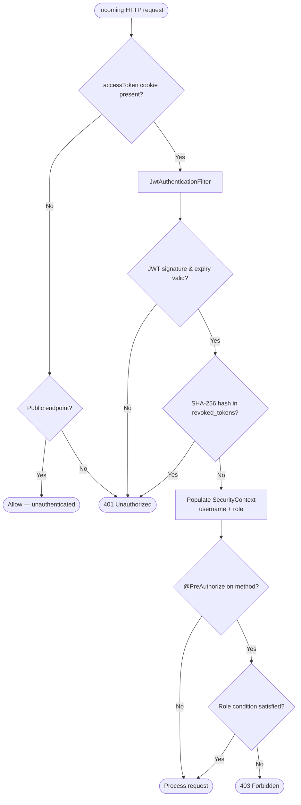

# GameDash — Security & Compliance Plan (English)

> 🇫🇷 **Version française :** [Plan Sécurité & Conformité (Français)](SECURITY_COMPLIANCE_PLAN_FR.md)

> **Document scope:** Threat model · Authentication & authorisation · Data protection · Secrets management · Audit & monitoring · Incident response · GDPR compliance · OWASP alignment · Known gaps & remediation roadmap  
> **Codebase:** Spring Boot 3 backend · Next.js 14 frontend · PostgreSQL 16 · Redis 6.x  
> **Deployment target:** Azure Container Apps (Spain Central)

---

## Table of Contents

1. [Security Architecture Overview](#1-security-architecture-overview)
2. [Threat Model](#2-threat-model)
3. [Authentication & Authorisation](#3-authentication--authorisation)
   - 3.1 [Identity Providers](#31-identity-providers)
   - 3.2 [Token Architecture](#32-token-architecture)
   - 3.3 [Role & Permission Matrix](#33-role--permission-matrix)
   - 3.4 [Token Revocation](#34-token-revocation)
4. [Data Classification & Protection](#4-data-classification--protection)
   - 4.1 [Data Classification Table](#41-data-classification-table)
   - 4.2 [Encryption in Transit](#42-encryption-in-transit)
   - 4.3 [Encryption at Rest](#43-encryption-at-rest)
   - 4.4 [Credential Storage](#44-credential-storage)
5. [Secrets Management](#5-secrets-management)
   - 5.1 [Secret Inventory](#51-secret-inventory)
   - 5.2 [Key Rotation Procedure](#52-key-rotation-procedure)
   - 5.3 [Local Development](#53-local-development)
6. [Network Security](#6-network-security)
   - 6.1 [Ingress & TLS Termination](#61-ingress--tls-termination)
   - 6.2 [CORS Policy](#62-cors-policy)
   - 6.3 [Rate Limiting](#63-rate-limiting)
7. [Input Validation & Injection Prevention](#7-input-validation--injection-prevention)
8. [Audit Logging & Monitoring](#8-audit-logging--monitoring)
   - 8.1 [Database Audit Records](#81-database-audit-records)
   - 8.2 [Application Log Events](#82-application-log-events)
   - 8.3 [Azure Monitoring](#83-azure-monitoring)
9. [Incident Response](#9-incident-response)
   - 9.1 [Response Procedures by Scenario](#91-response-procedures-by-scenario)
   - 9.2 [Contact & Escalation](#92-contact--escalation)
10. [GDPR Compliance](#10-gdpr-compliance)
    - 10.1 [Data Subject Rights](#101-data-subject-rights)
    - 10.2 [Data Residency](#102-data-residency)
    - 10.3 [Third-Party Processors](#103-third-party-processors)
11. [OWASP Top 10 Coverage](#11-owasp-top-10-coverage)
12. [Known Gaps & Remediation Roadmap](#12-known-gaps--remediation-roadmap)
13. [Compliance Checklist](#13-compliance-checklist)

---

## 1. Security Architecture Overview

```
┌─────────────────────────────────────────────────────────────────────┐
│  Browser (user)                                                     │
│   · HTTPS only (Azure forces redirect)                              │
│   · Cookies: HttpOnly, SameSite=Lax, Secure (prod)                  │
└──────────────────────────┬──────────────────────────────────────────┘
                           │ TLS 1.2+
                           ▼
┌─────────────────────────────────────────────────────────────────────┐
│  Azure Container Apps — Frontend (Next.js)                          │
│   · Static-IP ingress (Azure-managed TLS)                           │
│   · Next.js server proxies /api/*, /oauth2/*, /login/oauth2/*       │
│   · No secrets stored; no direct DB/Redis access                    │
└──────────────────────────┬──────────────────────────────────────────┘
                           │ HTTP (internal Container Apps network)
                           ▼
┌─────────────────────────────────────────────────────────────────────┐
│  Azure Container Apps — Backend (Spring Boot)                       │
│   · JwtAuthenticationFilter on every request                        │
│   · @PreAuthorize method-level guards                               │
│   · CORS restricted to ALLOWED_ORIGINS                              │
│   · Rate limiting per source IP                                      │
└──────────┬───────────────────────────────────────┬──────────────────┘
           │ TLS (sslmode=require)                  │ TLS (port 6380)
           ▼                                        ▼
┌──────────────────────┐              ┌─────────────────────────────┐
│  Azure PostgreSQL    │              │  Azure Cache for Redis       │
│  Flexible Server     │              │  · OAuth2 session state      │
│  AES-256 at rest     │              │  · JWT one-time code store   │
│  7-day PITR backup   │              │  · AES-256 at rest           │
└──────────────────────┘              └─────────────────────────────┘
```

**Security design principles applied:**

- **Zero trust between layers:** the backend accepts no implicit trust from the frontend; every request is authenticated via JWT.
- **Stateless core:** JWT-based sessions mean no shared state across requests, except for the brief OAuth2 handshake (Redis, 300 s TTL) and the token blacklist.
- **Defence in depth:** access control is enforced at both the path level (`SecurityFilterChain`) and the method level (`@PreAuthorize`), so a bypass of one layer does not grant access.
- **Principle of least privilege:** roles (PLAYER / STAFF / ADMIN) grant the minimum capabilities needed for each user type.
- **Secrets never in code:** all credentials are injected via environment variables; no defaults are committed.

---

## 2. Threat Model

### Assets

| Asset | Sensitivity | Location |
|-------|-------------|---------|
| User credentials (BCrypt hashes) | High | `users.password` (PostgreSQL) |
| PII (email, username, avatar) | High | `users` table (PostgreSQL) |
| JWT signing key | Critical | Azure Container Apps secret |
| OAuth2 client secrets | High | Azure Container Apps secrets |
| Session state (Redis) | Medium | Azure Cache for Redis |
| Match & purchase history | Medium | PostgreSQL |
| Platform configuration (rank thresholds, matchmaking params) | Low | PostgreSQL |

### Threat Actors & Mitigations

| Threat actor | Attack vector | Mitigation |
|-------------|--------------|-----------|
| Unauthenticated attacker | Brute-force login | Per-IP rate limiting (10 req / 60 s); BCrypt slow hash |
| Authenticated attacker | Privilege escalation | Two-layer role check; `@PreAuthorize` on destructive operations |
| Authenticated attacker | IDOR (other user's data) | All data-access methods filter by authenticated user's ID |
| Authenticated attacker | Match result manipulation | Two-player consensus required; solo result is flagged for admin review |
| Network-level attacker | Token interception | Cookies are `HttpOnly` + `Secure`; TLS on all external hops |
| Attacker with DB read access | Password recovery | BCrypt hashing — preimage is computationally infeasible |
| Attacker with stolen JWT | Token replay | SHA-256 blacklist checked per request; 1-hour access TTL limits blast radius |
| Insider / compromised admin | Untracked actions | `user_sanctions` append-only audit log; transactions ledger |
| SSRF via Steam callback | Forged Steam assertion | Back-channel validation against a hard-coded Steam URL only |
| Injection (SQL, XSS) | Malicious request body | JPA parameterised queries; Bean Validation; Jackson DTO projection |

---

## 3. Authentication & Authorisation

### 3.1 Identity Providers

| Provider | Protocol | Registration anchor | Notes |
|----------|----------|-------------------|-------|
| Local | Username + BCrypt password | `users.email` or `users.username` | Password complexity enforced at registration |
| Google | OIDC (Authorization Code) | `provider_id = sub` (stable Google UID) | Credential optional — app starts without it |
| Discord | OAuth2 (Authorization Code) | `provider_id = id` (Discord snowflake) | Credential optional — programmatic registration |
| Steam | OpenID 2.0 | `provider_id = steamId64` | Stateless back-channel assertion validation |

The OAuth2 / OIDC callback URL exposed to external providers is always on the **frontend** domain (`{FRONTEND_URL}/login/oauth2/code/{provider}`). Next.js proxies this path to the backend, ensuring providers never need to know the backend's internal address.

### 3.2 Token Architecture

| Token | Algorithm | TTL | Cookie path | Cookie attributes |
|-------|-----------|-----|-------------|------------------|
| Access JWT | HS256 | 1 hour | `/api` | `HttpOnly; SameSite=Lax; Secure` (prod) |
| Refresh JWT | HS256 | 7 days | `/api/auth` | `HttpOnly; SameSite=Lax; Secure` (prod) |

Both tokens are signed with a 256-bit key derived from `JWT_SECRET`. The algorithm is explicitly pinned to HS256 in `JwtTokenProvider` — JJWT's key-size-based auto-detection is disabled to prevent algorithm-confusion attacks.

Path-scoped cookies ensure the refresh token is sent only to `POST /api/auth/refresh` and `POST /api/auth/logout` — it is never visible to other API routes.

**OAuth2 one-time code exchange:** after the callback, the backend stores a serialised `AuthResponse` in Redis under a random UUID key with a 300-second TTL. The browser receives only the UUID; the frontend redeems it via `POST /api/auth/callback`. This pattern prevents tokens from appearing in browser URLs or logs.

### Authentication Flow



### 3.3 Role & Permission Matrix

| Capability | PLAYER | STAFF | ADMIN |
|-----------|:------:|:-----:|:-----:|
| Own profile read / write | ✓ | ✓ | ✓ |
| Join matchmaking, submit results | ✓ | ✓ | ✓ |
| Purchase items, claim quests | ✓ | ✓ | ✓ |
| View public maps and leaderboard | ✓ | ✓ | ✓ |
| Backoffice dashboard stats | | ✓ | ✓ |
| Search users, view sanction history | | ✓ | ✓ |
| Feature / hide maps, resolve reports | | ✓ | ✓ |
| Update rank thresholds | | | ✓ |
| Ban / unban users | | | ✓ |
| Create / update shop items | | | ✓ |
| Update matchmaking configuration | | | ✓ |

### 3.4 Token Revocation

On logout or account deletion both tokens (access + refresh) are revoked immediately:

```java
// TokenBlacklistService stores the SHA-256 digest, not the raw token
String hash = sha256Hex(rawToken);
revokedTokenRepository.save(new RevokedToken(hash, tokenExpiry));
```

Every authenticated request performs a single indexed blacklist lookup:

```sql
SELECT 1 FROM revoked_tokens
WHERE token_hash = :hash AND expires_at > NOW()
```

An hourly scheduled job purges rows where `expires_at < NOW()` to keep the table proportional to the number of currently-valid but explicitly-revoked tokens.

---

## 4. Data Classification & Protection

### 4.1 Data Classification Table

| Classification | Fields | Table(s) | GDPR relevance |
|---------------|--------|---------|---------------|
| PII — direct identifier | `email`, `username` | `users` | Art. 15, 17 |
| PII — indirect | `avatar_url`, `bio`, `region`, `language`, `provider_id` | `users` | Art. 15, 17 |
| Credentials | `password` (BCrypt hash) | `users` | Not recoverable — no erasure risk |
| Behavioural / analytics | match results, MMR snapshots, purchase history | `matches`, `mmr_snapshots`, `transactions` | Art. 15, 17 |
| Platform-sensitive | `banned`, `deleted_at`, `role` | `users` | Internal use only |
| Audit trail | ban type, reason, admin identity | `user_sanctions` | Append-only; admin accountability |
| Transient security | token hash, expiry | `revoked_tokens` | Auto-purged at TTL expiry |
| OAuth2 state (transient) | CSRF state, code verifier | Redis (`gamedash:session`) | Auto-purged after 300 s |

Data access follows the **need-to-know** principle: `GET /api/users/{userId}` (public profile) returns only display name, avatar, region, and stats — email, banned flag, role, and provider details are excluded via `PublicProfileDto`.

### 4.2 Encryption in Transit

| Connection | Protocol | Configuration |
|-----------|----------|--------------|
| Browser → Container Apps ingress | TLS 1.2+ | Enforced by Azure; plain HTTP is redirected to HTTPS |
| Next.js → Backend (internal) | HTTP | Azure Container Apps internal network; TLS not enforced on this hop |
| Backend → PostgreSQL | TLS | `sslmode=require` in JDBC connection string |
| Backend → Redis | TLS | Port 6380; `REDIS_SSL=true` |
| Backend → Google / Discord token endpoints | TLS | Java's default trust store; outbound HTTPS |
| Backend → Steam OpenID validation | TLS | Hard-coded Steam URL; no user-supplied URIs |

> **Gap:** The frontend-to-backend hop uses plain HTTP on the Container Apps internal virtual network. Azure's internal network is not publicly routable, but end-to-end TLS would be stronger. See [Section 12](#12-known-gaps--remediation-roadmap).

### 4.3 Encryption at Rest

| Store | Encryption | Key management |
|-------|-----------|---------------|
| PostgreSQL | AES-256 | Azure-managed platform keys |
| Redis | AES-256 | Azure-managed platform keys |
| Container image layers | Not encrypted | ACR stores images in Azure Blob Storage (AES-256 managed) |
| Uploaded files (`uploads_data`) | Not encrypted | Container local volume — no at-rest encryption |

### 4.4 Credential Storage

- **Passwords:** hashed with BCrypt using Spring Security's default work factor (≥ 10 rounds). Raw passwords are never stored, returned in any API response, or written to any log.
- **OAuth2 state:** stored only in Redis with a 300-second TTL. Never persisted to the database.
- **OAuth2 `access_token` / `id_token`:** used transiently in the callback handler to extract user identity. Never persisted to the database or cache after the handler returns.

---

## 5. Secrets Management

### 5.1 Secret Inventory

**Production — Azure Container Apps secret store:**

| Secret name | Env variable injected | Description |
|------------|----------------------|-------------|
| `db-url` | `SPRING_DATASOURCE_URL` | Full JDBC URL including host, port, and DB name |
| `db-password` | `SPRING_DATASOURCE_PASSWORD` | PostgreSQL user password |
| `redis-password` | `REDIS_PASSWORD` | Redis primary access key |
| `jwt-secret` | `JWT_SECRET` | HS256 signing key — Base64-encoded, decodes to ≥ 32 bytes |
| `google-client-id` | `GOOGLE_CLIENT_ID` | Google OAuth2 client ID |
| `google-secret` | `GOOGLE_CLIENT_SECRET` | Google OAuth2 client secret |
| `discord-client-id` | `DISCORD_CLIENT_ID` | Discord OAuth2 client ID |
| `discord-secret` | `DISCORD_CLIENT_SECRET` | Discord OAuth2 client secret |
| `steam-api-key` | `STEAM_API_KEY` | Steam Web API key |

Secrets are injected via `secretref:` bindings in the Container Apps environment-variable manifest. The plaintext value is never visible in the manifest or in `az containerapp show` output.

### 5.2 Key Rotation Procedure

**JWT secret rotation (invalidates all existing sessions immediately):**

```powershell
# 1. Generate a new key
$newKey = openssl rand -base64 32

# 2. Update the secret in the Container Apps store
az containerapp secret set `
  --resource-group <RG> --name gamedash-backend `
  --secrets "jwt-secret=$newKey"

# 3. Deploy a new revision to pick up the updated secret
az containerapp update `
  --resource-group <RG> --name gamedash-backend `
  --set-env-vars "JWT_SECRET=secretref:jwt-secret" `
  --revision-suffix "key-rotation-$(Get-Date -Format 'yyyyMMdd')"
```

> **Note:** All currently-valid JWTs become invalid immediately after the revision activates because signature verification fails against the new key. Users are silently redirected to the login page. This is the intended behaviour for a compromised-key scenario.

**OAuth2 secret rotation:**

```powershell
# Rotate on the provider side first, then update here
az containerapp secret set `
  --resource-group <RG> --name gamedash-backend `
  --secrets "google-secret=<new-value>"

az containerapp update `
  --resource-group <RG> --name gamedash-backend `
  --revision-suffix "oauth-rotation-$(Get-Date -Format 'yyyyMMdd')"
```

**Database password rotation:**

```powershell
# 1. Change password on the Flexible Server
az postgres flexible-server update `
  --resource-group <RG> --name <pg-server> `
  --admin-password <new-password>

# 2. Update the secret and redeploy
az containerapp secret set `
  --resource-group <RG> --name gamedash-backend `
  --secrets "db-password=<new-password>"

az containerapp update `
  --resource-group <RG> --name gamedash-backend `
  --revision-suffix "db-rotation-$(Get-Date -Format 'yyyyMMdd')"
```

### 5.3 Local Development

- `src/main/resources/application-local.yml` is **gitignored** and **not baked into the Docker image** (listed in `.dockerignore`).
- `.env` (copied from `.env.example`) is gitignored. Never commit `.env`.
- The `certs/` directory (custom CA certificates for corporate proxies) is gitignored. Never commit it.
- The production Docker image reads all credentials from environment variables injected at runtime; no defaults exist for `JWT_SECRET` — startup fails immediately if it is absent.

---

## 6. Network Security

### 6.1 Ingress & TLS Termination

Azure Container Apps ingress handles TLS termination. The frontend is the only externally-exposed endpoint. The backend ingress is configured as **internal** — it accepts traffic only from within the Container Apps environment, not from the public internet.

```
Internet → (HTTPS) → Frontend Container App
                      └─ (HTTP, internal VNET) → Backend Container App
                                                   └─ (TLS) → PostgreSQL
                                                   └─ (TLS) → Redis
```

### 6.2 CORS Policy

CORS is enforced in `SecurityConfig`. Allowed origins are controlled by the `ALLOWED_ORIGINS` environment variable (comma-separated list):

```yaml
# application.yml
app:
  cors:
    allowed-origins: ${ALLOWED_ORIGINS:http://localhost:3000}
```

In production, `ALLOWED_ORIGINS` is set to the frontend FQDN only. Pre-flight `OPTIONS` requests are handled automatically by Spring Security's `CorsFilter`.

CSRF protection is disabled — the `HttpOnly; SameSite=Lax` cookie attributes make CSRF moot for browser-initiated flows because cross-site requests cannot attach the cookies.

### 6.3 Rate Limiting

Per-source-IP limits enforced by a custom servlet filter before the Spring Security chain:

| Endpoint group | Default limit | Window |
|----------------|:-------------:|:------:|
| `POST /api/auth/login` | 10 requests | 60 s |
| `POST /api/auth/register` | 5 requests | 60 s |
| `POST /api/auth/refresh` | 20 requests | 60 s |
| `POST /api/auth/callback` | 10 requests | 60 s |

All limits are configurable via environment variables (`RATE_LIMIT_LOGIN`, `RATE_LIMIT_REGISTER`, `RATE_LIMIT_REFRESH`, `RATE_LIMIT_CALLBACK`, `RATE_LIMIT_WINDOW`).

Set `RATE_LIMIT_TRUSTED_PROXIES` to the Container Apps ingress IP so that `X-Forwarded-For` is used for real client IP extraction rather than the proxy's address.

---

## 7. Input Validation & Injection Prevention

**Bean Validation (`@Valid`)** is applied to every request body (`RegisterRequest`, `LoginRequest`, match result, etc.). Constraint violations produce a structured `HTTP 400` response before the service layer is reached:

```json
{
  "status": 400,
  "errors": {
    "username": "size must be between 3 and 30",
    "password": "must not be blank"
  }
}
```

**SQL injection:** the entire persistence layer uses Spring Data JPA / JPQL with named parameters. No native SQL strings are concatenated from user input anywhere in the codebase.

**XSS / output encoding:** the API returns JSON exclusively. There is no server-side HTML rendering. Jackson serialises all strings without interpretation. Frontend rendering is handled by React's built-in DOM escaping.

**SSRF:** the only outbound HTTP calls made from the backend are:
1. Google / Discord token and user-info endpoints — URLs are fixed in Spring Security's auto-configuration or `DiscordOAuth2Config`.
2. Steam OpenID back-channel assertion to `https://steamcommunity.com/openid/login` — URL is hard-coded in `SteamAuthController`.

No user-supplied URL is ever used as an outbound request target.

**File uploads:** avatar uploads are validated for MIME type and size (`max-file-size: 2MB`, `max-request-size: 3MB`). Files are stored on a named Docker volume, not served directly — URLs are constructed from the stored path and served under a known prefix.

---

## 8. Audit Logging & Monitoring

### 8.1 Database Audit Records

| Table | Event recorded | Retention policy |
|-------|---------------|-----------------|
| `user_sanctions` | Every ban / unban (type, reason, admin ID) | Permanent — append-only; `ON DELETE SET NULL` on admin FK |
| `transactions` | Every purchase (item, price, currency type, timestamp) | Permanent — `ON DELETE RESTRICT` preserves history even after item deletion |
| `mmr_snapshots` | Every MMR change (value, game mode, match ID, timestamp) | Permanent — append-only time series |
| `revoked_tokens` | Token revocation (hash, expiry) | Auto-purged hourly when `expires_at < NOW()` |

### 8.2 Application Log Events

| Level | Event |
|-------|-------|
| INFO | Successful local login (username); OAuth2 login (provider + user ID); new registration |
| WARN | JWT validation failure (invalid signature / expired); rate-limit breach; failed Steam assertion |
| ERROR | Steam login exception; OAuth2 code deserialisation failure |

Log level is controlled by the `LOG_LEVEL` environment variable (default `INFO`). Logs are written to stdout/stderr and streamed by Azure Container Apps to Log Analytics Workspace.

Sensitive values (passwords, raw JWTs, OAuth2 tokens) are **never** written to logs. The `password` field is excluded from all Jackson serialisation via `@JsonIgnore`.

### 8.3 Azure Monitoring

| Recommended alert | Trigger | Severity |
|-------------------|---------|---------|
| High WARN rate | > 50 WARN events / 5 min | Medium |
| ERROR events | Any ERROR log | High |
| Login rate-limit hit | > 100 429 responses / 5 min | High |
| Backend health check failure | `/actuator/health` returns non-200 | Critical |
| Database CPU > 80% | Azure Monitor metric | Medium |
| Redis memory > 80% | Azure Monitor metric | Medium |

Configure these in **Azure Monitor → Alert Rules** against the Log Analytics Workspace associated with the Container Apps environment.

---

## 9. Incident Response

### 9.1 Response Procedures by Scenario

#### Compromised user access token

1. Insert the SHA-256 hex digest of the stolen token into `revoked_tokens` with the token's original `exp` timestamp. This takes effect immediately on the next request.
2. If the user's credentials are also suspected compromised, reset the password via the admin API and force logout (step 3).
3. Ban the account temporarily (`POST /api/backoffice/users/{id}/ban`) while investigating.

#### Compromised JWT signing key

1. Generate a new 32-byte key: `openssl rand -base64 32`.
2. Rotate the `jwt-secret` in Azure Container Apps (see [Section 5.2](#52-key-rotation-procedure)).
3. Deploy a new revision. All existing tokens become invalid immediately — users are redirected to login.
4. Investigate the breach source (key leak in logs, source control, etc.).

#### Compromised OAuth2 credentials (Google / Discord)

1. Revoke the client secret in the provider's developer console.
2. Generate a new secret in the provider's console.
3. Update `google-secret` or `discord-secret` in Azure Container Apps and deploy a new revision (see [Section 5.2](#52-key-rotation-procedure)).
4. Affected users' sessions remain valid (OAuth2 credentials are not used after the initial login); no forced logout is needed unless the breach allowed token issuance on behalf of users.

#### Database breach (read access)

1. Immediately rotate all database credentials (`db-password`).
2. Assess which rows were accessible. Passwords are BCrypt hashes — direct decryption is computationally infeasible.
3. Notify affected users of the breach in compliance with GDPR Art. 33 (supervisory authority within 72 hours) and Art. 34 (users if high risk).
4. Rotate the JWT secret as a precaution to invalidate all existing sessions.
5. Review `user_sanctions` and `transactions` logs for evidence of data exfiltration.

#### Database breach (write access)

All of the above, plus:

1. Restore from the most recent clean point-in-time backup (see Technical Documentation §2.4).
2. Validate Flyway migration checksums on the restored instance.
3. Audit `user_sanctions` and `transactions` for anomalous rows inserted by the attacker.

#### Account taken over (ATO)

1. `POST /api/backoffice/users/{id}/ban` to block further access.
2. Revoke all active tokens via `TokenBlacklistService` (insert both access + refresh token hashes).
3. Reset the account's password and notify the legitimate owner via email.
4. Review the account's recent `transactions` and `mmr_snapshots` for fraudulent activity.

### 9.2 Contact & Escalation

| Role | Responsibility |
|------|---------------|
| Developer on call | First responder — executes Azure CLI rotation steps |
| Project lead | Approves user notifications; coordinates with providers |
| GDPR representative | Assesses breach severity; files supervisory authority notification if required |

---

## 10. GDPR Compliance

### 10.1 Data Subject Rights

| GDPR Article | Right | Current implementation | Gap |
|-------------|-------|----------------------|-----|
| Art. 15 | Right of access | `GET /api/users/me`, `/api/shop/transactions`, `/api/matchmaking/history` expose all personal data held about the authenticated user | No self-service export in structured machine-readable format (JSON is available via API calls; no one-click download) |
| Art. 17 | Right of erasure | `DELETE /api/users/me` soft-deletes the account (`deleted_at = NOW()`), revokes all tokens, clears cookies | Soft-delete only — linked rows in `transactions`, `mmr_snapshots`, `user_sanctions` are not physically removed (see [Section 12](#12-known-gaps--remediation-roadmap)) |
| Art. 16 | Right of rectification | `PATCH /api/users/me` allows updating username, bio, region, language | Email change is not implemented; requires admin intervention |
| Art. 5(1)(c) | Data minimisation | `GET /api/users/{userId}` returns only display name, avatar, region, stats — email, role, banned flag, provider details excluded | Compliant |
| Art. 25 | Privacy by design | SSO stores only the opaque `provider_id` (Google `sub`, Discord snowflake, Steam ID64); no OAuth2 access tokens are persisted after the callback | Compliant |
| Art. 46 | Data residency | All data stored in Azure Spain Central (EU) | Compliant |
| Art. 13/14 | Transparency | Privacy notice to be provided at registration | Not yet implemented (see [Section 12](#12-known-gaps--remediation-roadmap)) |

### 10.2 Data Residency

All processing occurs within the EU:

| Service | Azure region | EU-based |
|---------|-------------|---------|
| Container Apps (frontend + backend) | Spain Central | ✓ |
| PostgreSQL Flexible Server | Spain Central | ✓ |
| Azure Cache for Redis | Spain Central | ✓ |
| Azure Container Registry | Spain Central (or West Europe) | ✓ |
| Log Analytics Workspace | Spain Central | ✓ |

OAuth2 authentication flows involve Google (US) and Discord (US) as processors for the identity assertion only. No personal data is stored with these providers beyond what the user has already consented to in their respective accounts.

### 10.3 Third-Party Processors

| Processor | Purpose | Data transferred | Safeguards |
|-----------|---------|-----------------|-----------|
| Google (OIDC) | Identity assertion for login | Email, name, profile picture (read-only, not stored by us beyond `provider_id`) | Google DPA / SCCs |
| Discord (OAuth2) | Identity assertion for login | Discord ID, username, avatar, email (not stored beyond `provider_id`) | Discord DPA / SCCs |
| Valve / Steam (OpenID 2.0) | Identity assertion for login | Steam ID64 (public identifier) | Steam Subscriber Agreement |
| Microsoft Azure | Infrastructure | All data | Microsoft DPA / SCCs; EU Data Boundary commitments |

---

## 11. OWASP Top 10 Coverage

| OWASP 2021 | Risk | Status | Mitigation |
|-----------|------|:------:|-----------|
| A01 Broken Access Control | Unauthorised data access | ✓ | JWT + `@PreAuthorize`; `PublicProfileDto` strips sensitive fields; `HIDDEN` maps excluded regardless of query params |
| A02 Cryptographic Failures | Weak credential or data protection | ✓ | BCrypt passwords; HS256 with pinned 256-bit key; no raw tokens in URLs; TLS on all external connections |
| A03 Injection | SQL / command injection | ✓ | Spring Data JPA throughout; no string-concatenated native SQL; parameterised JPQL |
| A04 Insecure Design | Business logic bypass | ✓ | Purchase idempotency via DB UNIQUE constraint; quest-claim `claimed` flag; two-player match consensus |
| A05 Security Misconfiguration | Permissive CORS, debug endpoints exposed | ✓ | CORS restricted to `ALLOWED_ORIGINS`; only `/actuator/health` exposed (detail suppressed); no Swagger/OpenAPI in prod |
| A06 Vulnerable & Outdated Components | Dependency vulnerabilities | ⚠ | Spring Boot manages dependency versions; no automated CVE scanning in CI (see [Section 12](#12-known-gaps--remediation-roadmap)) |
| A07 Identification & Auth Failures | Session fixation, token replay | ✓ | SHA-256 blacklist per request; `SameSite=Lax` prevents cross-site submission; short-lived Redis OIDC state |
| A08 Software & Data Integrity Failures | Tampered migrations | ✓ | Flyway `validate-on-migrate: true` — checksum mismatch aborts startup |
| A09 Security Logging & Monitoring Failures | Insufficient audit trail | ✓ | `user_sanctions` and `transactions` are permanent append-only; application logs WARN/ERROR events |
| A10 SSRF | Forged server-side requests | ✓ | Only hard-coded URLs used for outbound calls; no user-supplied URL is fetched |

---

## 12. Known Gaps & Remediation Roadmap

| # | Gap | Risk | Recommended fix | Priority |
|---|-----|:----:|----------------|:--------:|
| 1 | **Soft-delete only — no hard erasure pipeline** | Art. 17 GDPR partial non-compliance | Implement an anonymisation job that nullifies PII fields or cascades hard-deletes on linked tables after a grace period | High |
| 2 | **No privacy notice at registration** | Art. 13/14 GDPR non-compliance | Add a consent checkbox on the registration page linking to a Privacy Policy page | High |
| 3 | **No automated CVE / dependency scanning** | Undetected vulnerable dependencies | Add `dependabot` or `trivy` to CI; configure Maven `dependency-check` plugin | Medium |
| 4 | **Frontend → backend hop uses plain HTTP** | Potential for internal network eavesdropping | Enable backend internal TLS in Container Apps; configure Spring Boot for HTTPS with a managed cert | Medium |
| 5 | **File uploads stored on container local volume** | Not horizontally scalable; no redundancy | Migrate uploads to Azure Blob Storage; serve via CDN with signed URLs | Medium |
| 6 | **No self-service data export** | Art. 15 UX gap (data accessible via API but no one-click export) | Add `GET /api/users/me/export` returning a JSON bundle of all personal data | Low |
| 7 | **Email change not self-serviceable** | User experience limitation | Add `PATCH /api/users/me/email` with email verification flow | Low |
| 8 | **No `Retry-After` header on rate-limit responses** | Client cannot back off intelligently | Return `Retry-After: <seconds>` in the 429 response | Low |
| 9 | **No API versioning** | Breaking changes require coordinated deployment | Introduce `/api/v2/` prefix with the first breaking change; alias existing routes to v1 | Low |
| 10 | **Application Insights not wired** | Limited observability on Azure | Set `APPLICATIONINSIGHTS_CONNECTION_STRING`; configure alert rules in Azure Monitor | Low |

---

## 13. Compliance Checklist

Use this checklist before any production deployment or after a significant infrastructure change.

### Security hardening

- [ ] `JWT_SECRET` is set, unique, and not the default value
- [ ] `COOKIE_SECURE=true` is set (HTTPS deployment)
- [ ] `ALLOWED_ORIGINS` contains only the production frontend URL
- [ ] `APP_SEED_ENABLED=false` or seed account passwords have been changed from their defaults
- [ ] `RATE_LIMIT_TRUSTED_PROXIES` is set to the Container Apps ingress IP
- [ ] All secrets are stored in Azure Container Apps secret store, not as plain environment variables
- [ ] The backend Container App ingress is set to **internal** only (not publicly exposed)

### OAuth2 / Identity providers

- [ ] Google redirect URI registered: `{FRONTEND_URL}/login/oauth2/code/google`
- [ ] Discord redirect URI registered: `{FRONTEND_URL}/login/oauth2/code/discord`
- [ ] Steam `BACKEND_URL` is set to the correct public backend URL (for OpenID `realm`)
- [ ] `FRONTEND_URL` is set to the correct production frontend URL (for post-login redirect)

### Data protection

- [ ] PostgreSQL `sslmode=require` in JDBC URL
- [ ] Redis TLS enabled (`REDIS_SSL=true`, port 6380)
- [ ] Azure PostgreSQL backup retention confirmed (≥ 7 days, target 35 days)
- [ ] No PII fields in application logs verified

### GDPR

- [ ] Privacy policy page live and linked from registration page
- [ ] Data residency confirmed: all Azure resources in EU region
- [ ] Third-party DPAs reviewed (Google, Discord, Microsoft Azure)
- [ ] Hard-erasure pipeline implemented (or gap documented and accepted)

### Monitoring

- [ ] Azure Monitor alert rules configured (health check, error rate, rate-limit hits)
- [ ] Log Analytics Workspace linked to Container Apps environment
- [ ] On-call rotation and escalation path documented

### Pre-go-live review

- [ ] Dependency CVE scan completed with no unresolved critical/high findings
- [ ] Penetration test or security review conducted against the production URL
- [ ] Incident response runbook reviewed by the team
- [ ] Key rotation procedure tested at least once in staging
