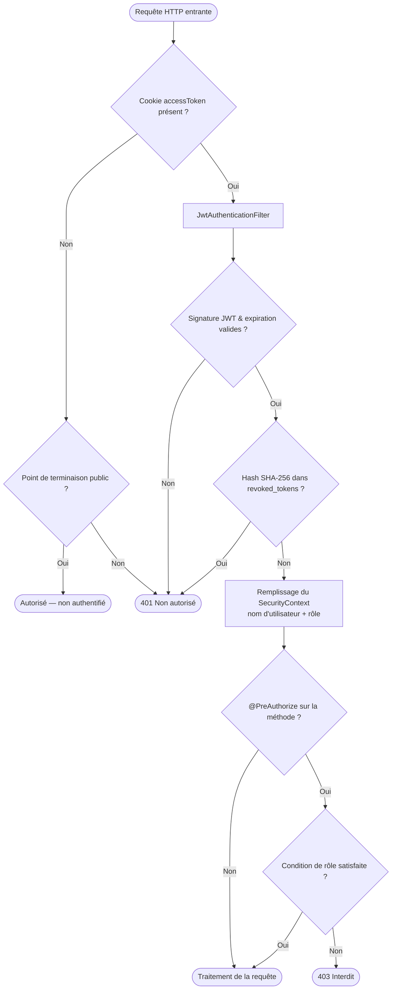

# GameDash — Plan Sécurité & Conformité (Français)

> 🇬🇧 **English version:** [Security & Compliance Plan (English)](SECURITY_COMPLIANCE_PLAN_EN.md)

> **Périmètre :** Modèle de menaces · Authentification & autorisation · Protection des données · Gestion des secrets · Audit & surveillance · Gestion des incidents · Conformité RGPD · Couverture OWASP · Lacunes connues & feuille de route  
> **Pile technique :** Spring Boot 3 (backend) · Next.js 14 (frontend) · PostgreSQL 16 · Redis 6.x  
> **Environnement de déploiement :** Azure Container Apps (Espagne Centre)

---

## Table des matières

1. [Vue d'ensemble de l'architecture de sécurité](#1-vue-densemble-de-larchitecture-de-sécurité)
2. [Modèle de menaces](#2-modèle-de-menaces)
3. [Authentification & autorisation](#3-authentification--autorisation)
   - 3.1 [Fournisseurs d'identité](#31-fournisseurs-didentité)
   - 3.2 [Architecture des jetons](#32-architecture-des-jetons)
   - 3.3 [Matrice des rôles et permissions](#33-matrice-des-rôles-et-permissions)
   - 3.4 [Révocation des jetons](#34-révocation-des-jetons)
4. [Classification & protection des données](#4-classification--protection-des-données)
   - 4.1 [Tableau de classification des données](#41-tableau-de-classification-des-données)
   - 4.2 [Chiffrement en transit](#42-chiffrement-en-transit)
   - 4.3 [Chiffrement au repos](#43-chiffrement-au-repos)
   - 4.4 [Stockage des identifiants](#44-stockage-des-identifiants)
5. [Gestion des secrets](#5-gestion-des-secrets)
   - 5.1 [Inventaire des secrets](#51-inventaire-des-secrets)
   - 5.2 [Procédure de rotation des clés](#52-procédure-de-rotation-des-clés)
   - 5.3 [Développement local](#53-développement-local)
6. [Sécurité réseau](#6-sécurité-réseau)
   - 6.1 [Entrée et terminaison TLS](#61-entrée-et-terminaison-tls)
   - 6.2 [Politique CORS](#62-politique-cors)
   - 6.3 [Limitation de débit](#63-limitation-de-débit)
7. [Validation des entrées & prévention des injections](#7-validation-des-entrées--prévention-des-injections)
8. [Journalisation d'audit & surveillance](#8-journalisation-daudit--surveillance)
   - 8.1 [Enregistrements d'audit en base de données](#81-enregistrements-daudit-en-base-de-données)
   - 8.2 [Événements de journalisation applicative](#82-événements-de-journalisation-applicative)
   - 8.3 [Surveillance Azure](#83-surveillance-azure)
9. [Gestion des incidents](#9-gestion-des-incidents)
   - 9.1 [Procédures de réponse par scénario](#91-procédures-de-réponse-par-scénario)
   - 9.2 [Contacts & escalade](#92-contacts--escalade)
10. [Conformité RGPD](#10-conformité-rgpd)
    - 10.1 [Droits des personnes concernées](#101-droits-des-personnes-concernées)
    - 10.2 [Localisation des données](#102-localisation-des-données)
    - 10.3 [Sous-traitants tiers](#103-sous-traitants-tiers)
11. [Couverture OWASP Top 10](#11-couverture-owasp-top-10)
12. [Lacunes connues & feuille de route de remédiation](#12-lacunes-connues--feuille-de-route-de-remédiation)
13. [Liste de contrôle de conformité](#13-liste-de-contrôle-de-conformité)

---

## 1. Vue d'ensemble de l'architecture de sécurité

```
┌─────────────────────────────────────────────────────────────────────┐
│  Navigateur (utilisateur)                                           │
│   · HTTPS uniquement (Azure force la redirection)                   │
│   · Cookies : HttpOnly, SameSite=Lax, Secure (prod)                 │
└──────────────────────────┬──────────────────────────────────────────┘
                           │ TLS 1.2+
                           ▼
┌─────────────────────────────────────────────────────────────────────┐
│  Azure Container Apps — Frontend (Next.js)                          │
│   · Terminaison TLS gérée par Azure                                 │
│   · Le serveur Next.js proxifie /api/*, /oauth2/*, /login/oauth2/*  │
│   · Aucun secret stocké ; aucun accès direct à la BDD ou Redis      │
└──────────────────────────┬──────────────────────────────────────────┘
                           │ HTTP (réseau interne Container Apps)
                           ▼
┌─────────────────────────────────────────────────────────────────────┐
│  Azure Container Apps — Backend (Spring Boot)                       │
│   · JwtAuthenticationFilter sur chaque requête                      │
│   · Contrôles au niveau méthode via @PreAuthorize                  │
│   · CORS limité à ALLOWED_ORIGINS                                   │
│   · Limitation de débit par IP source                               │
└──────────┬───────────────────────────────────────┬──────────────────┘
           │ TLS (sslmode=require)                  │ TLS (port 6380)
           ▼                                        ▼
┌──────────────────────┐              ┌─────────────────────────────┐
│  Azure PostgreSQL    │              │  Azure Cache for Redis       │
│  Flexible Server     │              │  · État de session OAuth2    │
│  AES-256 au repos    │              │  · Code à usage unique JWT   │
│  Sauvegarde PITR 7j  │              │  · AES-256 au repos          │
└──────────────────────┘              └─────────────────────────────┘
```

**Principes de conception sécurisée appliqués :**

- **Zéro confiance entre les couches :** le backend n'accorde aucune confiance implicite au frontend ; chaque requête est authentifiée par JWT.
- **Cœur sans état :** les sessions basées sur JWT n'impliquent aucun état partagé entre requêtes, à l'exception du bref échange OAuth2 (Redis, TTL 300 s) et de la liste noire de jetons.
- **Défense en profondeur :** le contrôle d'accès est appliqué à la fois au niveau du chemin (`SecurityFilterChain`) et au niveau de la méthode (`@PreAuthorize`), de sorte qu'un contournement d'une couche ne suffit pas à obtenir l'accès.
- **Principe du moindre privilège :** les rôles (PLAYER / STAFF / ADMIN) accordent uniquement les capacités minimales nécessaires à chaque type d'utilisateur.
- **Aucun secret dans le code :** toutes les informations d'identification sont injectées via des variables d'environnement ; aucune valeur par défaut n'est validée dans le dépôt.

---

## 2. Modèle de menaces

### Actifs

| Actif | Sensibilité | Localisation |
|-------|-------------|-------------|
| Identifiants utilisateurs (hachages BCrypt) | Élevée | `users.password` (PostgreSQL) |
| DCP (email, nom d'utilisateur, avatar) | Élevée | Table `users` (PostgreSQL) |
| Clé de signature JWT | Critique | Secret Azure Container Apps |
| Secrets clients OAuth2 | Élevée | Secrets Azure Container Apps |
| État de session (Redis) | Moyenne | Azure Cache for Redis |
| Historique des parties et achats | Moyenne | PostgreSQL |
| Configuration de la plateforme (seuils de rang, paramètres de matchmaking) | Faible | PostgreSQL |

### Acteurs de menace & atténuations

| Acteur de menace | Vecteur d'attaque | Atténuation |
|-----------------|------------------|------------|
| Attaquant non authentifié | Force brute sur la connexion | Limitation de débit par IP (10 req / 60 s) ; hachage BCrypt lent |
| Attaquant authentifié | Élévation de privilèges | Contrôle de rôle à deux niveaux ; `@PreAuthorize` sur les opérations destructives |
| Attaquant authentifié | IDOR (données d'un autre utilisateur) | Toutes les méthodes d'accès filtrent par l'ID de l'utilisateur authentifié |
| Attaquant authentifié | Manipulation du résultat de match | Consensus des deux joueurs requis ; le résultat solo est signalé à l'administrateur |
| Attaquant réseau | Interception de jeton | Cookies `HttpOnly` + `Secure` ; TLS sur tous les flux externes |
| Attaquant avec accès lecture BDD | Récupération de mot de passe | Hachage BCrypt — la préimage est computationnellement infaisable |
| Attaquant avec JWT volé | Rejeu de jeton | Liste noire SHA-256 vérifiée par requête ; TTL d'accès 1 heure limite le rayon de souffle |
| Interne / administrateur compromis | Actions non tracées | Journal d'audit `user_sanctions` immuable ; grand livre des transactions |
| SSRF via le callback Steam | Assertion Steam falsifiée | Validation en canal arrière contre une URL Steam codée en dur uniquement |
| Injection (SQL, XSS) | Corps de requête malveillant | Requêtes paramétrées JPA ; Bean Validation ; projection DTO Jackson |

---

## 3. Authentification & autorisation

### 3.1 Fournisseurs d'identité

| Fournisseur | Protocole | Ancre d'enregistrement | Remarques |
|------------|----------|----------------------|----------|
| Local | Nom d'utilisateur + mot de passe BCrypt | `users.email` ou `users.username` | Complexité du mot de passe vérifiée à l'inscription |
| Google | OIDC (Authorization Code) | `provider_id = sub` (UID Google stable) | Optionnel — l'application démarre sans |
| Discord | OAuth2 (Authorization Code) | `provider_id = id` (snowflake Discord) | Optionnel — enregistrement programmatique |
| Steam | OpenID 2.0 | `provider_id = steamId64` | Validation de l'assertion en canal arrière sans état |

L'URL de callback OAuth2 / OIDC exposée aux fournisseurs externes se trouve toujours sur le domaine **frontend** (`{FRONTEND_URL}/login/oauth2/code/{provider}`). Next.js proxifie ce chemin vers le backend, évitant ainsi que les fournisseurs n'aient besoin de connaître l'adresse interne du backend.

### 3.2 Architecture des jetons

| Jeton | Algorithme | TTL | Chemin du cookie | Attributs du cookie |
|-------|-----------|-----|-----------------|-------------------|
| JWT d'accès | HS256 | 1 heure | `/api` | `HttpOnly; SameSite=Lax; Secure` (prod) |
| JWT de rafraîchissement | HS256 | 7 jours | `/api/auth` | `HttpOnly; SameSite=Lax; Secure` (prod) |

Les deux jetons sont signés avec une clé de 256 bits dérivée de `JWT_SECRET`. L'algorithme est explicitement fixé à HS256 dans `JwtTokenProvider` — la détection automatique basée sur la taille de clé de JJWT est désactivée pour prévenir les attaques par confusion d'algorithme.

La portée des cookies par chemin garantit que le jeton de rafraîchissement n'est envoyé qu'à `POST /api/auth/refresh` et `POST /api/auth/logout` — il n'est jamais visible pour les autres routes API.

**Échange de code à usage unique OAuth2 :** après le callback, le backend stocke un `AuthResponse` sérialisé dans Redis sous une clé UUID aléatoire avec un TTL de 300 secondes. Le navigateur ne reçoit que l'UUID ; le frontend le rachète via `POST /api/auth/callback`. Ce schéma évite que les jetons n'apparaissent dans les URLs du navigateur ou dans les journaux.

### Flux d'authentification



### 3.3 Matrice des rôles et permissions

| Capacité | PLAYER | STAFF | ADMIN |
|---------|:------:|:-----:|:-----:|
| Lecture / modification de son propre profil | ✓ | ✓ | ✓ |
| Rejoindre le matchmaking, soumettre des résultats | ✓ | ✓ | ✓ |
| Acheter des objets, réclamer des quêtes | ✓ | ✓ | ✓ |
| Voir les cartes publiques et le classement | ✓ | ✓ | ✓ |
| Statistiques du tableau de bord backoffice | | ✓ | ✓ |
| Rechercher des utilisateurs, consulter l'historique des sanctions | | ✓ | ✓ |
| Mettre en avant / masquer des cartes, résoudre des signalements | | ✓ | ✓ |
| Modifier les seuils de rang | | | ✓ |
| Bannir / débannir des utilisateurs | | | ✓ |
| Créer / modifier des objets de la boutique | | | ✓ |
| Modifier la configuration du matchmaking | | | ✓ |

### 3.4 Révocation des jetons

À la déconnexion ou à la suppression du compte, les deux jetons (accès + rafraîchissement) sont révoqués immédiatement :

```java
// TokenBlacklistService stocke le condensé SHA-256, pas le jeton brut
String hash = sha256Hex(rawToken);
revokedTokenRepository.save(new RevokedToken(hash, tokenExpiry));
```

Chaque requête authentifiée effectue une seule recherche indexée dans la liste noire :

```sql
SELECT 1 FROM revoked_tokens
WHERE token_hash = :hash AND expires_at > NOW()
```

Une tâche planifiée horaire purge les lignes où `expires_at < NOW()` pour maintenir la taille de la table proportionnelle au nombre de jetons valides mais explicitement révoqués.

---

## 4. Classification & protection des données

### 4.1 Tableau de classification des données

| Classification | Champs | Table(s) | Pertinence RGPD |
|---------------|--------|---------|----------------|
| DCP — identifiant direct | `email`, `username` | `users` | Art. 15, 17 |
| DCP — identifiant indirect | `avatar_url`, `bio`, `region`, `language`, `provider_id` | `users` | Art. 15, 17 |
| Identifiants | `password` (hachage BCrypt) | `users` | Non récupérable — pas de risque d'effacement |
| Comportemental / analytique | résultats de parties, historique MMR, historique d'achats | `matches`, `mmr_snapshots`, `transactions` | Art. 15, 17 |
| Sensible plateforme | `banned`, `deleted_at`, `role` | `users` | Usage interne uniquement |
| Piste d'audit | type de sanction, motif, identité de l'admin | `user_sanctions` | Immuable ; responsabilité de l'admin |
| Sécurité transitoire | hash de jeton, expiration | `revoked_tokens` | Purgé automatiquement à l'expiration |
| État OAuth2 (transitoire) | état CSRF, vérificateur de code | Redis (`gamedash:session`) | Purgé automatiquement après 300 s |

L'accès aux données suit le principe du **besoin d'en connaître** : `GET /api/users/{userId}` (profil public) ne retourne que le nom d'affichage, l'avatar, la région et les statistiques — l'email, le rôle, l'indicateur de bannissement et les détails du fournisseur sont exclus via `PublicProfileDto`.

### 4.2 Chiffrement en transit

| Connexion | Protocole | Configuration |
|-----------|----------|--------------|
| Navigateur → entrée Container Apps | TLS 1.2+ | Imposé par Azure ; le HTTP est redirigé vers HTTPS |
| Next.js → Backend (interne) | HTTP | Réseau interne Container Apps ; TLS non imposé sur ce tronçon |
| Backend → PostgreSQL | TLS | `sslmode=require` dans la chaîne de connexion JDBC |
| Backend → Redis | TLS | Port 6380 ; `REDIS_SSL=true` |
| Backend → endpoints token/userinfo Google / Discord | TLS | Magasin de confiance Java par défaut ; HTTPS sortant |
| Backend → validation OpenID Steam | TLS | URL Steam codée en dur ; aucun URI fourni par l'utilisateur |

> **Lacune :** le tronçon frontend → backend utilise le HTTP en clair sur le réseau virtuel interne de Container Apps. Le réseau interne d'Azure n'est pas accessible publiquement, mais un TLS de bout en bout serait plus robuste. Voir la [Section 12](#12-lacunes-connues--feuille-de-route-de-remédiation).

### 4.3 Chiffrement au repos

| Stockage | Chiffrement | Gestion des clés |
|---------|-----------|-----------------|
| PostgreSQL | AES-256 | Clés de plateforme gérées par Azure |
| Redis | AES-256 | Clés de plateforme gérées par Azure |
| Couches d'image de conteneur | Non chiffré | ACR stocke dans Azure Blob Storage (AES-256 géré) |
| Fichiers uploadés (`uploads_data`) | Non chiffré | Volume local du conteneur — pas de chiffrement au repos |

### 4.4 Stockage des identifiants

- **Mots de passe :** hachés avec BCrypt selon le facteur de travail par défaut de Spring Security (≥ 10 rounds). Les mots de passe bruts ne sont jamais stockés, retournés dans une réponse API, ni écrits dans un journal.
- **État OAuth2 :** stocké uniquement dans Redis avec un TTL de 300 secondes. Jamais persisté en base de données.
- **`access_token` / `id_token` OAuth2 :** utilisés de manière transitoire dans le gestionnaire de callback pour extraire l'identité de l'utilisateur. Jamais persistés en base de données ou dans le cache après le retour du gestionnaire.

---

## 5. Gestion des secrets

### 5.1 Inventaire des secrets

**Production — magasin de secrets Azure Container Apps :**

| Nom du secret | Variable d'environnement injectée | Description |
|--------------|----------------------------------|-------------|
| `db-url` | `SPRING_DATASOURCE_URL` | URL JDBC complète incluant l'hôte, le port et le nom de la BDD |
| `db-password` | `SPRING_DATASOURCE_PASSWORD` | Mot de passe de l'utilisateur PostgreSQL |
| `redis-password` | `REDIS_PASSWORD` | Clé d'accès primaire Redis |
| `jwt-secret` | `JWT_SECRET` | Clé de signature HS256 — encodée en Base64, décoding ≥ 32 octets |
| `google-client-id` | `GOOGLE_CLIENT_ID` | ID client OAuth2 Google |
| `google-secret` | `GOOGLE_CLIENT_SECRET` | Secret client OAuth2 Google |
| `discord-client-id` | `DISCORD_CLIENT_ID` | ID client OAuth2 Discord |
| `discord-secret` | `DISCORD_CLIENT_SECRET` | Secret client OAuth2 Discord |
| `steam-api-key` | `STEAM_API_KEY` | Clé Web API Steam |

Les secrets sont injectés via des liaisons `secretref:` dans le manifeste de variables d'environnement de Container Apps. La valeur en clair n'est jamais visible dans le manifeste ni dans la sortie de `az containerapp show`.

### 5.2 Procédure de rotation des clés

**Rotation du secret JWT (invalide immédiatement toutes les sessions existantes) :**

```powershell
# 1. Générer une nouvelle clé
$newKey = openssl rand -base64 32

# 2. Mettre à jour le secret dans le magasin Container Apps
az containerapp secret set `
  --resource-group <RG> --name gamedash-backend `
  --secrets "jwt-secret=$newKey"

# 3. Déployer une nouvelle révision pour prendre en compte le secret mis à jour
az containerapp update `
  --resource-group <RG> --name gamedash-backend `
  --set-env-vars "JWT_SECRET=secretref:jwt-secret" `
  --revision-suffix "key-rotation-$(Get-Date -Format 'yyyyMMdd')"
```

> **Remarque :** tous les JWT actuellement valides deviennent invalides immédiatement après l'activation de la révision, car la vérification de signature échoue avec la nouvelle clé. Les utilisateurs sont silencieusement redirigés vers la page de connexion. C'est le comportement attendu pour un scénario de clé compromise.

**Rotation des secrets OAuth2 :**

```powershell
# Révoquer le secret côté fournisseur en premier, puis mettre à jour ici
az containerapp secret set `
  --resource-group <RG> --name gamedash-backend `
  --secrets "google-secret=<nouvelle-valeur>"

az containerapp update `
  --resource-group <RG> --name gamedash-backend `
  --revision-suffix "oauth-rotation-$(Get-Date -Format 'yyyyMMdd')"
```

**Rotation du mot de passe de base de données :**

```powershell
# 1. Changer le mot de passe sur le Flexible Server
az postgres flexible-server update `
  --resource-group <RG> --name <pg-serveur> `
  --admin-password <nouveau-mot-de-passe>

# 2. Mettre à jour le secret et redéployer
az containerapp secret set `
  --resource-group <RG> --name gamedash-backend `
  --secrets "db-password=<nouveau-mot-de-passe>"

az containerapp update `
  --resource-group <RG> --name gamedash-backend `
  --revision-suffix "db-rotation-$(Get-Date -Format 'yyyyMMdd')"
```

### 5.3 Développement local

- `src/main/resources/application-local.yml` est **dans le .gitignore** et **n'est pas intégré à l'image Docker** (listé dans `.dockerignore`).
- `.env` (copié depuis `.env.example`) est dans le .gitignore. Ne jamais committer `.env`.
- Le répertoire `certs/` (certificats CA personnalisés pour les proxys d'entreprise) est dans le .gitignore. Ne jamais le committer.
- L'image Docker de production lit toutes les informations d'identification depuis les variables d'environnement injectées à l'exécution ; aucune valeur par défaut n'existe pour `JWT_SECRET` — le démarrage échoue immédiatement s'il est absent.

---

## 6. Sécurité réseau

### 6.1 Entrée et terminaison TLS

L'entrée Azure Container Apps gère la terminaison TLS. Le frontend est le seul point de terminaison exposé à l'extérieur. L'entrée du backend est configurée en mode **interne** — elle n'accepte le trafic que depuis l'environnement Container Apps, pas depuis Internet public.

```
Internet → (HTTPS) → Container App Frontend
                      └─ (HTTP, VNET interne) → Container App Backend
                                                   └─ (TLS) → PostgreSQL
                                                   └─ (TLS) → Redis
```

### 6.2 Politique CORS

Le CORS est imposé dans `SecurityConfig`. Les origines autorisées sont contrôlées par la variable d'environnement `ALLOWED_ORIGINS` (liste séparée par des virgules) :

```yaml
# application.yml
app:
  cors:
    allowed-origins: ${ALLOWED_ORIGINS:http://localhost:3000}
```

En production, `ALLOWED_ORIGINS` est défini uniquement sur le FQDN du frontend. Les requêtes `OPTIONS` de pré-vérification sont gérées automatiquement par le `CorsFilter` de Spring Security.

La protection CSRF est désactivée — les attributs de cookie `HttpOnly; SameSite=Lax` rendent le CSRF inutile pour les flux initiés par le navigateur, car les requêtes cross-site ne peuvent pas joindre les cookies.

### 6.3 Limitation de débit

Limites par IP source imposées par un filtre de servlet personnalisé avant la chaîne Spring Security :

| Groupe de points de terminaison | Limite par défaut | Fenêtre |
|---------------------------------|:-----------------:|:-------:|
| `POST /api/auth/login` | 10 requêtes | 60 s |
| `POST /api/auth/register` | 5 requêtes | 60 s |
| `POST /api/auth/refresh` | 20 requêtes | 60 s |
| `POST /api/auth/callback` | 10 requêtes | 60 s |

Toutes les limites sont configurables via des variables d'environnement (`RATE_LIMIT_LOGIN`, `RATE_LIMIT_REGISTER`, `RATE_LIMIT_REFRESH`, `RATE_LIMIT_CALLBACK`, `RATE_LIMIT_WINDOW`).

Définir `RATE_LIMIT_TRUSTED_PROXIES` sur l'IP d'entrée de Container Apps afin que `X-Forwarded-For` soit utilisé pour l'extraction de l'IP client réelle.

---

## 7. Validation des entrées & prévention des injections

**Bean Validation (`@Valid`)** est appliqué à chaque corps de requête (`RegisterRequest`, `LoginRequest`, résultat de match, etc.). Les violations de contraintes produisent une réponse `HTTP 400` structurée avant d'atteindre la couche service :

```json
{
  "status": 400,
  "errors": {
    "username": "la taille doit être comprise entre 3 et 30",
    "password": "ne doit pas être vide"
  }
}
```

**Injection SQL :** toute la couche de persistance utilise Spring Data JPA / JPQL avec des paramètres nommés. Aucune chaîne SQL native n'est concaténée à partir d'une entrée utilisateur dans le code.

**XSS / encodage des sorties :** l'API renvoie exclusivement du JSON. Il n'y a aucun rendu HTML côté serveur. Jackson sérialise toutes les chaînes sans interprétation. Le rendu frontend est géré par l'échappement DOM intégré de React.

**SSRF :** les seuls appels HTTP sortants effectués depuis le backend sont :
1. Les endpoints token et userinfo de Google / Discord — les URLs sont fixées dans la configuration automatique de Spring Security ou dans `DiscordOAuth2Config`.
2. La validation de l'assertion OpenID Steam en canal arrière vers `https://steamcommunity.com/openid/login` — URL codée en dur dans `SteamAuthController`.

Aucun URL fourni par l'utilisateur n'est jamais utilisé comme cible de requête sortante.

**Upload de fichiers :** les uploads d'avatar sont validés pour le type MIME et la taille (`max-file-size: 2 Mo`, `max-request-size: 3 Mo`). Les fichiers sont stockés sur un volume Docker nommé, pas servis directement — les URLs sont construites depuis le chemin stocké et servies sous un préfixe connu.

---

## 8. Journalisation d'audit & surveillance

### 8.1 Enregistrements d'audit en base de données

| Table | Événement enregistré | Politique de rétention |
|-------|---------------------|----------------------|
| `user_sanctions` | Chaque bannissement / débannissement (type, motif, ID admin) | Permanent — immuable ; `ON DELETE SET NULL` sur la FK admin |
| `transactions` | Chaque achat (objet, prix, type de devise, horodatage) | Permanent — `ON DELETE RESTRICT` préserve l'historique même après suppression de l'objet |
| `mmr_snapshots` | Chaque changement de MMR (valeur, mode de jeu, ID de match, horodatage) | Permanent — série temporelle immuable |
| `revoked_tokens` | Révocation de jeton (hash, expiration) | Purgé automatiquement chaque heure quand `expires_at < NOW()` |

### 8.2 Événements de journalisation applicative

| Niveau | Événement |
|--------|----------|
| INFO | Connexion locale réussie (nom d'utilisateur) ; connexion OAuth2 (fournisseur + ID utilisateur) ; nouvelle inscription |
| WARN | Échec de validation JWT (signature invalide / expiré) ; dépassement de limite de débit ; assertion Steam échouée |
| ERROR | Exception lors de la connexion Steam ; échec de désérialisation du code OAuth2 |

Le niveau de journalisation est contrôlé par la variable d'environnement `LOG_LEVEL` (par défaut `INFO`). Les journaux sont écrits sur stdout/stderr et diffusés par Azure Container Apps vers le Log Analytics Workspace.

Les valeurs sensibles (mots de passe, JWT bruts, jetons OAuth2) ne sont **jamais** écrites dans les journaux. Le champ `password` est exclu de toute sérialisation Jackson via `@JsonIgnore`.

### 8.3 Surveillance Azure

| Alerte recommandée | Déclencheur | Sévérité |
|-------------------|------------|---------|
| Taux de WARN élevé | > 50 événements WARN / 5 min | Moyenne |
| Événements ERROR | Tout log ERROR | Haute |
| Limite de débit atteinte à la connexion | > 100 réponses 429 / 5 min | Haute |
| Échec du contrôle de santé du backend | `/actuator/health` retourne non-200 | Critique |
| CPU PostgreSQL > 80 % | Métrique Azure Monitor | Moyenne |
| Mémoire Redis > 80 % | Métrique Azure Monitor | Moyenne |

Configurer ces alertes dans **Azure Monitor → Règles d'alerte** contre le Log Analytics Workspace associé à l'environnement Container Apps.

---

## 9. Gestion des incidents

### 9.1 Procédures de réponse par scénario

#### Jeton d'accès utilisateur compromis

1. Insérer le condensé SHA-256 hexadécimal du jeton volé dans `revoked_tokens` avec l'horodatage `exp` original du jeton. La prise d'effet est immédiate à la prochaine requête.
2. Si les identifiants de l'utilisateur sont également suspectés compromis, réinitialiser le mot de passe via l'API admin et forcer la déconnexion (étape 3).
3. Bannir temporairement le compte (`POST /api/backoffice/users/{id}/ban`) le temps de l'investigation.

#### Clé de signature JWT compromise

1. Générer une nouvelle clé 32 octets : `openssl rand -base64 32`.
2. Faire tourner le `jwt-secret` dans Azure Container Apps (voir la [Section 5.2](#52-procédure-de-rotation-des-clés)).
3. Déployer une nouvelle révision. Tous les jetons existants deviennent immédiatement invalides — les utilisateurs sont redirigés vers la connexion.
4. Investiguer la source de la fuite (journaux, dépôt de code, etc.).

#### Identifiants OAuth2 compromis (Google / Discord)

1. Révoquer le secret client dans la console développeur du fournisseur.
2. Générer un nouveau secret dans la console du fournisseur.
3. Mettre à jour `google-secret` ou `discord-secret` dans Azure Container Apps et déployer une nouvelle révision (voir la [Section 5.2](#52-procédure-de-rotation-des-clés)).
4. Les sessions des utilisateurs concernés restent valides (les identifiants OAuth2 ne sont pas utilisés après la connexion initiale) ; aucune déconnexion forcée n'est nécessaire à moins que la brèche n'ait permis l'émission de jetons au nom des utilisateurs.

#### Brèche base de données (accès lecture)

1. Faire immédiatement tourner toutes les informations d'identification de la base de données (`db-password`).
2. Évaluer les lignes accessibles. Les mots de passe sont des hachages BCrypt — le déchiffrement direct est computationnellement infaisable.
3. Notifier les utilisateurs concernés conformément à l'Art. 33 du RGPD (autorité de contrôle sous 72 heures) et à l'Art. 34 (utilisateurs si risque élevé).
4. Faire tourner le secret JWT par précaution pour invalider toutes les sessions existantes.
5. Examiner les journaux `user_sanctions` et `transactions` pour détecter des signes d'exfiltration de données.

#### Brèche base de données (accès écriture)

Tout ce qui précède, plus :

1. Restaurer à partir de la sauvegarde la plus récente propre par restauration à un instant précis (voir Documentation Technique §2.4).
2. Valider les checksums des migrations Flyway sur l'instance restaurée.
3. Auditer `user_sanctions` et `transactions` pour détecter des lignes anormales insérées par l'attaquant.

#### Compromission de compte (ATO)

1. `POST /api/backoffice/users/{id}/ban` pour bloquer tout accès ultérieur.
2. Révoquer tous les jetons actifs via `TokenBlacklistService` (insérer les hachages des jetons accès + rafraîchissement).
3. Réinitialiser le mot de passe du compte et notifier le propriétaire légitime par email.
4. Examiner les `transactions` et `mmr_snapshots` récents du compte pour détecter toute activité frauduleuse.

### 9.2 Contacts & escalade

| Rôle | Responsabilité |
|------|---------------|
| Développeur d'astreinte | Premier intervenant — exécute les étapes Azure CLI de rotation |
| Responsable de projet | Approuve les notifications aux utilisateurs ; coordination avec les fournisseurs |
| Responsable RGPD | Évalue la gravité de la brèche ; dépose la notification à l'autorité de contrôle si nécessaire |

---

## 10. Conformité RGPD

### 10.1 Droits des personnes concernées

| Article RGPD | Droit | Implémentation actuelle | Lacune |
|-------------|-------|------------------------|--------|
| Art. 15 | Droit d'accès | `GET /api/users/me`, `/api/shop/transactions`, `/api/matchmaking/history` exposent toutes les données personnelles détenues sur l'utilisateur authentifié | Pas d'export en libre-service dans un format lisible par machine (JSON disponible via appels API ; pas de téléchargement en un clic) |
| Art. 17 | Droit à l'effacement | `DELETE /api/users/me` supprime logiquement le compte (`deleted_at = NOW()`), révoque tous les jetons, supprime les cookies | Suppression logique uniquement — les lignes liées dans `transactions`, `mmr_snapshots`, `user_sanctions` ne sont pas physiquement supprimées (voir la [Section 12](#12-lacunes-connues--feuille-de-route-de-remédiation)) |
| Art. 16 | Droit de rectification | `PATCH /api/users/me` permet de mettre à jour le nom d'utilisateur, la bio, la région, la langue | Le changement d'email n'est pas implémenté ; nécessite une intervention admin |
| Art. 5(1)(c) | Minimisation des données | `GET /api/users/{userId}` ne retourne que le nom d'affichage, l'avatar, la région et les statistiques — email, rôle, indicateur de bannissement, détails du fournisseur exclus | Conforme |
| Art. 25 | Protection des données dès la conception | Le SSO ne stocke que l'opaque `provider_id` (Google `sub`, snowflake Discord, Steam ID64) ; aucun jeton OAuth2 n'est persisté après le callback | Conforme |
| Art. 46 | Localisation des données | Toutes les données stockées dans Azure Espagne Centre (UE) | Conforme |
| Art. 13/14 | Transparence | Notice de confidentialité à fournir à l'inscription | Non encore implémenté (voir la [Section 12](#12-lacunes-connues--feuille-de-route-de-remédiation)) |

### 10.2 Localisation des données

Tous les traitements s'effectuent au sein de l'UE :

| Service | Région Azure | Dans l'UE |
|---------|-------------|:---------:|
| Container Apps (frontend + backend) | Espagne Centre | ✓ |
| PostgreSQL Flexible Server | Espagne Centre | ✓ |
| Azure Cache for Redis | Espagne Centre | ✓ |
| Azure Container Registry | Espagne Centre (ou Europe Ouest) | ✓ |
| Log Analytics Workspace | Espagne Centre | ✓ |

Les flux d'authentification OAuth2 impliquent Google (États-Unis) et Discord (États-Unis) comme sous-traitants pour l'assertion d'identité uniquement. Aucune donnée personnelle n'est stockée chez ces fournisseurs au-delà de ce à quoi l'utilisateur a déjà consenti dans leurs comptes respectifs.

### 10.3 Sous-traitants tiers

| Sous-traitant | Finalité | Données transférées | Garanties |
|--------------|---------|-------------------|----------|
| Google (OIDC) | Assertion d'identité pour la connexion | Email, nom, photo de profil (lecture seule, non stocké au-delà du `provider_id`) | DPA Google / CCT |
| Discord (OAuth2) | Assertion d'identité pour la connexion | ID Discord, nom d'utilisateur, avatar, email (non stocké au-delà du `provider_id`) | DPA Discord / CCT |
| Valve / Steam (OpenID 2.0) | Assertion d'identité pour la connexion | Steam ID64 (identifiant public) | Accord abonnés Steam |
| Microsoft Azure | Infrastructure | Toutes les données | DPA Microsoft / CCT ; engagements frontière de données UE |

---

## 11. Couverture OWASP Top 10

| OWASP 2021 | Risque | Statut | Atténuation |
|-----------|--------|:------:|------------|
| A01 Contrôle d'accès défaillant | Accès non autorisé aux données | ✓ | JWT + `@PreAuthorize` ; `PublicProfileDto` supprime les champs sensibles ; cartes `HIDDEN` exclues quels que soient les paramètres de requête |
| A02 Défaillances cryptographiques | Protection faible des identifiants ou des données | ✓ | Mots de passe BCrypt ; HS256 avec clé 256 bits fixée ; aucun jeton brut dans les URLs ; TLS sur toutes les connexions externes |
| A03 Injection | Injection SQL / commande | ✓ | Spring Data JPA partout ; aucune chaîne SQL native concaténée ; JPQL paramétré |
| A04 Conception non sécurisée | Contournement de logique métier | ✓ | Idempotence des achats via contrainte UNIQUE en BDD ; indicateur `claimed` pour les quêtes ; consensus de match à deux joueurs |
| A05 Mauvaise configuration de sécurité | CORS permissif, endpoints de débogage exposés | ✓ | CORS restreint à `ALLOWED_ORIGINS` ; seul `/actuator/health` exposé (détails supprimés) ; pas de Swagger/OpenAPI en prod |
| A06 Composants vulnérables et obsolètes | Vulnérabilités de dépendances | ⚠ | Spring Boot gère les versions de dépendances ; pas d'analyse CVE automatisée en CI (voir la [Section 12](#12-lacunes-connues--feuille-de-route-de-remédiation)) |
| A07 Défaillances d'identification et d'authentification | Fixation de session, rejeu de jeton | ✓ | Liste noire SHA-256 par requête ; `SameSite=Lax` empêche la soumission cross-site ; état OIDC Redis à courte durée de vie |
| A08 Défaillances d'intégrité logicielle et des données | Migrations falsifiées | ✓ | Flyway `validate-on-migrate: true` — toute divergence de checksum interrompt le démarrage |
| A09 Défaillances de journalisation et de surveillance | Piste d'audit insuffisante | ✓ | `user_sanctions` et `transactions` sont des journaux immuables permanents ; l'application journalise les événements WARN/ERROR |
| A10 Falsification de requête côté serveur (SSRF) | Requêtes serveur falsifiées | ✓ | Seules des URLs codées en dur sont utilisées pour les appels sortants ; aucun URI fourni par l'utilisateur n'est récupéré |

---

## 12. Lacunes connues & feuille de route de remédiation

| # | Lacune | Risque | Correction recommandée | Priorité |
|---|--------|:------:|----------------------|:--------:|
| 1 | **Suppression logique uniquement — pas de pipeline d'effacement physique** | Non-conformité partielle Art. 17 RGPD | Implémenter un job d'anonymisation qui nullifie les champs DCP ou cascade les suppressions physiques sur les tables liées après une période de grâce | Haute |
| 2 | **Pas de notice de confidentialité à l'inscription** | Non-conformité Art. 13/14 RGPD | Ajouter une case à cocher de consentement sur la page d'inscription avec un lien vers une page Politique de confidentialité | Haute |
| 3 | **Pas d'analyse CVE / dépendances automatisée** | Dépendances vulnérables non détectées | Ajouter `dependabot` ou `trivy` en CI ; configurer le plugin Maven `dependency-check` | Moyenne |
| 4 | **Le tronçon frontend → backend utilise le HTTP en clair** | Possible écoute sur le réseau interne | Activer TLS interne backend dans Container Apps ; configurer Spring Boot pour HTTPS avec un certificat géré | Moyenne |
| 5 | **Fichiers uploadés sur le volume local du conteneur** | Non scalable horizontalement ; pas de redondance | Migrer les uploads vers Azure Blob Storage ; servir via CDN avec URLs signées | Moyenne |
| 6 | **Pas d'export de données en libre-service** | Lacune UX Art. 15 (données accessibles via API mais pas d'export en un clic) | Ajouter `GET /api/users/me/export` retournant un bundle JSON de toutes les données personnelles | Faible |
| 7 | **Changement d'email non disponible en libre-service** | Limitation d'expérience utilisateur | Ajouter `PATCH /api/users/me/email` avec un flux de vérification par email | Faible |
| 8 | **Pas d'en-tête `Retry-After` sur les réponses de limitation de débit** | Le client ne peut pas s'adapter intelligemment | Retourner `Retry-After: <secondes>` dans la réponse 429 | Faible |
| 9 | **Pas de versionnement d'API** | Les changements incompatibles nécessitent un déploiement coordonné | Introduire le préfixe `/api/v2/` avec le premier changement incompatible ; aliaser les routes existantes en v1 pendant la transition | Faible |
| 10 | **Application Insights non câblé** | Observabilité limitée sur Azure | Définir `APPLICATIONINSIGHTS_CONNECTION_STRING` ; configurer des règles d'alerte dans Azure Monitor | Faible |

---

## 13. Liste de contrôle de conformité

Utiliser cette liste avant tout déploiement en production ou après un changement d'infrastructure significatif.

### Durcissement de la sécurité

- [ ] `JWT_SECRET` est défini, unique et n'est pas la valeur par défaut
- [ ] `COOKIE_SECURE=true` est défini (déploiement HTTPS)
- [ ] `ALLOWED_ORIGINS` contient uniquement l'URL du frontend de production
- [ ] `APP_SEED_ENABLED=false` ou les mots de passe des comptes de démarrage ont été changés depuis leurs valeurs par défaut
- [ ] `RATE_LIMIT_TRUSTED_PROXIES` est défini sur l'IP d'entrée de Container Apps
- [ ] Tous les secrets sont stockés dans le magasin de secrets Azure Container Apps, pas comme variables d'environnement en clair
- [ ] L'entrée du Container App backend est configurée en mode **interne** uniquement (non exposé publiquement)

### OAuth2 / Fournisseurs d'identité

- [ ] URI de redirection Google enregistré : `{FRONTEND_URL}/login/oauth2/code/google`
- [ ] URI de redirection Discord enregistré : `{FRONTEND_URL}/login/oauth2/code/discord`
- [ ] `BACKEND_URL` Steam est défini sur l'URL publique correcte du backend (pour le `realm` OpenID)
- [ ] `FRONTEND_URL` est défini sur l'URL correcte du frontend de production (pour la redirection post-connexion)

### Protection des données

- [ ] `sslmode=require` dans l'URL JDBC PostgreSQL
- [ ] TLS Redis activé (`REDIS_SSL=true`, port 6380)
- [ ] Rétention des sauvegardes Azure PostgreSQL confirmée (≥ 7 jours, cible 35 jours)
- [ ] Absence de champs DCP dans les journaux applicatifs vérifiée

### RGPD

- [ ] Page de politique de confidentialité en ligne et liée depuis la page d'inscription
- [ ] Localisation des données confirmée : toutes les ressources Azure dans une région UE
- [ ] DPA des sous-traitants tiers examinés (Google, Discord, Microsoft Azure)
- [ ] Pipeline d'effacement physique implémenté (ou lacune documentée et acceptée)

### Surveillance

- [ ] Règles d'alerte Azure Monitor configurées (contrôle de santé, taux d'erreur, dépassements de limite de débit)
- [ ] Log Analytics Workspace lié à l'environnement Container Apps
- [ ] Rotation d'astreinte et chemin d'escalade documentés

### Revue avant mise en production

- [ ] Analyse CVE des dépendances complétée sans résultat critique/élevé non résolu
- [ ] Test d'intrusion ou revue de sécurité effectué sur l'URL de production
- [ ] Procédure de gestion des incidents revue par l'équipe
- [ ] Procédure de rotation des clés testée au moins une fois en staging
