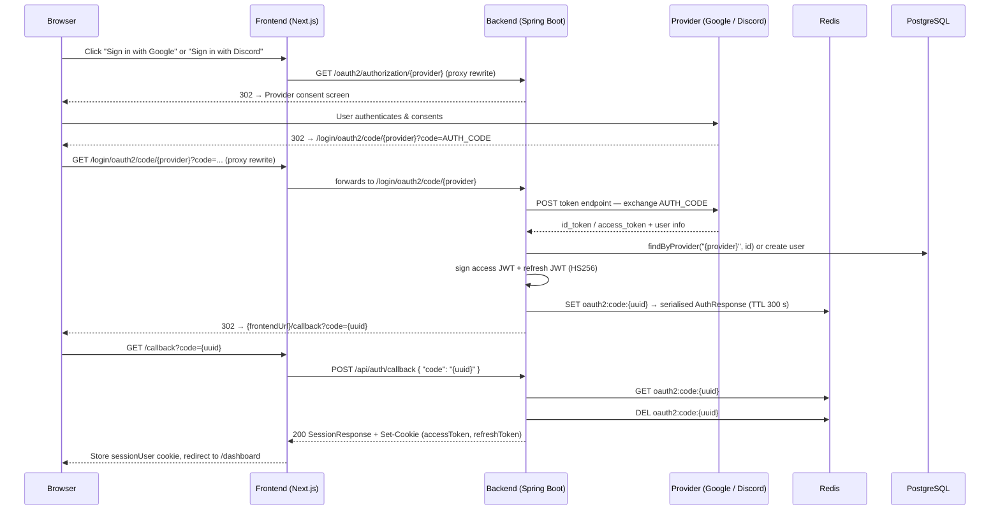
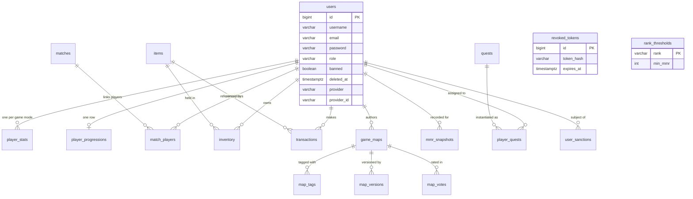
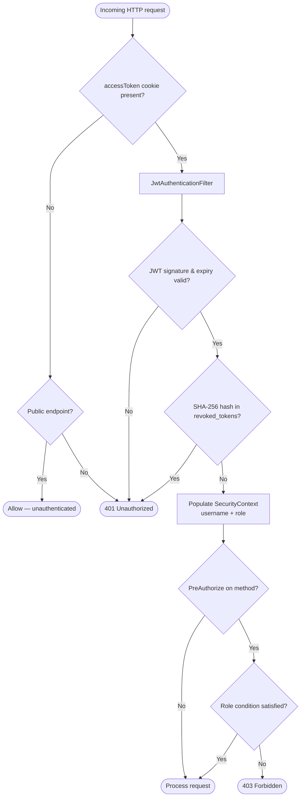

# GameDash — Technical Documentation (English)

> 🇫🇷 **Version française :** [Documentation Technique (Français)](TECHNICAL_DOCUMENTATION_FR.md)

> **Document scope:** API & Transactions · Database · Security · Matchmaking Algorithm  
> **Codebase:** Spring Boot 3 backend · Next.js 14 frontend · PostgreSQL 15 · Redis 6.x  
> **Deployment target:** Azure Container Apps (Spain Central)

---

## Table of Contents

1. [API & Transactions](#1-api--transactions)
   - 1.1 [Endpoint Inventory](#11-endpoint-inventory)
   - 1.2 [Request / Response Schemas](#12-request--response-schemas)
   - 1.3 [Transaction Boundaries](#13-transaction-boundaries)
   - 1.4 [Error Model](#14-error-model)
   - 1.5 [Rate Limiting, Pagination, and Versioning](#15-rate-limiting-pagination-and-versioning)
2. [Database](#2-database)
   - 2.1 [Schema Overview](#21-schema-overview)
   - 2.2 [Indexing Strategy and Rationale](#22-indexing-strategy-and-rationale)
   - 2.3 [Migration Process](#23-migration-process)
   - 2.4 [Backup, Retention, and Recovery](#24-backup-retention-and-recovery)
   - 2.5 [Data Classification](#25-data-classification)
3. [Security](#3-security)
   - 3.1 [Authentication & Authorization Model](#31-authentication--authorization-model)
   - 3.2 [Transport and At-Rest Encryption](#32-transport-and-at-rest-encryption)
   - 3.3 [Input Validation, Output Encoding, OWASP Top 10](#33-input-validation-output-encoding-and-owasp-top-10)
   - 3.4 [Secrets Management](#34-secrets-management)
   - 3.5 [Audit Logging and Incident Response](#35-audit-logging-and-incident-response)
   - 3.6 [GDPR Compliance Notes](#36-gdpr-compliance-notes)
4. [Matchmaking Algorithm](#4-matchmaking-algorithm)
   - 4.1 [System Overview](#41-system-overview)
   - 4.2 [Data Structures](#42-data-structures)
   - 4.3 [Queue Operations](#43-queue-operations)
   - 4.4 [Pairing Algorithm](#44-pairing-algorithm)
   - 4.5 [ELO Rating System](#45-elo-rating-system)
   - 4.6 [Match Result — Two-Phase Consensus](#46-match-result--two-phase-consensus)
   - 4.7 [Reward Disbursement](#47-reward-disbursement)
   - 4.8 [Concurrency Model](#48-concurrency-model)
   - 4.9 [Startup & Configuration Refresh](#49-startup--configuration-refresh)
   - 4.10 [Known Limitations & Future Work](#410-known-limitations--future-work)

---

## 1. API & Transactions

### Sequence Diagram — OAuth2 Social Login Flow (Google / Discord)



---

### 1.1 Endpoint Inventory

Authentication and health endpoints are public. All other endpoints require a valid access-token cookie. The ADMIN/STAFF column reflects additional role guards beyond basic authentication.

#### Authentication — `/api/auth/**` (public)

| Method | Path | Role guard | Purpose |
|--------|------|-----------|---------|
| POST | `/api/auth/register` | — | Create account; return session cookies |
| POST | `/api/auth/login` | — | Credential login; return session cookies |
| POST | `/api/auth/refresh` | — | Rotate token pair from refresh cookie |
| POST | `/api/auth/logout` | — | Blacklist tokens; clear cookies |
| POST | `/api/auth/callback` | — | Redeem OAuth2 one-time code for session |
| GET  | `/api/auth/oauth2/failure` | — | OAuth2 error passthrough redirect |
| GET  | `/api/auth/steam` | — | Initiate Steam OpenID 2.0 redirect |
| GET  | `/api/auth/steam/callback` | — | Validate Steam assertion; issue tokens |

#### Users — `/api/users/**`

| Method | Path | Role guard | Purpose |
|--------|------|-----------|---------|
| GET    | `/api/users/me` | authenticated | Own full profile |
| PATCH  | `/api/users/me` | authenticated | Update username, bio, region, language |
| DELETE | `/api/users/me` | authenticated | Soft-delete account; revoke tokens |
| POST   | `/api/users/me/avatar` | authenticated | Upload profile picture (multipart/form-data) |
| PATCH  | `/api/users/me/preferences` | authenticated | Update preferred game mode / language |
| GET    | `/api/users/{userId}` | authenticated | Public profile of another user |

#### Matchmaking — `/api/matchmaking/**`

| Method | Path | Role guard | Purpose |
|--------|------|-----------|---------|
| POST   | `/api/matchmaking/queue/join` | authenticated | Join a game-mode queue |
| GET    | `/api/matchmaking/queue/status` | authenticated | Current queue position / state |
| DELETE | `/api/matchmaking/queue/leave` | authenticated | Leave queue |
| GET    | `/api/matchmaking/matches/{id}` | authenticated | Match detail (participants or ADMIN/STAFF) |
| POST   | `/api/matchmaking/matches/{id}/result` | authenticated | Submit match outcome (consensus required) |
| GET    | `/api/matchmaking/history` | authenticated | Paginated match history; filters: `gameMode`, `from`, `to` |

#### MMR & Leaderboard — `/api/mmr/**`

| Method | Path | Role guard | Purpose |
|--------|------|-----------|---------|
| GET | `/api/mmr/me` | authenticated | Own stats per game mode |
| GET | `/api/mmr/players/{userId}` | authenticated | Another player's stats |
| GET | `/api/mmr/leaderboard` | authenticated | Top-N ranking (`gameMode`, `limit` params) |
| GET | `/api/mmr/me/history` | authenticated | Own MMR progression time series |
| GET | `/api/mmr/players/{userId}/history` | authenticated | Another player's MMR time series |

#### Shop & Inventory — `/api/shop/**`

| Method | Path | Role guard | Purpose |
|--------|------|-----------|---------|
| GET   | `/api/shop` | authenticated | Available items catalogue |
| POST  | `/api/shop/purchase/{itemId}` | authenticated | Purchase item with soft currency |
| GET   | `/api/shop/inventory` | authenticated | Own inventory |
| GET   | `/api/shop/transactions` | authenticated | Paginated purchase history |
| PATCH | `/api/shop/inventory/{id}/equip` | authenticated | Toggle equipped state |

#### Maps — `/api/maps/**`

| Method | Path | Role guard | Purpose |
|--------|------|-----------|---------|
| GET    | `/api/maps` | **public** | Paginated map listing; filters: `search`, `status` |
| GET    | `/api/maps/{id}` | **public** | Single map detail |
| GET    | `/api/maps/creators/{userId}/stats` | **public** | Creator aggregated stats |
| GET    | `/api/maps/my` | authenticated | Own maps |
| POST   | `/api/maps` | authenticated | Create map |
| POST   | `/api/maps/{id}/versions` | authenticated | Publish new version |
| GET    | `/api/maps/{id}/versions` | authenticated | Version history |
| POST   | `/api/maps/{id}/vote` | authenticated | Rate map (1–5) |
| POST   | `/api/maps/{id}/test` | authenticated | Mark as play-tested |
| POST   | `/api/maps/{id}/screenshots` | authenticated | Upload screenshot (multipart) |
| DELETE | `/api/maps/{id}/screenshots` | authenticated | Remove screenshot by URL |
| POST   | `/api/maps/{id}/favorite` | authenticated | Toggle favorite |
| GET    | `/api/maps/{id}/favorite` | authenticated | Check if favorited |
| GET    | `/api/maps/{id}/tested` | authenticated | Check if caller has tested |
| POST   | `/api/maps/{id}/report` | authenticated | Report a map |
| PATCH  | `/api/maps/{id}/status` | ADMIN / STAFF | Change map status |

#### Quests — `/api/quests/**`

| Method | Path | Role guard | Purpose |
|--------|------|-----------|---------|
| GET  | `/api/quests/my` | authenticated | Active quests; auto-assigned if slots empty |
| POST | `/api/quests/{id}/claim` | authenticated | Claim reward of a completed quest |

#### Progression — `/api/progression/**`

| Method | Path | Role guard | Purpose |
|--------|------|-----------|---------|
| GET | `/api/progression/me` | authenticated | Full progression (level, XP, currency) |
| GET | `/api/progression/players/{userId}` | authenticated | Public progression (level, XP only) |

#### Backoffice — `/api/backoffice/**` (ADMIN or STAFF)

| Method | Path | Role guard | Purpose |
|--------|------|-----------|---------|
| GET  | `/api/backoffice/stats` | ADMIN / STAFF | Platform dashboard metrics |
| GET  | `/api/backoffice/rank-thresholds` | ADMIN / STAFF | Current MMR→rank mapping |
| PUT  | `/api/backoffice/rank-thresholds` | **ADMIN only** | Overwrite all 15 tier thresholds |
| GET  | `/api/backoffice/stats/rank-distribution` | ADMIN / STAFF | Rank distribution histogram |
| GET  | `/api/backoffice/matchmaking-config` | ADMIN / STAFF | Matchmaking parameters per game mode |
| PUT  | `/api/backoffice/matchmaking-config` | **ADMIN only** | Update matchmaking parameters |
| GET  | `/api/backoffice/users` | ADMIN / STAFF | Search users by name or email |
| GET  | `/api/backoffice/users/{userId}/sanctions` | ADMIN / STAFF | Sanction history |
| POST | `/api/backoffice/users/{userId}/ban` | **ADMIN only** | Ban user |
| POST | `/api/backoffice/users/{userId}/unban` | **ADMIN only** | Unban user |
| GET  | `/api/backoffice/economy/items` | ADMIN / STAFF | Full item catalogue |
| POST | `/api/backoffice/economy/items` | **ADMIN only** | Create item |
| PUT  | `/api/backoffice/economy/items/{itemId}` | **ADMIN only** | Update item |
| PATCH | `/api/backoffice/economy/items/{itemId}/availability` | **ADMIN only** | Toggle item availability |
| GET  | `/api/backoffice/economy/revenue` | ADMIN / STAFF | Revenue statistics |
| GET  | `/api/backoffice/maps` | ADMIN / STAFF | Map list (filter: status, search, onlyReported) |
| POST | `/api/backoffice/maps/{mapId}/feature` | ADMIN / STAFF | Toggle featured flag |
| GET  | `/api/backoffice/maps/reports` | ADMIN / STAFF | Unresolved map reports |
| POST | `/api/backoffice/maps/reports/{reportId}/resolve` | ADMIN / STAFF | Resolve a report |

#### Health

| Method | Path | Role guard | Purpose |
|--------|------|-----------|---------|
| GET | `/actuator/health` | **public** | Liveness probe (component detail suppressed) |

---

### 1.2 Request / Response Schemas

#### POST `/api/auth/register`

```json
// Request
{
  "username": "gamer42",
  "email": "gamer@example.com",
  "password": "Str0ng!Pass"
}

// Response 201 Created
// Set-Cookie: accessToken=<jwt>; HttpOnly; Path=/api; SameSite=Lax; Max-Age=3600
// Set-Cookie: refreshToken=<jwt>; HttpOnly; Path=/api/auth; SameSite=Lax; Max-Age=604800
{
  "userId": 7,
  "username": "gamer42",
  "role": "PLAYER"
}
```

#### POST `/api/auth/login`

```json
// Request
{
  "usernameOrEmail": "gamer42",
  "password": "Str0ng!Pass"
}

// Response 200 — same SessionResponse shape as register
```

#### POST `/api/auth/refresh`

```json
// Request body (optional — cookie takes precedence)
{
  "refreshToken": "<raw-token-for-non-browser-clients>"
}

// Response 200 — new cookies issued; same SessionResponse body
```

#### POST `/api/auth/callback` (OAuth2 code exchange)

```json
// Request
{
  "code": "550e8400-e29b-41d4-a716-446655440000"
}

// Response 200 — same SessionResponse shape + new cookies
```

#### POST `/api/matchmaking/queue/join`

```json
// Request
{ "gameMode": "RANKED" }

// Response 200
{
  "status": "QUEUED",
  "gameMode": "RANKED",
  "position": 3
}
```

#### POST `/api/matchmaking/matches/{id}/result`

```json
// Request
{
  "winnerId": 7,
  "durationSeconds": 342
}

// Response 200 — after both players confirm (consensus)
{
  "matchId": 55,
  "newMmr": 1150,
  "rankChange": "SILVER_III",
  "xpGained": 120
}

// Response 200 — first reporter only; second player must confirm
{
  "matchId": 55,
  "status": "AWAITING_CONFIRMATION"
}
```

#### POST `/api/shop/purchase/{itemId}`

```json
// Response 200
{
  "id": 88,
  "userId": 7,
  "itemId": 12,
  "pricePaid": 250,
  "currencyType": "SOFT",
  "createdAt": "2025-11-14T10:30:00Z"
}
```

#### GET `/api/matchmaking/history` — paginated envelope (applies to all `Page<T>` responses)

```json
{
  "content": [
    {
      "id": 55,
      "gameMode": "RANKED",
      "status": "FINISHED",
      "winnerId": 7,
      "createdAt": "2025-11-14T09:00:00Z",
      "durationSeconds": 342
    }
  ],
  "pageable": { "pageNumber": 0, "pageSize": 20 },
  "totalElements": 87,
  "totalPages": 5,
  "first": true,
  "last": false
}
```

Query parameters: `page` (default 0), `size` (default 20, max 100), `sort` (e.g. `createdAt,desc`).

---

### 1.3 Transaction Boundaries

#### Shop purchase — `ShopService.purchase()`

All five steps execute within a single `@Transactional` database transaction:

1. Read soft-currency balance from `player_progressions`.
2. Verify item availability in `items`.
3. Check `inventory` for an existing row — reject if already owned.
4. Insert row into `transactions` (purchase ledger).
5. Insert row into `inventory`; deduct currency from `player_progressions`.

**Rollback trigger:** any exception in steps 1–5 rolls back all writes. The `UNIQUE (user_id, item_id)` constraint on `inventory` acts as a last-resort idempotency guard — a duplicate request fails at step 3 with a business exception, not a silent double-charge.

#### Quest reward claim — `QuestService.claimReward()`

1. Verify `player_quests.completed = TRUE` and `claimed = FALSE`.
2. Set `claimed = TRUE`.
3. Grant `reward_xp` and `reward_coins` via `ProgressionService` (updates `player_progressions`).
4. Evaluate level-up condition; increment `level` if threshold crossed.

Single `@Transactional`. The `claimed` flag is the idempotency guard — a second call to the same quest ID throws before any mutation.

#### Match result consensus — `MatchmakingService.reportResult()`

Two-phase commit at the application level (V20 migration):

- **Phase 1 (first reporter):** Sets `matches.first_reporter_id` and `matches.claimed_winner_id`. No rewards are disbursed.
- **Phase 2 (second reporter):** Validates that both reporters agree on `winnerId`. On agreement:
  1. Set `matches.status = FINISHED`, `winner_id = agreed_winner`.
  2. Apply ELO delta to `player_stats.mmr` for all participants.
  3. Insert `mmr_snapshots` rows.
  4. Trigger XP grants via `ProgressionService`.

If reports conflict, the match is flagged for admin review. The entire Phase 2 block runs in a single `@Transactional`.

#### Token revocation — `TokenBlacklistService.revoke()`

Single `INSERT INTO revoked_tokens` per token, isolated from the calling transaction. If this insert fails (e.g., database unavailable), cookies are still cleared on the client. The token expires naturally within its declared TTL.

---

### 1.4 Error Model

**Business exceptions** are translated by a global `@ControllerAdvice` handler:

```json
{
  "error": "Bad Request",
  "message": "Invalid or expired authorization code",
  "status": 400
}
```

**Unauthenticated** (no valid JWT):

```json
{ "error": "Unauthorized" }
```
HTTP 401. The `authenticationEntryPoint` returns this directly; Spring Security does not redirect to `/login`.

**Forbidden** (authenticated but insufficient role): HTTP 403, empty body.

**Bean Validation failure** (malformed request body): HTTP 400 with field-level detail:

```json
{
  "status": 400,
  "errors": {
    "username": "size must be between 3 and 30",
    "password": "must not be blank"
  }
}
```

**Client handling guidance:**

| HTTP Status | Recommended action |
|-------------|-------------------|
| 400 | Surface field errors to the user; do not retry |
| 401 | Attempt one silent `POST /api/auth/refresh`; on second 401, redirect to `/login` |
| 403 | Display permission-denied message; do not retry |
| 429 | Back off; respect `Retry-After` header |
| 5xx | Retry with exponential back-off (max 3 attempts) |

---

### 1.5 Rate Limiting, Pagination, and Versioning

#### Rate limits

Enforced per source IP. Set `RATE_LIMIT_TRUSTED_PROXIES` to the reverse-proxy IP so that `X-Forwarded-For` is used for real client IP extraction when behind Azure Container Apps ingress or the Next.js proxy.

| Endpoint group | Default limit | Window |
|----------------|--------------|--------|
| `POST /api/auth/login` | 10 requests | 60 s |
| `POST /api/auth/register` | 5 requests | 60 s |
| `POST /api/auth/refresh` | 20 requests | 60 s |
| `POST /api/auth/callback` | 10 requests | 60 s |

All limits are configurable via environment variables (`RATE_LIMIT_LOGIN`, `RATE_LIMIT_REGISTER`, `RATE_LIMIT_REFRESH`, `RATE_LIMIT_CALLBACK`, `RATE_LIMIT_WINDOW`).

#### Pagination

Uses Spring Data's `Pageable` mechanism. All collection endpoints that can return large result sets are paginated.

| Parameter | Default | Maximum |
|-----------|---------|---------|
| `page` | 0 | — |
| `size` | 20 | 100 |
| `sort` | endpoint-specific | — |

The `max-page-size: 100` hard cap is enforced in `application.yml` and prevents unbounded result sets regardless of the `size` parameter.

#### Versioning

No versioning strategy is currently implemented. All routes are under the unversioned `/api/` prefix. A breaking change requires coordinated frontend/backend deployment. The recommended path forward is a URL-based prefix (`/api/v2/`) introduced with the first breaking change, with the unversioned routes aliased to v1 during a transition period.

---

## 2. Database

### ER Diagram (simplified — principal entities and relationships)



---

### 2.1 Schema Overview

PostgreSQL 15 (Azure Flexible Server). Hibernate is configured in `validate` mode — it verifies that JPA entities match the physical schema at startup but never modifies the schema. Flyway is the sole schema authority.

#### `users`

Central entity. Supports both local credentials (`password`, BCrypt hash) and SSO (`provider` + `provider_id`). Soft-delete is implemented via `deleted_at` (NULL = active); the `banned` flag suspends access without destroying data.

```sql
-- Key columns (see V1 + V3 for full definition)
id             BIGSERIAL PRIMARY KEY
username       VARCHAR(30)  NOT NULL UNIQUE
email          VARCHAR(255) NOT NULL UNIQUE
password       VARCHAR(255) NOT NULL          -- BCrypt hash
role           VARCHAR(20)  NOT NULL DEFAULT 'PLAYER'
banned         BOOLEAN      NOT NULL DEFAULT FALSE
deleted_at     TIMESTAMPTZ                    -- NULL means active
provider       VARCHAR(50)                    -- 'google' | 'steam' | NULL
provider_id    VARCHAR(100)                   -- opaque SSO subject
```

A partial unique index `idx_users_provider_unique` on `(provider, provider_id) WHERE NOT NULL` enforces one account per SSO identity without affecting local accounts.

#### `player_stats`

One row per `(user_id, game_mode)`. Stores current MMR and the computed rank tier string. Rank is recalculated against `rank_thresholds` on every MMR update.

#### `player_progressions`

One row per user. Holds level, XP, `xp_to_next_level`, and soft-currency balance. Protected by an optimistic-lock `version` column (V9) to prevent lost updates under concurrent requests.

#### `matches` + `match_players`

`matches` owns the lifecycle: `PENDING → IN_PROGRESS → FINISHED`. The two consensus columns (`first_reporter_id`, `claimed_winner_id`) were added in V20 to enforce dual-player result confirmation before rewards are disbursed. `match_players` is a join table; a player's full history is retrieved via the `idx_match_players_user` index.

#### `items` + `inventory` + `transactions`

`items` is the shop catalogue. `inventory` tracks ownership with a `UNIQUE (user_id, item_id)` constraint. `transactions` is an **append-only purchase ledger** — `item_id` uses `ON DELETE RESTRICT` to preserve purchase history even if the item is later removed from the catalogue.

#### `game_maps`

Community-created maps. `status` ∈ {DRAFT, PUBLISHED, HIDDEN, FEATURED}. `test_count`, `favorite_count`, and `average_rating` are denormalised aggregates updated on mutation to avoid expensive aggregation queries at read time. The public listing endpoint silently filters out `HIDDEN` maps regardless of the `status` query parameter.

#### `rank_thresholds`

15-row configuration table. Seeded in V4 with values previously hard-coded in `Rank.java`. Loaded into an in-memory cache on startup and refreshed live through `PUT /api/backoffice/rank-thresholds`.

```sql
-- Default thresholds (V4 seed)
('BRONZE_III', 0), ('BRONZE_II', 300), ('BRONZE_I', 600),
('SILVER_III', 900), ('SILVER_II', 1100), ('SILVER_I', 1300),
('GOLD_III', 1500), ('GOLD_II', 1700), ('GOLD_I', 1900),
('PLATINUM_III', 2100), ('PLATINUM_II', 2300), ('PLATINUM_I', 2500),
('DIAMOND', 2800), ('MASTER', 3200), ('GRANDMASTER', 3600)
```

#### `mmr_snapshots`

Append-only time series. One row is inserted per participant per completed match. Never updated. Feeds the MMR progression curve on the profile page.

#### `quests` + `player_quests`

`quests` is a static catalogue (two types: DAILY, WEEKLY; six entries seeded in V7–V8). `player_quests` is the per-user assignment. `expires_at` drives daily/weekly rotation — the service auto-assigns new quests when the active slot is empty or expired.

#### `revoked_tokens`

JWT blacklist. Stores SHA-256 hex digests of revoked tokens (V21 replaced full token text with fixed-length hashes). A scheduled job purges rows where `expires_at < NOW()` hourly, keeping the table size proportional to active (not yet naturally expired) revocations.

#### `user_sanctions`

Append-only audit log for ban/unban actions. `admin_id` is nullable — the record survives admin account deletion (`ON DELETE SET NULL`). Never modified after insertion.

---

### 2.2 Indexing Strategy and Rationale

| Index name | Table | Columns | Purpose |
|-----------|-------|---------|---------|
| `idx_player_stats_user` | player_stats | user_id | Profile stats lookup |
| `idx_player_stats_mode_mmr` | player_stats | (game_mode, mmr DESC) | Leaderboard sort without full-table scan |
| `idx_match_players_match` | match_players | match_id | Fetch participants of a match |
| `idx_match_players_user` | match_players | user_id | Per-player match history |
| `idx_matches_status` | matches | status | Queue management (filter PENDING/IN_PROGRESS) |
| `idx_matches_created_at` | matches | created_at DESC | Date-range history filter |
| `idx_inventory_user` | inventory | user_id | Inventory page load |
| `idx_transactions_user_created` | transactions | (user_id, created_at DESC) | Chronological purchase history |
| `idx_game_maps_author` | game_maps | author_id | "My maps" listing |
| `idx_game_maps_status` | game_maps | status | Public map listing with status filter |
| `idx_map_votes_map_id` | map_votes | map_id | Average rating recalculation |
| `idx_map_versions_map` | map_versions | map_id | Version history per map |
| `idx_mmr_snapshots_user_mode_time` | mmr_snapshots | (user_id, game_mode, recorded_at ASC/DESC) | Time-ordered progression curve (two indexes, V4 + V10) |
| `idx_player_quests_user_expires` | player_quests | (user_id, expires_at) | Active quest lookup; expiry-based rotation |
| `idx_revoked_tokens_hash` | revoked_tokens | token_hash | O(1) blacklist check per request |
| `idx_revoked_tokens_expires_at` | revoked_tokens | expires_at | Efficient hourly cleanup scan |
| `idx_user_sanctions_subject` | user_sanctions | (subject_id, created_at DESC) | Chronological sanction history |
| `idx_users_provider_unique` | users | (provider, provider_id) WHERE NOT NULL | SSO account deduplication |

All indexes use PostgreSQL's default B-tree structure. Composite indexes are ordered to support the dominant query pattern (filter first, sort second).

---

### 2.3 Migration Process

Flyway is configured as follows:

```yaml
spring:
  flyway:
    enabled:             true
    locations:           classpath:db/migration
    baseline-on-migrate: true
    validate-on-migrate: true
```

Migration scripts live at `src/main/resources/db/migration/` and follow the naming convention `V{n}__{description}.sql`. Twenty-one migrations exist as of this document (V1–V21).

**Startup sequence:**

```
Application start
  └─▶ Flyway scans classpath:db/migration
      ├─▶ validate-on-migrate: compare applied checksums
      │     └─▶ Checksum mismatch → FATAL: startup aborted
      └─▶ Apply pending scripts in version order (each in own transaction)
          └─▶ Hibernate validates JPA entities against physical schema
                └─▶ Validation failure → FATAL: startup aborted
                    Application ready ✓
```

**Authoring rules:**

1. Never modify a committed migration file. Create `V{n+1}` for corrections.
2. Destructive operations (DROP COLUMN, data transformation) require explicit steps — do not rely on `ALTER TABLE … SET DEFAULT` to migrate existing rows implicitly.
3. `baseline-on-migrate: true` allows the first deployment against an existing database to mark the current state as the baseline without replaying V1.
4. Test migrations locally against a PostgreSQL instance matching the target version before pushing.

---

### 2.4 Backup, Retention, and Recovery

> **Assumption:** Azure Database for PostgreSQL Flexible Server, Spain Central.

**Automated backups:** Full weekly backups + transaction log backups every 5 minutes (Azure managed). Default retention: 7 days. Configurable up to 35 days in the Azure portal.

**Point-in-time restore (PITR):** Any timestamp within the retention window can be restored to a new server instance. Target RPO: 5 minutes.

**Recovery procedure:**

```powershell
# 1. Restore to a new server via Azure CLI
az postgres flexible-server restore `
  --resource-group <RG> `
  --name <new-server-name> `
  --source-server <original-server-name> `
  --restore-time "2025-11-14T08:00:00Z"

# 2. Update the Container App secret to point to the new host
az containerapp secret set --name gamedash-backend `
  --resource-group <RG> `
  --secrets "db-url=jdbc:postgresql://<new-host>:5432/gamedash?sslmode=require"

# 3. Deploy a new revision to pick up the updated secret
az containerapp update --name gamedash-backend `
  --resource-group <RG> --revision-suffix "recovery-v1"
```

Flyway will **validate** (not re-run) migrations on startup — the schema is already in place on the restored server.

**Manual snapshots:** Use `pg_dump` for point-in-time exports. Store encrypted dumps in Azure Blob Storage with an immutable storage policy and a separate retention lifecycle.

---

### 2.5 Data Classification

| Classification | Fields | Table(s) |
|---------------|--------|---------|
| PII — direct identifier | `email`, `username` | `users` |
| PII — indirect | `avatar_url`, `bio`, `region`, `provider_id` | `users` |
| Credentials | `password` (BCrypt hash — not recoverable) | `users` |
| Behavioural / analytics | match results, MMR history, purchase history | `matches`, `player_stats`, `mmr_snapshots`, `transactions` |
| Platform-sensitive | `banned`, `deleted_at`, `provider`, `role` | `users` |
| Audit trail | sanction type, reason, admin identity | `user_sanctions` |
| Transient security | token hash, expiry | `revoked_tokens` |

Fields in the PII rows are subject to GDPR right-of-access and right-of-erasure obligations (see Section 3.6).

---

## 3. Security

### Authentication Flow Diagram



---

### 3.1 Authentication & Authorization Model

#### Token architecture

| Token | Algorithm | TTL | Cookie path | Contains |
|-------|-----------|-----|-------------|---------|
| Access JWT | HS256 | 1 hour | `/api` | `sub`, `role`, `typ=access`, `iat`, `exp` |
| Refresh JWT | HS256 | 7 days | `/api/auth` | `sub`, `typ=refresh`, `iat`, `exp` |

Both tokens are signed with a 32-byte key decoded from the Base64 value of `JWT_SECRET`. The algorithm is pinned to HS256 explicitly in `JwtTokenProvider` — JJWT's auto-selection based on key size is disabled.

Cookies carry `HttpOnly`, `SameSite=Lax`, and `Secure` (conditional on `COOKIE_SECURE=true` in production). Path scoping ensures the refresh token is never sent to non-auth API endpoints, limiting its exposure surface.

#### OAuth2 session handling

Google OIDC and Discord OAuth2 logins require a server-side session to carry the CSRF state parameter between the authorization redirect and the callback. Spring Session stores this in Redis (`gamedash:session` namespace, 300-second TTL). After the callback and JWT issuance, the session is no longer used; all subsequent requests are fully stateless.

Steam authentication uses a custom stateless controller (`SteamAuthController`) that validates the OpenID 2.0 assertion via a back-channel POST to Steam — no server-side session is created.

#### Role and permission matrix

| Capability | PLAYER | STAFF | ADMIN |
|-----------|--------|-------|-------|
| Own profile read / write | ✓ | ✓ | ✓ |
| Join matchmaking, submit results | ✓ | ✓ | ✓ |
| View public maps and leaderboard | ✓ | ✓ | ✓ |
| Backoffice dashboard stats | | ✓ | ✓ |
| Search users, view sanctions | | ✓ | ✓ |
| Feature / hide maps, resolve reports | | ✓ | ✓ |
| Update rank thresholds | | | ✓ |
| Ban / unban users | | | ✓ |
| Create / update shop items | | | ✓ |
| Update matchmaking config | | | ✓ |

Role enforcement is intentionally two-layered:
- **Path level** — `SecurityFilterChain` requires `ROLE_ADMIN` or `ROLE_STAFF` for all `/api/backoffice/**` paths.
- **Method level** — `@PreAuthorize("hasRole('ADMIN')")` on destructive operations.

A vulnerability in one layer cannot alone bypass the other.

#### Token revocation

On logout or account deletion, both tokens are revoked:

```java
// TokenBlacklistService — stores SHA-256 hex digest, not the raw token
String hash = sha256Hex(rawToken);
revokedTokenRepository.save(new RevokedToken(hash, expiry));
```

Every authenticated request performs one indexed lookup:
```sql
SELECT 1 FROM revoked_tokens
WHERE token_hash = :hash AND expires_at > NOW()
```

An hourly scheduled job purges expired rows to keep the table small.

---

### 3.2 Transport and At-Rest Encryption

**In transit:**

| Connection | Protocol | Notes |
|-----------|----------|-------|
| Browser → Container Apps ingress | TLS 1.2+ | Enforced by Azure; HTTP redirect to HTTPS |
| Backend → PostgreSQL | TLS | `sslmode=require` in JDBC URL |
| Backend → Redis | TLS | Port 6380; `REDIS_SSL=true` |
| Next.js → Backend (internal) | HTTP | Internal Container Apps virtual network; TLS not enforced on this hop |

**At rest:**

- PostgreSQL: Azure-managed AES-256 (platform keys).
- Redis: Azure-managed encryption at rest.
- Application-level field encryption: not implemented.

**Passwords:** BCrypt-hashed by Spring Security's `PasswordEncoder` at registration time. Raw passwords are never stored, logged, or returned in any API response.

---

### 3.3 Input Validation, Output Encoding, and OWASP Top 10

| OWASP | Risk | Mitigation in codebase |
|-------|------|----------------------|
| A01 Broken Access Control | Unauthorised data access | JWT + `@PreAuthorize`; `PublicProfileDto` strips email, banned flag, provider details, last-login; HIDDEN map status forcibly excluded from public filter |
| A02 Cryptographic Failures | Weak credential storage | BCrypt with Spring default work factor; HS256 with 256-bit key; no raw tokens in redirect URLs (opaque code via Redis) |
| A03 Injection | SQL injection | Spring Data JPA / JPQL throughout; no native string-concatenated SQL; parameterised queries enforced by ORM |
| A04 Insecure Design | Business logic bypass | Purchase idempotency via DB UNIQUE constraint; quest-claim idempotency via `claimed` flag; match consensus prevents solo result manipulation |
| A05 Security Misconfiguration | CSRF, permissive CORS | CSRF disabled (JWT `SameSite=Lax` cookies make CSRF moot for browser flows); CORS restricted to `ALLOWED_ORIGINS`; `HIDDEN` map guard is enforced server-side regardless of query params |
| A07 Identification Failures | Token replay / session fixation | SHA-256 blacklist checked per request; `SameSite=Lax` prevents cross-site cookie submission; OIDC state in short-lived Redis session prevents replay |
| A08 Integrity Failures | Tampered schema migrations | Flyway `validate-on-migrate: true` — checksum mismatch aborts startup |
| A09 Logging Failures | Insufficient audit trail | `user_sanctions` table for all bans; `transactions` ledger for purchases; Spring Security logs auth events; `@Slf4j` WARN on token failures |
| A10 SSRF | Server-side request forgery | Steam OpenID validates assertion via back-channel call to a hard-coded Steam URL — not a user-supplied URL |

**Bean Validation (`@Valid`)** is applied to all request bodies. Violations produce a structured 400 response before the service layer is reached.

**Output filtering:** JSON serialisation via Jackson. DTOs (`PublicProfileDto`, `MeDto`) explicitly exclude internal fields. No hand-built HTML output exists in the codebase.

---

### 3.4 Secrets Management

**Production — Azure Container Apps:**

Secrets are stored in the Container Apps secret store and injected as environment variables via `secretref:` bindings. The plaintext value is never visible in the environment-variable manifest.

| Secret name | Environment variable | Description |
|------------|---------------------|-------------|
| `db-password` | `SPRING_DATASOURCE_PASSWORD` | PostgreSQL user password |
| `redis-password` | `REDIS_PASSWORD` | Redis primary access key |
| `jwt-secret` | `JWT_SECRET` | HS256 signing key (Base64-encoded, 32 decoded bytes) |
| `google-secret` | `GOOGLE_CLIENT_SECRET` | Google OAuth2 client secret |
| `discord-secret` | `DISCORD_CLIENT_SECRET` | Discord OAuth2 client secret |
| `steam-api-key` | `STEAM_API_KEY` | Steam Web API key |

**Key rotation procedure:**

```powershell
# Step 1 — update the secret value
az containerapp secret set `
  --resource-group <RG> --name gamedash-backend `
  --secrets "jwt-secret=<new-base64-key>"

# Step 2 — deploy a new revision that picks up the updated secret
az containerapp update `
  --resource-group <RG> --name gamedash-backend `
  --set-env-vars "JWT_SECRET=secretref:jwt-secret" `
  --revision-suffix "key-rotation-v1"
```

**Local development:**

`src/main/resources/application-local.yml` is gitignored and listed in `.dockerignore`. It is never committed and never baked into a container image. The production image reads all credentials from environment variables injected at runtime.

---

### 3.5 Audit Logging and Incident Response

**Database audit records:**

| Table | Event | Retention |
|-------|-------|---------|
| `user_sanctions` | Every ban / unban (type, reason, admin) | Permanent (append-only) |
| `transactions` | Every purchase (item, price, currency) | Permanent (`ON DELETE RESTRICT`) |
| `mmr_snapshots` | Every MMR change (value, game mode, time) | Permanent (append-only) |
| `revoked_tokens` | Token revocation with natural expiry | Until `expires_at` |

**Application log events (SLF4J / Logback):**

| Level | Event |
|-------|-------|
| INFO | Successful login, OAuth2 login (user identifier), registration |
| WARN | JWT validation failure, rate-limit breach, failed Steam assertion |
| ERROR | Steam login exception, OAuth2 code deserialisation failure |

Log level is controlled by `LOG_LEVEL` env var (default `INFO`). Azure Container Apps streams stdout/stderr to Log Analytics Workspace; alert rules on `level=WARN`/`ERROR` patterns are recommended.

**Incident response actions:**

| Scenario | Action |
|---------|--------|
| Compromised access token | Insert SHA-256 hash into `revoked_tokens` with the token's `exp` timestamp — effective immediately on next request |
| Compromised account | `POST /api/backoffice/users/{id}/ban` — sets `banned=TRUE`; subsequent logins rejected in `AuthService.login()` |
| Compromised JWT secret | Rotate `jwt-secret` (see Section 3.4); all existing tokens become invalid immediately (signature verification fails) |
| Database breach | Rotate all DB credentials; passwords are BCrypt hashes — direct decryption is infeasible; revoke OAuth2 tokens with providers |

---

### 3.6 GDPR Compliance Notes

| GDPR Article | Obligation | Current implementation |
|-------------|-----------|----------------------|
| Art. 15 | Right of access | `GET /api/users/me`, `/api/shop/transactions`, `/api/matchmaking/history` provide full personal data |
| Art. 17 | Right of erasure | `DELETE /api/users/me` soft-deletes the account (`deleted_at = NOW()`), revokes tokens, clears cookies |
| Art. 5(1)(c) | Data minimisation | `GET /api/users/{userId}` returns only display name, avatar, region, and stats — email, banned flag, provider details excluded |
| Art. 25 | Privacy by design | SSO stores only the opaque `provider_id`; no Google/Steam OAuth tokens are persisted |
| Art. 46 | Data residency | All data in Azure Spain Central (EU) |

**Known gap — hard erasure:** Account deletion is currently a soft-delete. The `user_sanctions`, `transactions`, and `mmr_snapshots` tables retain rows referencing the deleted user ID. Before handling real user data in production, a hard-erasure or anonymisation pipeline must be implemented to satisfy Art. 17 for these linked records. The `ON DELETE CASCADE` on most tables means a hard delete of the `users` row would cascade automatically; the exceptions are `transactions` (`ON DELETE CASCADE`) and `user_sanctions` (`ON DELETE CASCADE` for subject; `ON DELETE SET NULL` for admin).

---

## 4. Matchmaking Algorithm

> **Source:** `gamedash-backend/src/main/java/com/gamedash/matchmaking/service/MatchmakingService.java`  
> **Related:** `MmrService.java` · `ProgressionService.java` · `QuestService.java`

---

### 4.1 System Overview

```
┌─────────────────────────────────────────────────────────────────┐
│  Player A                       Player B                        │
│  POST /matchmaking/queue/join   POST /matchmaking/queue/join    │
└──────────────┬──────────────────────────────┬───────────────────┘
               │                              │
               ▼                              ▼
┌─────────────────────────────────────────────────────────────────┐
│  MatchmakingService.joinQueue()  [synchronized]                 │
│                                                                 │
│  1. Fetch / create PlayerStats (MMR) from PostgreSQL            │
│  2. findOpponent()                                              │
│     ├─ Strict pass:  |MMR_A - MMR_B| ≤ mmrSpread               │
│     └─ Relaxed pass: B has waited > maxWaitSeconds              │
│                                                                 │
│  ┌── No match ──────┐     ┌── Match found ────────────────┐    │
│  │ ADD to in-memory │     │ REMOVE B from queue           │    │
│  │ queue            │     │ createMatch(A, B, gameMode)   │    │
│  │ Status → IN_QUEUE│     │ Status A, B → IN_MATCH        │    │
│  └──────────────────┘     └───────────────────────────────┘    │
└─────────────────────────────────────────────────────────────────┘
               │ Match created
               ▼
┌─────────────────────────────────────────────────────────────────┐
│  reportResult()  — two-phase consensus                          │
│                                                                 │
│  Phase 1: First player reports winner                           │
│           Status → PENDING_CONFIRMATION                         │
│  Phase 2: Second player reports winner                          │
│           ├─ Same winner → COMPLETED + rewards disbursed        │
│           └─ Different winner → DISPUTED (admin adjudicates)    │
└─────────────────────────────────────────────────────────────────┘
               │ COMPLETED
               ▼
┌─────────────────────────────────────────────────────────────────┐
│  finalizeMatch()                                                │
│  1. ELO update (MmrService)                                     │
│  2. XP + coins (ProgressionService)                             │
│  3. Quest progress (QuestService)                               │
│  4. Status A, B → ONLINE                                        │
└─────────────────────────────────────────────────────────────────┘
```

GameDash uses a **simulated matchmaking model**: there is no authoritative game server. Both players self-declare the match outcome; the consensus protocol prevents unilateral self-boosting but cannot prevent collusion between two cooperating accounts. This is a documented design constraint for this phase of the project.

---

### 4.2 Data Structures

#### 4.2.1 In-Memory Queue

```java
// One list per game mode, shared across all threads
Map<GameMode, CopyOnWriteArrayList<QueueEntry>> queues = new ConcurrentHashMap<>();

record QueueEntry(Long userId, int mmr, Instant joinedAt) {}
```

Each entry captures the player's **user ID**, their **current MMR** in the requested game mode (fetched from PostgreSQL at join time), and the **timestamp** they joined. The timestamp drives the relaxed-pass timeout.

`CopyOnWriteArrayList` is used for safe iteration during `findOpponent()`: iteration is always over a snapshot, so concurrent modifications do not cause `ConcurrentModificationException`. All structural mutations (`removeIf`, `add`, `remove`) happen inside the `synchronized` block in `joinQueue()`.

#### 4.2.2 Match Entity

| Column | Type | Description |
|--------|------|-------------|
| `id` | `BIGSERIAL` PK | Auto-incremented match identifier |
| `game_mode` | `VARCHAR` | `RANKED`, `UNRANKED`, `FUN`, or `CUSTOM` |
| `status` | `VARCHAR` | Current lifecycle state (see §4.2.3) |
| `winner_id` | `BIGINT` FK | Set on `COMPLETED`; null otherwise |
| `claimed_winner_id` | `BIGINT` | Phase-1 claim; cleared on finalization |
| `first_reporter_id` | `BIGINT` | User ID of the first result reporter |
| `created_at` | `TIMESTAMPTZ` | Row creation timestamp |
| `started_at` | `TIMESTAMPTZ` | Match creation timestamp (same as `created_at` currently) |
| `ended_at` | `TIMESTAMPTZ` | Timestamp when the match reached a terminal status |
| `duration_seconds` | `INT` | `ended_at − started_at` in seconds |

Players are linked via the `match_players` join table (`@ManyToMany`).

#### 4.2.3 Match Status State Machine

```
                 createMatch()
  ┌───────────┐ ─────────────► ┌─────────────┐
  │  PENDING  │                │ IN_PROGRESS  │
  └───────────┘                └──────┬───────┘
                                      │ Phase 1: first report
                                      ▼
                              ┌──────────────────────┐
                              │  PENDING_CONFIRMATION │
                              └──────────┬───────────┘
                         Phase 2         │
                    ┌────────────────────┴──────────────────┐
                    │ agreement                              │ disagreement
                    ▼                                        ▼
              ┌───────────┐                          ┌──────────┐
              │ COMPLETED │                          │ DISPUTED │
              └───────────┘                          └──────────┘
```

`CANCELLED` is defined in the enum but not currently triggered by the service. `PENDING` is the initial ORM default but the service sets `IN_PROGRESS` at creation time.

#### 4.2.4 Per-Mode Configuration

Stored in the `matchmaking_configs` table with one row per `GameMode`. Loaded into an in-memory cache (`volatile Map<GameMode, MatchmakingConfig>`) on startup and refreshed every 60 seconds.

| Field | Default | Constraint | Description |
|-------|:-------:|:----------:|-------------|
| `maxWaitSeconds` | 60 | 5 – 600 | Seconds before the strict MMR filter is dropped |
| `mmrSpread` | 300 | 1 – 5000 | Maximum MMR difference allowed in the strict pass |
| `teamSize` | 1 | 1 – 10 | Players per team (1v1 currently) |

Configurable at runtime via `PUT /api/backoffice/matchmaking-config` (ADMIN only).

---

### 4.3 Queue Operations

#### 4.3.1 Joining the Queue

```
POST /api/matchmaking/queue/join   { "gameMode": "RANKED" }
```

Full flow inside `joinQueue(Long userId, GameMode gameMode)` — **synchronized**:

```
1. Get or create the CopyOnWriteArrayList for the requested gameMode.

2. Idempotent entry: removeIf(userId) — if the player re-joins, the old
   entry is replaced. This handles the case where the client retried after
   a timeout without leaving.

3. Fetch (or lazily create) MMR stats from PostgreSQL.
   └─ Uses TransactionTemplate.execute() so the transaction commits
      while the synchronized lock is still held (see §4.8).

4. Call findOpponent(queue, userId, mmr, gameMode).
   ├─ Opponent found:
   │   a. Remove the opponent's QueueEntry from the queue.
   │   b. createMatch(gameMode, userId, opponent.userId)
   │      ├─ Persists the Match row (status = IN_PROGRESS).
   │      └─ Sets both users' status to IN_MATCH.
   │   c. Return QueueStatusResponse { status="MATCHED", matchId=... }
   │
   └─ No opponent:
       a. Set caller's status to IN_QUEUE (committed under lock).
       b. Add new QueueEntry(userId, mmr, now()) to queue.
       c. Return QueueStatusResponse { status="SEARCHING", position=queue.size() }
```

If `createMatch()` throws, the opponent's entry is restored to the queue so they are not silently dropped.

#### 4.3.2 Leaving the Queue

```
DELETE /api/matchmaking/queue/leave
```

Executed inside `leaveQueue(Long userId)` — **synchronized**:

1. Calls `removeIf(e -> e.userId().equals(userId))` on all game-mode queues.
2. If the player's current status is `IN_QUEUE`, sets it to `ONLINE`.

The status guard ensures a player who has already been matched (status `IN_MATCH`) is never accidentally moved back to `ONLINE` by a stale leave request arriving after the match was created.

#### 4.3.3 Queue Status Polling

```
GET /api/matchmaking/queue/status
```

Iterates the in-memory queues without acquiring the `synchronized` lock. Returns:

| Field | Description |
|-------|-------------|
| `status` | `"SEARCHING"` (in queue) or `"IDLE"` (not in any queue) |
| `position` | 1-based index in the current game-mode queue |
| `mmr` | MMR captured at join time |
| `waitSeconds` | `now − joinedAt` in seconds |

---

### 4.4 Pairing Algorithm

#### 4.4.1 Strict Pass

Scans all entries in the queue for the requested game mode:

1. **Exclude self:** skip entries where `entry.userId == currentUserId`.
2. **MMR filter:** keep entries where `|entry.mmr − currentMmr| ≤ mmrSpread`.
3. **Best-match selection:** among the filtered candidates, pick the one with the **smallest absolute MMR difference** (closest rating).

```java
queue.stream()
    .filter(e -> !e.userId().equals(currentUserId))
    .filter(e -> Math.abs(e.mmr() - mmr) <= spread)
    .min(Comparator.comparingInt(e -> Math.abs(e.mmr() - mmr)));
```

If this stream produces a result, the strict pass is used and the relaxed pass is skipped.

#### 4.4.2 Relaxed Pass

Triggered only when the strict pass returns empty. Scans the queue again:

1. **Exclude self:** same as above.
2. **Wait timeout filter:** keep entries where `now − entry.joinedAt > maxWaitSeconds`. Only opponents who have been waiting long enough qualify — the **incoming player** is not subject to the wait threshold.
3. **Best-match selection:** among the filtered candidates, pick the one with the **smallest absolute MMR difference**.

```java
queue.stream()
    .filter(e -> !e.userId().equals(currentUserId))
    .filter(e -> Duration.between(e.joinedAt(), Instant.now()).getSeconds() > maxWait)
    .min(Comparator.comparingInt(e -> Math.abs(e.mmr() - mmr)));
```

The relaxed pass prioritises the **least MMR-distant** long-waiter, not the one who has waited the longest. This avoids pairing a 1200 MMR player with a 3000 MMR player just because the latter waited 61 seconds.

#### 4.4.3 Algorithm Pseudocode

```
function findOpponent(queue, currentUserId, currentMmr, gameMode):
    spread   = getMmrSpread(gameMode)    // default 300
    maxWait  = getMaxWait(gameMode)      // default 60 s

    // ── Strict pass ──────────────────────────────────────────────
    candidates = [e for e in queue
                  if e.userId ≠ currentUserId
                  and |e.mmr - currentMmr| ≤ spread]

    if candidates not empty:
        return min(candidates, key = |e.mmr - currentMmr|)

    // ── Relaxed pass ─────────────────────────────────────────────
    longWaiters = [e for e in queue
                   if e.userId ≠ currentUserId
                   and (now - e.joinedAt) > maxWait]

    if longWaiters not empty:
        return min(longWaiters, key = |e.mmr - currentMmr|)

    return NONE    // player is added to the queue; no match yet
```

---

### 4.5 ELO Rating System

#### 4.5.1 Formula

The same formula originally proposed by Arpad Elo for chess, applied here to 1v1 gaming:

```
E(A) = 1 / (1 + 10^((MMR_B − MMR_A) / 400))

ΔA = round(K × (S(A) − E(A)))

new MMR(A) = max(0, MMR(A) + ΔA)
```

Where:

| Symbol | Meaning |
|--------|---------|
| `E(A)` | Expected score of player A — probability of A winning given both ratings |
| `MMR_A`, `MMR_B` | Current MMR of player A and player B |
| `K` | K-factor — maximum points that can change in one match (32) |
| `S(A)` | Actual outcome for A: `1.0` if A won, `0.0` if A lost |
| `ΔA` | MMR change for player A |

The floor `max(0, ...)` prevents negative MMR. The analogous formula is computed for player B independently.

#### 4.5.2 Parameters

| Parameter | Value | Effect |
|-----------|:-----:|--------|
| K-factor | **32** | A decisive upset (300-MMR underdog wins) yields roughly ±26 MMR change |
| ELO scale | **400** | Same scale as FIDE chess; a 400-point gap means the stronger player wins ~91 % of the time |
| MMR floor | **0** | Losers cannot go below zero |
| Starting MMR | **1000** | All new player-mode combinations begin at 1 000 |

#### 4.5.3 Rank Tiers

Rank is assigned by comparing the player's current MMR against the `rank_thresholds` table (15 rows). Default thresholds (configurable by ADMIN via `PUT /api/backoffice/rank-thresholds`):

| Rank | Min MMR | Rank | Min MMR | Rank | Min MMR |
|------|:-------:|------|:-------:|------|:-------:|
| BRONZE_III | 0 | SILVER_III | 900 | PLATINUM_III | 2 100 |
| BRONZE_II | 300 | SILVER_II | 1 100 | PLATINUM_II | 2 300 |
| BRONZE_I | 600 | SILVER_I | 1 300 | PLATINUM_I | 2 500 |
| | | GOLD_III | 1 500 | DIAMOND | 2 800 |
| | | GOLD_II | 1 700 | MASTER | 3 200 |
| | | GOLD_I | 1 900 | GRANDMASTER | 3 600 |

Rank is recalculated on every MMR update. The threshold table is cached in memory (sorted descending by `minMmr`) and the rank resolution is `O(15)` — iterate from the highest tier downward and return the first threshold the player's MMR meets or exceeds.

#### 4.5.4 Worked Example

**Setup:** Player A (MMR 1 200) vs Player B (MMR 1 500). A wins.

```
E(A) = 1 / (1 + 10^((1500 − 1200) / 400))
     = 1 / (1 + 10^0.75)
     = 1 / (1 + 5.623)
     ≈ 0.151

ΔA = round(32 × (1.0 − 0.151)) = round(32 × 0.849) = round(27.2) = +27
new MMR(A) = 1 200 + 27 = 1 227   →  SILVER_III  (≥ 1 300? No → SILVER_III)

E(B) = 1 / (1 + 10^((1200 − 1500) / 400))
     ≈ 1 − E(A) ≈ 0.849

ΔB = round(32 × (0.0 − 0.849)) = round(−27.2) = −27
new MMR(B) = max(0, 1 500 − 27) = 1 473   →  SILVER_I  (≥ 1 500? No → SILVER_I)
```

The upset winner (A) gains more MMR than a win against an equal opponent would yield, and the favourite (B) loses more, because the outcome was unexpected relative to the pre-match ratings.

---

### 4.6 Match Result — Two-Phase Consensus

Because there is no authoritative game server, both players must declare the same winner before any rewards are disbursed.

#### 4.6.1 Phase 1 — First Report

```
POST /api/matchmaking/matches/{id}/result   { "winnerId": 42 }
   (called by the first player)
```

Preconditions checked:
- Caller is a participant of the match.
- `winnerId` is a participant of the match.
- Match status is `IN_PROGRESS`.

Actions:
1. Store `winnerId` in `match.claimedWinnerId`.
2. Store `callerId` in `match.firstReporterId`.
3. Transition status: `IN_PROGRESS → PENDING_CONFIRMATION`.
4. Return `MatchResultResponse { match, rewards=null }` — no rewards yet.

#### 4.6.2 Phase 2 — Confirmation or Dispute

```
POST /api/matchmaking/matches/{id}/result   { "winnerId": ? }
   (called by the second player)
```

Preconditions checked:
- Caller is a participant of the match.
- Caller is **not** the `firstReporterId` (prevents double-submission by the same player).
- Match status is `PENDING_CONFIRMATION`.

**Agreement path** (`request.winnerId == match.claimedWinnerId`):

1. Call `finalizeMatch()`:
   - ELO update for both players.
   - XP + coin rewards for both players.
   - Quest progress for both players.
   - Both players' status set to `ONLINE`.
   - `match.winner = winner`, `status → COMPLETED`, `endedAt = now()`, `durationSeconds` computed.
2. Return `MatchResultResponse { match, rewards=callerRewards }`.

> The **first reporter** receives `rewards=null` in their Phase-1 response and must re-fetch the match record to see the final rewards. The second reporter receives their rewards immediately.

**Dispute path** (`request.winnerId ≠ match.claimedWinnerId`):

1. `match.status → DISPUTED`, `match.endedAt = now()`.
2. Both players' status set to `ONLINE`.
3. Return `MatchResultResponse { match, rewards=null }`.
4. An ADMIN must review and manually resolve via the backoffice.

#### 4.6.3 Concurrency Guard

`reportResult()` acquires a **pessimistic `SELECT … FOR UPDATE` lock** on the match row at the start of the transaction:

```java
matchRepository.findByIdForUpdate(matchId)
```

Two simultaneous calls for the same match (e.g., both players submitting Phase 2 simultaneously) serialise at the database. The second call blocks until the first transaction commits or rolls back, then re-reads the now-updated status and follows the correct branch (`COMPLETED` → throws "not awaiting result").

---

### 4.7 Reward Disbursement

All reward writes happen inside the same transaction as `reportResult()` (REQUIRED propagation in `ProgressionService`). If any step fails, the entire match-result transaction rolls back, preventing orphaned rewards.

#### 4.7.1 MMR Update

Called as `mmrService.updateAfterMatch(winnerId, loserId, gameMode)`:

1. `getOrCreateStats()` for both players — creates the `player_stats` row on first play using `INSERT … ON CONFLICT DO NOTHING` to prevent duplicate-key races.
2. Apply the ELO formula (§4.5.1) for both players independently.
3. Clamp results to `max(0, newMmr)`.
4. Update `player_stats.mmr`, `player_stats.rank`, `wins`/`losses`, `updatedAt`.
5. Insert one `mmr_snapshot` row per player (append-only time series).
6. Evict the leaderboard cache (`@CacheEvict`).

#### 4.7.2 Progression Rewards

Called as `progressionService.applyMatchRewards(userId, won)` for each player:

| Outcome | XP gained | Soft currency gained |
|---------|:---------:|:--------------------:|
| Win | +150 | +100 |
| Loss | +50 | +0 |

XP is accumulated in `player_progressions.xp`. Each level has a threshold defined by `addXp()` (XP-to-next-level increases with level). When `xp >= xpToNextLevel`, the level increments and level-up rewards fire (§4.7.3).

#### 4.7.3 Level-Up Rewards

Triggered when `levelAfter > levelBefore` after adding XP:

```
For each level gained from (levelBefore+1) to levelAfter:
  1. Bonus coins = 200 × new_level
     Example: levelling to 5 → +1 000 coins; levelling to 10 → +2 000 coins

  2. If new_level % 5 == 0:
     Grant one random item from the shop catalogue
     that the player does not already own.
     (Single SQL query: SELECT ... NOT IN owned items)
```

Multiple level-ups in one match (possible after a long break) are all processed in order. If the player already owns all available items, no item is granted and the method returns `null` for `bonusItemName`.

#### 4.7.4 Quest Progress

Called as `questService.onMatchCompleted(userId, gameMode, won)` for each player. The `QuestService` checks if the player has active quests with a `PLAY_MATCH` or `WIN_MATCH` objective type and increments progress accordingly. If a quest's progress reaches its target, it is marked `completed = true` and becomes claimable via `POST /api/quests/{id}/claim`.

---

### 4.8 Concurrency Model

#### Why `synchronized` + `TransactionTemplate` instead of `@Transactional`

Spring's `@Transactional` proxy commits the transaction **after** the annotated method returns. If `joinQueue()` were `@Transactional` and `synchronized`, the commit would happen outside the lock:

```
Thread 1: acquires lock → creates match in TX1 → releases lock → TX1 commits
Thread 2: acquires lock → reads DB (TX1 still open!) → sees no match → adds second opponent
```

This creates a window where Thread 2 reads stale DB state. To close the window, `TransactionTemplate.execute()` is used instead: it commits **before** `execute()` returns, while the lock is still held.

```java
public synchronized QueueStatusResponse joinQueue(Long userId, GameMode gameMode) {
    // Lock is held for the entire method body

    Integer mmr = transactionTemplate.execute(ts ->   // commits here ← under lock
        mmrService.getOrCreateStats(userId, gameMode).getMmr());

    // ... findOpponent() ...

    Match match = transactionTemplate.execute(ts ->   // commits here ← under lock
        createMatch(gameMode, userId, opponentId));

    // Lock released at method exit — all DB state already committed
}
```

#### Config cache thread safety

`configCache` is declared `volatile`. Two concurrent refreshes both write the same data from the database; the last-write-wins outcome is always correct. Adding `synchronized` to `refreshConfigCache()` would share the same monitor as `joinQueue()` and could block queue operations for the duration of a database round-trip.

#### `leaveQueue` guard

`leaveQueue()` only transitions `IN_QUEUE → ONLINE`. It explicitly checks the player's current status before updating:

```java
if (u.getStatus() == PlayerStatus.IN_QUEUE) {
    u.setStatus(PlayerStatus.ONLINE);
}
```

This prevents a stale leave request (arriving after the match was already created) from overwriting the `IN_MATCH` status.

---

### 4.9 Startup & Configuration Refresh

On `ApplicationReadyEvent`:

```
onStartup()
├─ ensureDefaultConfigs()
│   └─ For each GameMode: INSERT default MatchmakingConfig if none exists
│      (maxWaitSeconds=60, mmrSpread=300, teamSize=1)
│
├─ refreshConfigCache()
│   └─ Load all MatchmakingConfig rows into volatile configCache
│
└─ resetStaleStatuses()
    └─ Find all users with status IN_QUEUE or IN_MATCH
       (stuck from a previous server instance)
       Set their status to ONLINE
       Log: "Reset N stale player statuses to ONLINE on startup"
```

`refreshConfigCache()` also runs on a **60-second fixed-rate schedule** to pick up admin config changes made while the application is running.

---

### 4.10 Known Limitations & Future Work

| # | Limitation | Impact | Recommended fix |
|---|-----------|:------:|----------------|
| 1 | **Single-instance queue** — the queue lives in-memory per JVM | Horizontal scaling is impossible; a second backend replica would have an empty queue and reset stale statuses for players matched on the other node | Migrate the queue to a shared store (Redis with Redisson distributed data structures) before enabling multiple replicas |
| 2 | **Self-reported results** — no authoritative game client | Two cooperating accounts can agree on any outcome (collude to boost rating) | Integrate a server-authoritative game service that submits outcomes; remove the self-report path |
| 3 | **No timeout for PENDING_CONFIRMATION** — if the first reporter never gets a response from the second player, the match stays `PENDING_CONFIRMATION` forever | Players remain in `IN_MATCH` status indefinitely | Add a scheduled job that transitions matches stuck in `PENDING_CONFIRMATION` for > N minutes to `CANCELLED` and resets player statuses |
| 4 | **Relaxed pass selects closest MMR, not longest waiter** — a 61-second waiter with extreme MMR might never be selected if there are always closer long-waiters | Potentially unfair wait times for outlier MMR players | Introduce a weighted score combining wait time and MMR proximity |
| 5 | **1v1 only** — `teamSize` is stored but not used in pairing logic | Multi-player modes cannot be supported without rework | Implement team assembly: collect `teamSize` players per side before creating the match |
| 6 | **No abandon / disconnect handling** — if a matched player never submits a result, the match stays `IN_PROGRESS` | Players remain `IN_MATCH` indefinitely | Add a deadline field and a scheduled job to auto-cancel timed-out matches |
