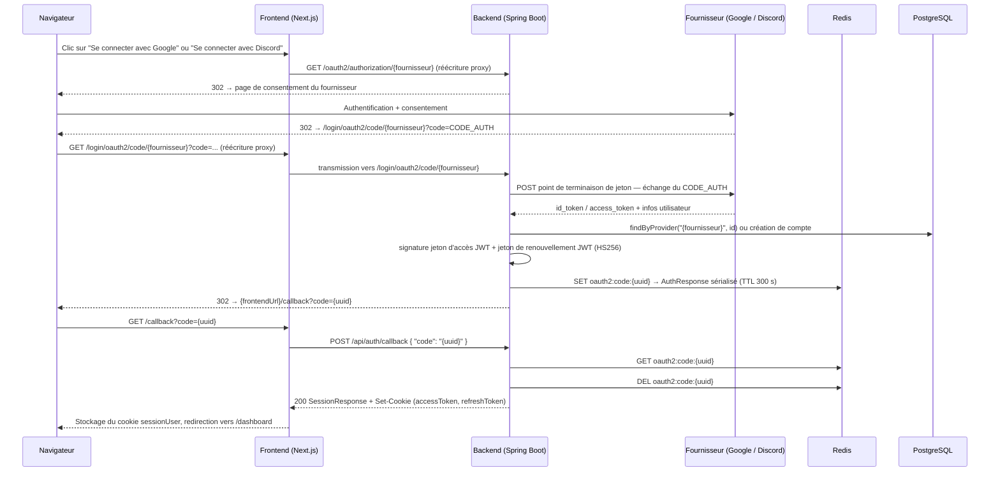
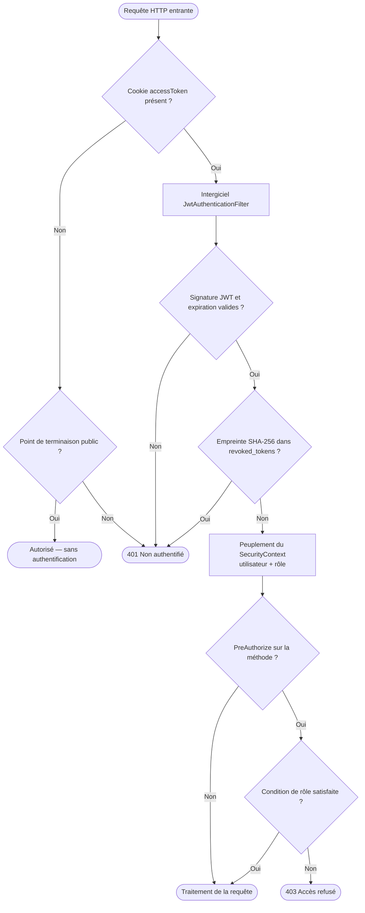

# GameDash — Documentation Technique (Français)

> 🇬🇧 **English version:** [Technical Documentation (English)](TECHNICAL_DOCUMENTATION_EN.md)

> **Périmètre :** API & Transactions · Base de données · Sécurité · Algorithme de Matchmaking  
> **Pile technique :** Spring Boot 3 (backend) · Next.js 14 (frontend) · PostgreSQL 15 · Redis 6.x  
> **Environnement de déploiement :** Azure Container Apps (Espagne Centre)

---

## Table des matières

1. [API & Transactions](#1-api--transactions)
   - 1.1 [Inventaire des points de terminaison](#11-inventaire-des-points-de-terminaison)
   - 1.2 [Schémas de requête / réponse](#12-schémas-de-requête--réponse)
   - 1.3 [Périmètres transactionnels](#13-périmètres-transactionnels)
   - 1.4 [Modèle d'erreur](#14-modèle-derreur)
   - 1.5 [Limitation de débit, pagination et versionnement](#15-limitation-de-débit-pagination-et-versionnement)
2. [Base de données](#2-base-de-données)
   - 2.1 [Vue d'ensemble du schéma](#21-vue-densemble-du-schéma)
   - 2.2 [Stratégie d'indexation et justification](#22-stratégie-dindexation-et-justification)
   - 2.3 [Processus de migration](#23-processus-de-migration)
   - 2.4 [Sauvegarde, rétention et restauration](#24-sauvegarde-rétention-et-restauration)
   - 2.5 [Classification des données](#25-classification-des-données)
3. [Sécurité](#3-sécurité)
   - 3.1 [Modèle d'authentification et d'autorisation](#31-modèle-dauthentification-et-dautorisation)
   - 3.2 [Chiffrement du transport et des données au repos](#32-chiffrement-du-transport-et-des-données-au-repos)
   - 3.3 [Validation des entrées, encodage des sorties et OWASP Top 10](#33-validation-des-entrées-encodage-des-sorties-et-owasp-top-10)
   - 3.4 [Gestion des secrets](#34-gestion-des-secrets)
   - 3.5 [Journalisation d'audit et gestion des incidents](#35-journalisation-daudit-et-gestion-des-incidents)
   - 3.6 [Conformité RGPD](#36-conformité-rgpd)
4. [Algorithme de Matchmaking](#4-algorithme-de-matchmaking)
   - 4.1 [Vue d'ensemble du système](#41-vue-densemble-du-système)
   - 4.2 [Structures de données](#42-structures-de-données)
   - 4.3 [Opérations sur la file d'attente](#43-opérations-sur-la-file-dattente)
   - 4.4 [Algorithme de mise en correspondance](#44-algorithme-de-mise-en-correspondance)
   - 4.5 [Système de notation ELO](#45-système-de-notation-elo)
   - 4.6 [Résultat de match — Consensus en deux phases](#46-résultat-de-match--consensus-en-deux-phases)
   - 4.7 [Distribution des récompenses](#47-distribution-des-récompenses)
   - 4.8 [Modèle de concurrence](#48-modèle-de-concurrence)
   - 4.9 [Démarrage et rafraîchissement de la configuration](#49-démarrage-et-rafraîchissement-de-la-configuration)
   - 4.10 [Limitations connues & travaux futurs](#410-limitations-connues--travaux-futurs)

---

## 1. API & Transactions

### Diagramme de séquence — Flux de connexion OAuth2 sociale (Google / Discord)



---

### 1.1 Inventaire des points de terminaison

Les points de terminaison d'authentification et de santé sont publics. Tous les autres nécessitent un jeton d'accès valide (cookie). La colonne rôle indique une restriction supplémentaire au-delà de la simple authentification.

#### Authentification — `/api/auth/**` (public)

| Méthode | Route | Rôle requis | Objet |
|---------|-------|-------------|-------|
| POST | `/api/auth/register` | — | Création de compte ; retourne les cookies de session |
| POST | `/api/auth/login` | — | Connexion par identifiants ; retourne les cookies de session |
| POST | `/api/auth/refresh` | — | Rotation de la paire de jetons depuis le cookie de renouvellement |
| POST | `/api/auth/logout` | — | Inscription des jetons en liste noire ; suppression des cookies |
| POST | `/api/auth/callback` | — | Échange d'un code OAuth2 à usage unique contre une session |
| GET  | `/api/auth/oauth2/failure` | — | Redirection en cas d'échec OAuth2 |
| GET  | `/api/auth/steam` | — | Déclenchement de la redirection Steam OpenID 2.0 |
| GET  | `/api/auth/steam/callback` | — | Validation de l'assertion Steam ; émission des jetons |

#### Utilisateurs — `/api/users/**`

| Méthode | Route | Rôle requis | Objet |
|---------|-------|-------------|-------|
| GET    | `/api/users/me` | authentifié | Profil complet de l'utilisateur courant |
| PATCH  | `/api/users/me` | authentifié | Modification du pseudo, biographie, région, langue |
| DELETE | `/api/users/me` | authentifié | Suppression logique du compte ; révocation des jetons |
| POST   | `/api/users/me/avatar` | authentifié | Envoi d'une photo de profil (multipart/form-data) |
| PATCH  | `/api/users/me/preferences` | authentifié | Modification des préférences (mode de jeu, langue) |
| GET    | `/api/users/{userId}` | authentifié | Profil public d'un autre utilisateur |

#### Matchmaking — `/api/matchmaking/**`

| Méthode | Route | Rôle requis | Objet |
|---------|-------|-------------|-------|
| POST   | `/api/matchmaking/queue/join` | authentifié | Rejoindre la file d'attente d'un mode de jeu |
| GET    | `/api/matchmaking/queue/status` | authentifié | Position / état courant dans la file |
| DELETE | `/api/matchmaking/queue/leave` | authentifié | Quitter la file d'attente |
| GET    | `/api/matchmaking/matches/{id}` | authentifié | Détail d'un match (participants ou ADMIN/STAFF) |
| POST   | `/api/matchmaking/matches/{id}/result` | authentifié | Soumettre le résultat d'un match (consensus requis) |
| GET    | `/api/matchmaking/history` | authentifié | Historique paginé ; filtres : `gameMode`, `from`, `to` |

#### MMR & Classement — `/api/mmr/**`

| Méthode | Route | Rôle requis | Objet |
|---------|-------|-------------|-------|
| GET | `/api/mmr/me` | authentifié | Statistiques MMR propres par mode de jeu |
| GET | `/api/mmr/players/{userId}` | authentifié | Statistiques d'un autre joueur |
| GET | `/api/mmr/leaderboard` | authentifié | Classement des N meilleurs (`gameMode`, `limit`) |
| GET | `/api/mmr/me/history` | authentifié | Courbe de progression MMR personnelle |
| GET | `/api/mmr/players/{userId}/history` | authentifié | Courbe de progression d'un autre joueur |

#### Boutique & Inventaire — `/api/shop/**`

| Méthode | Route | Rôle requis | Objet |
|---------|-------|-------------|-------|
| GET   | `/api/shop` | authentifié | Catalogue des articles disponibles |
| POST  | `/api/shop/purchase/{itemId}` | authentifié | Achat d'un article avec la monnaie de jeu |
| GET   | `/api/shop/inventory` | authentifié | Inventaire personnel |
| GET   | `/api/shop/transactions` | authentifié | Historique paginé des achats |
| PATCH | `/api/shop/inventory/{id}/equip` | authentifié | Basculer l'état équipé / non équipé |

#### Cartes — `/api/maps/**`

| Méthode | Route | Rôle requis | Objet |
|---------|-------|-------------|-------|
| GET    | `/api/maps` | **public** | Liste paginée des cartes ; filtres : `search`, `status` |
| GET    | `/api/maps/{id}` | **public** | Détail d'une carte |
| GET    | `/api/maps/creators/{userId}/stats` | **public** | Statistiques agrégées d'un créateur |
| GET    | `/api/maps/my` | authentifié | Cartes personnelles |
| POST   | `/api/maps` | authentifié | Création d'une carte |
| POST   | `/api/maps/{id}/versions` | authentifié | Publication d'une nouvelle version |
| GET    | `/api/maps/{id}/versions` | authentifié | Historique des versions |
| POST   | `/api/maps/{id}/vote` | authentifié | Notation d'une carte (1 à 5) |
| POST   | `/api/maps/{id}/test` | authentifié | Marquer comme testé en jeu |
| POST   | `/api/maps/{id}/screenshots` | authentifié | Téléverser une capture d'écran (multipart) |
| DELETE | `/api/maps/{id}/screenshots` | authentifié | Supprimer une capture par URL |
| POST   | `/api/maps/{id}/favorite` | authentifié | Basculer le favori |
| GET    | `/api/maps/{id}/favorite` | authentifié | Vérifier si la carte est en favori |
| GET    | `/api/maps/{id}/tested` | authentifié | Vérifier si l'utilisateur a testé la carte |
| POST   | `/api/maps/{id}/report` | authentifié | Signaler une carte |
| PATCH  | `/api/maps/{id}/status` | ADMIN / STAFF | Changer le statut d'une carte |

#### Quêtes — `/api/quests/**`

| Méthode | Route | Rôle requis | Objet |
|---------|-------|-------------|-------|
| GET  | `/api/quests/my` | authentifié | Quêtes actives ; attribution automatique si les créneaux sont vides |
| POST | `/api/quests/{id}/claim` | authentifié | Réclamer la récompense d'une quête terminée |

#### Progression — `/api/progression/**`

| Méthode | Route | Rôle requis | Objet |
|---------|-------|-------------|-------|
| GET | `/api/progression/me` | authentifié | Progression complète (niveau, XP, monnaie) |
| GET | `/api/progression/players/{userId}` | authentifié | Progression publique (niveau et XP uniquement) |

#### Panneau d'administration — `/api/backoffice/**` (ADMIN ou STAFF)

| Méthode | Route | Rôle requis | Objet |
|---------|-------|-------------|-------|
| GET  | `/api/backoffice/stats` | ADMIN / STAFF | Métriques du tableau de bord |
| GET  | `/api/backoffice/rank-thresholds` | ADMIN / STAFF | Seuils MMR → rang actuels |
| PUT  | `/api/backoffice/rank-thresholds` | **ADMIN seul** | Remplacement des 15 seuils de paliers |
| GET  | `/api/backoffice/stats/rank-distribution` | ADMIN / STAFF | Histogramme de distribution des rangs |
| GET  | `/api/backoffice/matchmaking-config` | ADMIN / STAFF | Paramètres de matchmaking par mode |
| PUT  | `/api/backoffice/matchmaking-config` | **ADMIN seul** | Mise à jour des paramètres |
| GET  | `/api/backoffice/users` | ADMIN / STAFF | Recherche d'utilisateurs par pseudo ou courriel |
| GET  | `/api/backoffice/users/{userId}/sanctions` | ADMIN / STAFF | Historique des sanctions |
| POST | `/api/backoffice/users/{userId}/ban` | **ADMIN seul** | Bannissement d'un utilisateur |
| POST | `/api/backoffice/users/{userId}/unban` | **ADMIN seul** | Levée d'un bannissement |
| GET  | `/api/backoffice/economy/items` | ADMIN / STAFF | Catalogue complet des articles |
| POST | `/api/backoffice/economy/items` | **ADMIN seul** | Création d'un article |
| PUT  | `/api/backoffice/economy/items/{itemId}` | **ADMIN seul** | Mise à jour d'un article |
| PATCH | `/api/backoffice/economy/items/{itemId}/availability` | **ADMIN seul** | Basculer la disponibilité |
| GET  | `/api/backoffice/economy/revenue` | ADMIN / STAFF | Statistiques de revenus |
| GET  | `/api/backoffice/maps` | ADMIN / STAFF | Liste de cartes avec filtres (statut, recherche, signalements) |
| POST | `/api/backoffice/maps/{mapId}/feature` | ADMIN / STAFF | Basculer le statut « à la une » |
| GET  | `/api/backoffice/maps/reports` | ADMIN / STAFF | Signalements non résolus |
| POST | `/api/backoffice/maps/reports/{reportId}/resolve` | ADMIN / STAFF | Résoudre un signalement |

#### Santé

| Méthode | Route | Rôle requis | Objet |
|---------|-------|-------------|-------|
| GET | `/actuator/health` | **public** | Sonde de vivacité (détail des composants masqué) |

---

### 1.2 Schémas de requête / réponse

#### POST `/api/auth/register`

```json
// Corps de la requête
{
  "username": "gamer42",
  "email": "gamer@exemple.com",
  "password": "MotDePasse!1"
}

// Réponse 201 Created
// Set-Cookie: accessToken=<jeton>; HttpOnly; Path=/api; SameSite=Lax; Max-Age=3600
// Set-Cookie: refreshToken=<jeton>; HttpOnly; Path=/api/auth; SameSite=Lax; Max-Age=604800
{
  "userId": 7,
  "username": "gamer42",
  "role": "PLAYER"
}
```

#### POST `/api/auth/login`

```json
// Corps de la requête
{
  "usernameOrEmail": "gamer42",
  "password": "MotDePasse!1"
}

// Réponse 200 — même structure SessionResponse que l'inscription
```

#### POST `/api/auth/refresh`

```json
// Corps optionnel (le cookie est prioritaire)
{
  "refreshToken": "<jeton-brut-pour-clients-non-navigateur>"
}

// Réponse 200 — nouveaux cookies émis ; même corps SessionResponse
```

#### POST `/api/auth/callback` (échange du code OAuth2)

```json
// Corps de la requête
{
  "code": "550e8400-e29b-41d4-a716-446655440000"
}

// Réponse 200 — même structure SessionResponse + nouveaux cookies
```

#### POST `/api/matchmaking/queue/join`

```json
// Corps de la requête
{ "gameMode": "RANKED" }

// Réponse 200
{
  "status": "QUEUED",
  "gameMode": "RANKED",
  "position": 3
}
```

#### POST `/api/matchmaking/matches/{id}/result`

```json
// Corps de la requête
{
  "winnerId": 7,
  "durationSeconds": 342
}

// Réponse 200 — après confirmation des deux joueurs (consensus)
{
  "matchId": 55,
  "newMmr": 1150,
  "rankChange": "SILVER_III",
  "xpGained": 120
}

// Réponse 200 — premier déclarant seulement ; le second joueur doit confirmer
{
  "matchId": 55,
  "status": "AWAITING_CONFIRMATION"
}
```

#### POST `/api/shop/purchase/{itemId}`

```json
// Réponse 200
{
  "id": 88,
  "userId": 7,
  "itemId": 12,
  "pricePaid": 250,
  "currencyType": "SOFT",
  "createdAt": "2025-11-14T10:30:00Z"
}
```

#### GET `/api/matchmaking/history` — enveloppe paginée (valable pour tous les `Page<T>`)

```json
{
  "content": [
    {
      "id": 55,
      "gameMode": "RANKED",
      "status": "FINISHED",
      "winnerId": 7,
      "createdAt": "2025-11-14T09:00:00Z",
      "durationSeconds": 342
    }
  ],
  "pageable": { "pageNumber": 0, "pageSize": 20 },
  "totalElements": 87,
  "totalPages": 5,
  "first": true,
  "last": false
}
```

Paramètres de requête : `page` (défaut 0), `size` (défaut 20, maximum 100), `sort` (ex. `createdAt,desc`).

---

### 1.3 Périmètres transactionnels

#### Achat en boutique — `ShopService.purchase()`

Les cinq étapes s'exécutent dans une seule transaction de base de données `@Transactional` :

1. Lecture du solde de monnaie de jeu dans `player_progressions`.
2. Vérification de la disponibilité de l'article dans `items`.
3. Contrôle de l'inventaire — rejet si l'article est déjà possédé.
4. Insertion d'une ligne dans `transactions` (registre d'achats).
5. Insertion dans `inventory` ; déduction de la monnaie dans `player_progressions`.

**Déclenchement de l'annulation :** toute exception aux étapes 1 à 5 annule l'ensemble des écritures. La contrainte `UNIQUE (user_id, item_id)` sur `inventory` sert de garde-fou d'idempotence de dernier recours : une requête dupliquée échoue à l'étape 3 avec une exception métier, sans double déduction.

#### Réclamation de récompense de quête — `QuestService.claimReward()`

1. Vérification que `player_quests.completed = TRUE` et `claimed = FALSE`.
2. Passage à `claimed = TRUE`.
3. Attribution de `reward_xp` et `reward_coins` via `ProgressionService`.
4. Évaluation de la montée de niveau ; incrémentation de `level` si le seuil est atteint.

Transaction `@Transactional` unique. L'indicateur `claimed` assure l'idempotence : un second appel sur le même identifiant de quête lève une exception métier avant toute mutation.

#### Consensus sur le résultat d'un match — `MatchmakingService.reportResult()`

Validation en deux phases au niveau applicatif (migration V20) :

- **Phase 1 (premier déclarant) :** renseigne `matches.first_reporter_id` et `matches.claimed_winner_id`. Aucune récompense n'est distribuée.
- **Phase 2 (second déclarant) :** vérifie que les deux joueurs s'accordent sur `winnerId`. En cas d'accord :
  1. Passage à `matches.status = FINISHED`, `winner_id = vainqueur_convenu`.
  2. Application du delta ELO dans `player_stats.mmr` pour tous les participants.
  3. Insertion de lignes dans `mmr_snapshots`.
  4. Attribution de l'XP via `ProgressionService`.

En cas de désaccord, le match est signalé pour révision administrative. L'intégralité de la phase 2 s'exécute dans une seule transaction `@Transactional`.

#### Révocation de jeton — `TokenBlacklistService.revoke()`

Un seul `INSERT INTO revoked_tokens`, isolé de la transaction appelante. Si cet insert échoue (base de données indisponible), les cookies sont tout de même supprimés côté client. Le jeton expire naturellement selon sa durée de vie déclarée.

---

### 1.4 Modèle d'erreur

**Exceptions métier** traduites par un `@ControllerAdvice` global :

```json
{
  "error": "Bad Request",
  "message": "Code d'autorisation invalide ou expiré",
  "status": 400
}
```

**Non authentifié** (absence ou invalidité du jeton JWT) :

```json
{ "error": "Unauthorized" }
```
Code HTTP 401. Le point d'entrée d'authentification retourne directement cette réponse ; Spring Security n'effectue pas de redirection vers `/login`.

**Accès interdit** (authentifié mais rôle insuffisant) : HTTP 403, corps vide.

**Violation de validation** (contraintes Bean Validation) : HTTP 400 avec détail par champ :

```json
{
  "status": 400,
  "errors": {
    "username": "la taille doit être comprise entre 3 et 30",
    "password": "ne doit pas être vide"
  }
}
```

**Recommandations côté client :**

| Code HTTP | Action recommandée |
|-----------|-------------------|
| 400 | Afficher les erreurs de champ à l'utilisateur ; ne pas réessayer |
| 401 | Tenter un renouvellement silencieux via `POST /api/auth/refresh` ; en cas de second 401, rediriger vers `/login` |
| 403 | Afficher un message d'accès refusé ; ne pas réessayer |
| 429 | Patienter ; respecter l'en-tête `Retry-After` |
| 5xx | Réessayer avec un délai exponentiel (3 tentatives maximum) |

---

### 1.5 Limitation de débit, pagination et versionnement

#### Limitation de débit

Appliquée par adresse IP source. Renseigner `RATE_LIMIT_TRUSTED_PROXIES` avec l'adresse IP du mandataire inverse afin d'utiliser `X-Forwarded-For` pour l'extraction de l'adresse réelle du client (ingress Azure Container Apps, proxy Next.js).

| Groupe de routes | Limite par défaut | Fenêtre |
|-----------------|-------------------|---------|
| `POST /api/auth/login` | 10 requêtes | 60 s |
| `POST /api/auth/register` | 5 requêtes | 60 s |
| `POST /api/auth/refresh` | 20 requêtes | 60 s |
| `POST /api/auth/callback` | 10 requêtes | 60 s |

Toutes les limites sont configurables via des variables d'environnement (`RATE_LIMIT_LOGIN`, `RATE_LIMIT_REGISTER`, `RATE_LIMIT_REFRESH`, `RATE_LIMIT_CALLBACK`, `RATE_LIMIT_WINDOW`).

#### Pagination

S'appuie sur le mécanisme `Pageable` de Spring Data. Tous les points de terminaison susceptibles de retourner de grands ensembles de résultats sont paginés.

| Paramètre | Défaut | Maximum |
|-----------|--------|---------|
| `page` | 0 | — |
| `size` | 20 | 100 |
| `sort` | propre à chaque route | — |

Le plafond `max-page-size: 100` est appliqué dans `application.yml`, indépendamment de la valeur du paramètre `size`.

#### Versionnement

Aucune stratégie de versionnement n'est actuellement en place. Toutes les routes sont sous le préfixe non versionné `/api/`. Un changement non rétrocompatible nécessite un déploiement coordonné du frontend et du backend. L'approche recommandée est un préfixe URL (`/api/v2/`) introduit lors du premier changement cassant, les routes non versionnées étant aliasées vers la v1 durant une période de transition.

---

## 2. Base de données

### Diagramme entité-relation (simplifié — entités principales et relations)

```mermaid
erDiagram
    users ||--o{ player_stats         : "un par mode de jeu"
    users ||--o| player_progressions  : "une ligne"
    users ||--o{ match_players        : "participe"
    users ||--o{ inventory            : "possède"
    users ||--o{ transactions         : "effectue"
    users ||--o{ game_maps            : "crée"
    users ||--o{ mmr_snapshots        : "enregistré pour"
    users ||--o{ player_quests        : "assigné à"
    users ||--o{ user_sanctions       : "sujet de"
    matches ||--o{ match_players      : "relie les joueurs"
    items   ||--o{ inventory          : "contenu dans"
    items   ||--o{ transactions       : "référencé par"
    game_maps ||--o{ map_tags         : "étiqueté avec"
    game_maps ||--o{ map_versions     : "versionné par"
    game_maps ||--o{ map_votes        : "noté dans"
    quests    ||--o{ player_quests    : "instancié en"

    users {
        bigint  id CP
        varchar username
        varchar email
        varchar password
        varchar role
        boolean banned
        timestamptz deleted_at
        varchar provider
        varchar provider_id
    }

    revoked_tokens {
        bigint id CP
        varchar token_hash
        timestamptz expires_at
    }

    rank_thresholds {
        varchar rang CP
        int mmr_minimum
    }
```

---

### 2.1 Vue d'ensemble du schéma

PostgreSQL 15 (Azure Flexible Server). Hibernate est en mode `validate` : il vérifie à l'initialisation que les entités JPA correspondent au schéma physique, sans jamais le modifier. Flyway est la seule autorité sur le schéma.

#### Table `users`

Entité centrale. Prend en charge les comptes locaux (mot de passe haché BCrypt) et les comptes SSO (colonnes `provider` + `provider_id`). La suppression logique est implémentée via `deleted_at` (NULL = actif) ; l'indicateur `banned` suspend l'accès sans supprimer les données.

```sql
-- Colonnes clés (voir V1 + V3 pour la définition complète)
id             BIGSERIAL CLEF PRIMAIRE
username       VARCHAR(30)  NOT NULL UNIQUE
email          VARCHAR(255) NOT NULL UNIQUE
password       VARCHAR(255) NOT NULL          -- hachage BCrypt
role           VARCHAR(20)  NOT NULL DEFAULT 'PLAYER'
banned         BOOLEAN      NOT NULL DEFAULT FALSE
deleted_at     TIMESTAMPTZ                    -- NULL = actif
provider       VARCHAR(50)                    -- 'google' | 'steam' | NULL
provider_id    VARCHAR(100)                   -- identifiant sujet SSO opaque
```

Un index unique partiel `idx_users_provider_unique` sur `(provider, provider_id) WHERE NOT NULL` garantit un compte unique par identité SSO sans affecter les comptes locaux.

#### Table `player_stats`

Une ligne par `(user_id, mode_de_jeu)`. Stocke le MMR courant et le palier de rang calculé. Le rang est recalculé par rapport à `rank_thresholds` à chaque modification du MMR.

#### Table `player_progressions`

Une ligne par utilisateur. Contient le niveau, l'XP, `xp_to_next_level` et le solde de monnaie de jeu. Protégée par une colonne de verrouillage optimiste `version` (V9) pour prévenir les mises à jour perdues en cas de requêtes concurrentes.

#### Tables `matches` + `match_players`

`matches` gère le cycle de vie : `PENDING → IN_PROGRESS → FINISHED`. Les deux colonnes de consensus (`first_reporter_id`, `claimed_winner_id`) ont été ajoutées en V20 pour imposer une confirmation bilatérale avant la distribution des récompenses. `match_players` est une table de jointure ; l'historique complet d'un joueur est récupéré via l'index `idx_match_players_user`.

#### Tables `items` + `inventory` + `transactions`

`items` est le catalogue de la boutique. `inventory` suit la possession avec une contrainte `UNIQUE (user_id, item_id)`. `transactions` est un **registre d'achats en ajout seul** — `item_id` utilise `ON DELETE RESTRICT` pour préserver l'historique même si l'article est retiré du catalogue.

#### Table `game_maps`

Cartes créées par la communauté. Le statut appartient à : {DRAFT, PUBLISHED, HIDDEN, FEATURED}. `test_count`, `favorite_count` et `average_rating` sont des agrégats dénormalisés mis à jour à chaque mutation pour éviter des requêtes d'agrégation coûteuses à la lecture. Le point de terminaison de liste publique exclut silencieusement les cartes HIDDEN, indépendamment du paramètre `status`.

#### Table `rank_thresholds`

Table de configuration à 15 lignes. Initialisée en V4 avec les valeurs précédemment codées en dur dans `Rank.java`. Chargée en mémoire au démarrage et actualisée en temps réel via `PUT /api/backoffice/rank-thresholds`.

```sql
-- Seuils par défaut (initialisation V4)
('BRONZE_III', 0), ('BRONZE_II', 300), ('BRONZE_I', 600),
('SILVER_III', 900), ('SILVER_II', 1100), ('SILVER_I', 1300),
('GOLD_III', 1500), ('GOLD_II', 1700), ('GOLD_I', 1900),
('PLATINUM_III', 2100), ('PLATINUM_II', 2300), ('PLATINUM_I', 2500),
('DIAMOND', 2800), ('MASTER', 3200), ('GRANDMASTER', 3600)
```

#### Table `mmr_snapshots`

Série temporelle en ajout seul. Une ligne est insérée par participant à la fin de chaque match. Jamais modifiée. Alimente la courbe de progression MMR sur la page de profil.

#### Tables `quests` + `player_quests`

`quests` est un catalogue statique (deux types : DAILY, WEEKLY ; six entrées initialisées en V7–V8). `player_quests` est l'assignation par utilisateur. `expires_at` pilote la rotation quotidienne / hebdomadaire : le service attribue automatiquement de nouvelles quêtes lorsque le créneau actif est vide ou expiré.

#### Table `revoked_tokens`

Liste noire des jetons JWT. Stocke les empreintes SHA-256 (V21 a remplacé le texte du jeton par des empreintes de longueur fixe). Un travail planifié purge les lignes dont `expires_at < NOW()` toutes les heures.

#### Table `user_sanctions`

Journal d'audit en ajout seul pour les actions de bannissement / levée de bannissement. `admin_id` est nullable — l'enregistrement subsiste si le compte administrateur est supprimé (`ON DELETE SET NULL`). Jamais modifié après insertion.

---

### 2.2 Stratégie d'indexation et justification

| Nom de l'index | Table | Colonnes | Justification |
|---------------|-------|---------|---------------|
| `idx_player_stats_user` | player_stats | user_id | Consultation des statistiques du profil |
| `idx_player_stats_mode_mmr` | player_stats | (game_mode, mmr DESC) | Tri du classement sans parcours de table complet |
| `idx_match_players_match` | match_players | match_id | Récupération des participants d'un match |
| `idx_match_players_user` | match_players | user_id | Historique des matchs par joueur |
| `idx_matches_status` | matches | status | Gestion de la file (filtre PENDING / IN_PROGRESS) |
| `idx_matches_created_at` | matches | created_at DESC | Filtre par plage de dates dans l'historique |
| `idx_inventory_user` | inventory | user_id | Chargement de la page d'inventaire |
| `idx_transactions_user_created` | transactions | (user_id, created_at DESC) | Historique chronologique des achats |
| `idx_game_maps_author` | game_maps | author_id | Liste « Mes cartes » |
| `idx_game_maps_status` | game_maps | status | Liste publique des cartes avec filtre de statut |
| `idx_map_votes_map_id` | map_votes | map_id | Recalcul de la note moyenne |
| `idx_map_versions_map` | map_versions | map_id | Historique des versions par carte |
| `idx_mmr_snapshots_user_mode_time` | mmr_snapshots | (user_id, game_mode, recorded_at ASC/DESC) | Courbe de progression ordonnée dans le temps (deux index, V4 + V10) |
| `idx_player_quests_user_expires` | player_quests | (user_id, expires_at) | Consultation des quêtes actives ; rotation par expiration |
| `idx_revoked_tokens_hash` | revoked_tokens | token_hash | Vérification de la liste noire en O(1) par requête authentifiée |
| `idx_revoked_tokens_expires_at` | revoked_tokens | expires_at | Parcours de nettoyage horaire efficace |
| `idx_user_sanctions_subject` | user_sanctions | (subject_id, created_at DESC) | Historique chronologique des sanctions |
| `idx_users_provider_unique` | users | (provider, provider_id) WHERE NOT NULL | Déduplication des comptes SSO |

Tous les index utilisent la structure B-tree par défaut de PostgreSQL. Les index composés sont ordonnés pour couvrir le schéma de requête dominant (filtre en premier, tri en second).

---

### 2.3 Processus de migration

Flyway est configuré comme suit :

```yaml
spring:
  flyway:
    enabled:             true
    locations:           classpath:db/migration
    baseline-on-migrate: true
    validate-on-migrate: true
```

Les scripts de migration se trouvent dans `src/main/resources/db/migration/` et suivent la convention `V{n}__{description}.sql`. 21 migrations existent à la date de ce document (V1–V21).

**Séquence au démarrage :**

```
Démarrage de l'application
  └─▶ Flyway analyse classpath:db/migration
      ├─▶ validate-on-migrate : comparaison des sommes de contrôle appliquées
      │     └─▶ Divergence → FATAL : démarrage interrompu
      └─▶ Application des scripts en attente par ordre de version (chacun dans sa transaction)
          └─▶ Hibernate valide les entités JPA par rapport au schéma physique
                └─▶ Échec de validation → FATAL : démarrage interrompu
                    Application prête ✓
```

**Règles d'écriture des migrations :**

1. Ne jamais modifier un script de migration déjà livré. Créer `V{n+1}` pour les corrections.
2. Les opérations destructrices (DROP COLUMN, transformation de données) doivent inclure des étapes explicites — ne pas supposer que `ALTER TABLE … SET DEFAULT` migre les lignes existantes implicitement.
3. `baseline-on-migrate: true` permet le premier déploiement sur une base existante en marquant l'état courant comme référence sans rejouer V1.
4. Tester les migrations localement sur une instance PostgreSQL correspondant à la version cible avant toute intégration.

---

### 2.4 Sauvegarde, rétention et restauration

> **Hypothèse :** Azure Database pour PostgreSQL Flexible Server, Espagne Centre.

**Sauvegardes automatiques :** sauvegardes complètes hebdomadaires + journaux de transactions toutes les 5 minutes (gérés par Azure). Rétention par défaut : 7 jours. Configurable jusqu'à 35 jours dans le portail Azure.

**Restauration à un instant précis (PITR) :** tout horodatage dans la fenêtre de rétention peut être restauré sur une nouvelle instance serveur. Objectif de délai de restauration (RPO) : 5 minutes.

**Procédure de restauration :**

```powershell
# 1. Restauration vers un nouveau serveur via Azure CLI
az postgres flexible-server restore `
  --resource-group <GR> `
  --name <nouveau-serveur> `
  --source-server <serveur-original> `
  --restore-time "2025-11-14T08:00:00Z"

# 2. Mise à jour du secret Container App pour pointer vers le nouvel hôte
az containerapp secret set --name gamedash-backend `
  --resource-group <GR> `
  --secrets "db-url=jdbc:postgresql://<nouvel-hôte>:5432/gamedash?sslmode=require"

# 3. Déploiement d'une nouvelle révision pour prendre en compte le secret mis à jour
az containerapp update --name gamedash-backend `
  --resource-group <GR> --revision-suffix "restauration-v1"
```

Flyway **validera** (sans rejouer) les migrations au démarrage — le schéma est déjà en place sur le serveur restauré.

**Exports manuels :** utiliser `pg_dump` pour des instantanés ponctuels. Stocker les archives chiffrées dans Azure Blob Storage avec une politique de stockage immuable et un cycle de vie de rétention distinct.

---

### 2.5 Classification des données

| Catégorie | Champs | Table(s) |
|----------|--------|---------|
| DCP — identifiant direct | `email`, `username` | `users` |
| DCP — identifiant indirect | `avatar_url`, `bio`, `region`, `provider_id` | `users` |
| Identifiants d'accès | `password` (hachage BCrypt — non réversible) | `users` |
| Comportementaux / analytiques | résultats de matchs, historique MMR, historique d'achats | `matches`, `player_stats`, `mmr_snapshots`, `transactions` |
| Données sensibles de plateforme | `banned`, `deleted_at`, `provider`, `role` | `users` |
| Piste d'audit | type de sanction, motif, identité de l'administrateur | `user_sanctions` |
| Sécurité transitoire | empreinte du jeton, date d'expiration | `revoked_tokens` |

Les champs identifiés comme données à caractère personnel (DCP) sont soumis aux obligations RGPD de droit d'accès et de droit à l'effacement décrites à la section 3.6.

---

## 3. Sécurité

### Diagramme du flux d'authentification



---

### 3.1 Modèle d'authentification et d'autorisation

#### Architecture des jetons

| Jeton | Algorithme | Durée de vie | Chemin du cookie | Contenu |
|-------|-----------|-------------|-----------------|---------|
| Jeton d'accès JWT | HS256 | 1 heure | `/api` | `sub`, `role`, `typ=access`, `iat`, `exp` |
| Jeton de renouvellement JWT | HS256 | 7 jours | `/api/auth` | `sub`, `typ=refresh`, `iat`, `exp` |

Les deux jetons sont signés avec une clé de 32 octets décodée depuis la valeur Base64 de `JWT_SECRET`. L'algorithme est explicitement fixé à HS256 dans `JwtTokenProvider` — la sélection automatique de JJWT selon la taille de la clé est désactivée.

Les cookies portent les attributs `HttpOnly`, `SameSite=Lax` et `Secure` (conditionnel à `COOKIE_SECURE=true` en production). Le chemin restreint empêche le jeton de renouvellement d'être transmis vers des routes non-auth, limitant sa surface d'exposition.

#### Gestion de session OAuth2

La connexion via Google OIDC et Discord OAuth2 nécessite une session HTTP côté serveur pour transporter le paramètre d'état CSRF entre la redirection initiale et le rappel. Spring Session stocke cette session dans Redis (espace de noms `gamedash:session`, TTL de 300 secondes). Une fois le rappel traité et les jetons JWT émis, la session n'est plus utilisée — toutes les requêtes suivantes sont sans état.

L'authentification Steam utilise un contrôleur stateless personnalisé (`SteamAuthController`) qui valide l'assertion OpenID 2.0 via un appel de canal arrière vers Steam — aucune session serveur n'est créée.

#### Matrice des rôles et permissions

| Fonctionnalité | PLAYER | STAFF | ADMIN |
|---------------|--------|-------|-------|
| Lecture / modification du profil personnel | ✓ | ✓ | ✓ |
| Rejoindre le matchmaking, soumettre les résultats | ✓ | ✓ | ✓ |
| Cartes publiques et classement | ✓ | ✓ | ✓ |
| Tableau de bord d'administration | | ✓ | ✓ |
| Recherche d'utilisateurs, consultation des sanctions | | ✓ | ✓ |
| Mise en avant / masquage de cartes, résolution de signalements | | ✓ | ✓ |
| Mise à jour des seuils de rang | | | ✓ |
| Bannissement / levée de bannissement | | | ✓ |
| Création / mise à jour d'articles en boutique | | | ✓ |
| Mise à jour de la configuration du matchmaking | | | ✓ |

Le contrôle d'accès est délibérément bicouche :
- **Niveau chemin** — `SecurityFilterChain` exige `ROLE_ADMIN` ou `ROLE_STAFF` pour toutes les routes `/api/backoffice/**`.
- **Niveau méthode** — `@PreAuthorize("hasRole('ADMIN')")` sur les opérations destructrices.

Une vulnérabilité dans une couche ne peut seule contourner l'autre.

#### Révocation de jeton

À la déconnexion ou à la suppression de compte, les deux jetons sont révoqués :

```java
// TokenBlacklistService — stocke l'empreinte SHA-256, pas le jeton brut
String hash = sha256Hex(jeton);
revokedTokenRepository.save(new RevokedToken(hash, expiration));
```

Chaque requête authentifiée effectue une consultation indexée :

```sql
SELECT 1 FROM revoked_tokens
WHERE token_hash = :hash AND expires_at > NOW()
```

Un travail planifié purge les lignes expirées toutes les heures pour maintenir la table à taille réduite.

---

### 3.2 Chiffrement du transport et des données au repos

**En transit :**

| Connexion | Protocole | Remarques |
|-----------|-----------|-----------|
| Navigateur → ingress Container Apps | TLS 1.2+ | Appliqué par Azure ; redirection HTTP → HTTPS |
| Backend → PostgreSQL | TLS | `sslmode=require` dans l'URL JDBC |
| Backend → Redis | TLS | Port 6380 ; `REDIS_SSL=true` |
| Next.js → Backend (interne) | HTTP | Réseau virtuel interne Container Apps ; TLS non appliqué sur ce tronçon |

**Au repos :**

- PostgreSQL : chiffrement AES-256 géré par Azure (clés de plateforme).
- Redis : chiffrement au repos géré par Azure.
- Chiffrement applicatif des champs : non implémenté.

**Mots de passe :** hachés par BCrypt via `PasswordEncoder` de Spring Security à l'inscription. Les mots de passe en clair ne sont jamais stockés, journalisés ou retournés dans une réponse API.

---

### 3.3 Validation des entrées, encodage des sorties et OWASP Top 10

| OWASP | Risque | Mitigation dans le code |
|-------|--------|------------------------|
| A01 Contrôle d'accès défaillant | Accès non autorisé aux données | JWT + `@PreAuthorize` ; `PublicProfileDto` masque courriel, indicateur de bannissement, détails SSO, date de dernière connexion ; les cartes HIDDEN sont forcément exclues du filtre public |
| A02 Défaillances cryptographiques | Stockage faible des identifiants | BCrypt avec facteur de travail Spring par défaut ; HS256 avec clé de 256 bits ; pas de jetons dans les URL de redirection (code opaque via Redis) |
| A03 Injection | Injection SQL | Spring Data JPA / JPQL dans tout le code ; aucune requête SQL construite par concaténation de chaînes ; requêtes paramétrées appliquées par l'ORM |
| A04 Conception non sécurisée | Contournement de la logique métier | Idempotence de l'achat via contrainte UNIQUE en base ; idempotence de la quête via indicateur `claimed` ; consensus de match empêche la manipulation unilatérale |
| A05 Mauvaise configuration de sécurité | CSRF, CORS permissif | CSRF désactivé (cookies JWT `SameSite=Lax` rendent le CSRF sans objet pour les flux navigateur) ; CORS limité à `ALLOWED_ORIGINS` ; exclusion des cartes HIDDEN appliquée côté serveur |
| A07 Défaillances d'identification | Rejeu de jeton / fixation de session | Liste noire SHA-256 vérifiée par requête ; `SameSite=Lax` bloque la soumission inter-sites ; état OIDC en session Redis de courte durée contre le rejeu |
| A08 Défaillances d'intégrité | Migrations de schéma altérées | `validate-on-migrate: true` de Flyway — une somme de contrôle invalide interrompt le démarrage |
| A09 Défaillances de journalisation | Piste d'audit insuffisante | Table `user_sanctions` pour tous les bannissements ; registre `transactions` pour les achats ; journalisation des événements d'authentification par Spring Security ; WARN sur les échecs de jeton |
| A10 Falsification de requête côté serveur | SSRF | La validation Steam OpenID s'effectue via un appel de canal arrière vers une URL Steam codée en dur — pas d'URL fournie par l'utilisateur |

**Validation par contraintes (`@Valid`)** appliquée à tous les corps de requête. Les violations produisent une réponse 400 structurée avant d'atteindre la couche service.

**Filtrage des sorties :** sérialisation JSON via Jackson. Les DTO (`PublicProfileDto`, `MeDto`) excluent explicitement les champs internes. Aucune sortie HTML construite manuellement n'existe dans le code.

---

### 3.4 Gestion des secrets

**Production — Azure Container Apps :**

Les secrets sont stockés dans le magasin de secrets Container Apps et injectés comme variables d'environnement via des liaisons `secretref:`. La valeur en clair n'est jamais visible dans le manifeste des variables d'environnement.

| Nom du secret | Variable d'environnement | Description |
|-------------|------------------------|-------------|
| `db-password` | `SPRING_DATASOURCE_PASSWORD` | Mot de passe PostgreSQL |
| `redis-password` | `REDIS_PASSWORD` | Clé d'accès principale Redis |
| `jwt-secret` | `JWT_SECRET` | Clé de signature HS256 (encodée Base64, 32 octets décodés) |
| `google-secret` | `GOOGLE_CLIENT_SECRET` | Secret client Google OAuth2 |
| `discord-secret` | `DISCORD_CLIENT_SECRET` | Secret client Discord OAuth2 |
| `steam-api-key` | `STEAM_API_KEY` | Clé d'API Steam Web |

**Procédure de rotation des clés :**

```powershell
# Étape 1 — mettre à jour la valeur du secret
az containerapp secret set `
  --resource-group <GR> --name gamedash-backend `
  --secrets "jwt-secret=<nouvelle-cle-base64>"

# Étape 2 — déployer une nouvelle révision qui prend en compte le secret mis à jour
az containerapp update `
  --resource-group <GR> --name gamedash-backend `
  --set-env-vars "JWT_SECRET=secretref:jwt-secret" `
  --revision-suffix "rotation-cle-v1"
```

**Développement local :**

`src/main/resources/application-local.yml` est inscrit dans `.gitignore` et listé dans `.dockerignore`. Il n'est jamais livré et jamais inclus dans une image de conteneur. L'image de production lit tous les identifiants depuis les variables d'environnement injectées au moment de l'exécution.

---

### 3.5 Journalisation d'audit et gestion des incidents

**Enregistrements d'audit en base de données :**

| Table | Événement | Rétention |
|-------|-----------|-----------|
| `user_sanctions` | Chaque bannissement / levée (type, motif, administrateur) | Permanente (ajout seul) |
| `transactions` | Chaque achat (article, prix, devise) | Permanente (`ON DELETE RESTRICT`) |
| `mmr_snapshots` | Chaque variation de MMR (valeur, mode, horodatage) | Permanente (ajout seul) |
| `revoked_tokens` | Révocation de jeton avec expiration naturelle | Jusqu'à `expires_at` |

**Événements journalisés par l'application (SLF4J / Logback) :**

| Niveau | Événement |
|--------|-----------|
| INFO | Connexion réussie, connexion OAuth2 (identifiant utilisateur), inscription |
| WARN | Échec de validation JWT, dépassement de limite de débit, assertion Steam invalide |
| ERROR | Exception de connexion Steam, échec de désérialisation du code OAuth2 |

Le niveau de journalisation est contrôlé par la variable d'environnement `LOG_LEVEL` (défaut `INFO`). Azure Container Apps achemine stdout/stderr vers Log Analytics Workspace ; des règles d'alerte sur les motifs `level=WARN` / `level=ERROR` sont recommandées.

**Actions de réponse aux incidents :**

| Scénario | Action |
|---------|--------|
| Jeton d'accès compromis | Insérer l'empreinte SHA-256 dans `revoked_tokens` avec l'horodatage `exp` du jeton — effectif immédiatement à la prochaine requête |
| Compte compromis | `POST /api/backoffice/users/{id}/ban` — passe `banned=TRUE` ; les tentatives de connexion suivantes sont rejetées dans `AuthService.login()` |
| Secret JWT compromis | Rotation de `jwt-secret` (voir section 3.4) ; tous les jetons existants deviennent immédiatement invalides (échec de vérification de la signature) |
| Violation de la base de données | Rotation de tous les identifiants de la base ; les mots de passe sont des empreintes BCrypt — le déchiffrement direct est infaisable ; révoquer les jetons OAuth2 auprès des fournisseurs |

---

### 3.6 Conformité RGPD

| Article RGPD | Obligation | Implémentation actuelle |
|-------------|-----------|------------------------|
| Art. 15 | Droit d'accès | `GET /api/users/me`, `/api/shop/transactions`, `/api/matchmaking/history` fournissent l'intégralité des données personnelles |
| Art. 17 | Droit à l'effacement | `DELETE /api/users/me` effectue une suppression logique (`deleted_at = NOW()`), révoque les jetons et supprime les cookies |
| Art. 5(1)(c) | Minimisation des données | `GET /api/users/{userId}` ne retourne que le pseudo, l'avatar, la région et les statistiques — courriel, indicateur de bannissement et détails SSO exclus |
| Art. 25 | Protection des données dès la conception | Le SSO ne stocke que l'identifiant sujet opaque (`provider_id`) ; aucun jeton Google / Steam n'est conservé |
| Art. 46 | Localisation des données | Toutes les données en Europe — Azure Espagne Centre (UE) |

**Lacune identifiée — effacement réel :** la suppression de compte est actuellement une suppression logique. Les tables `user_sanctions`, `transactions` et `mmr_snapshots` conservent des lignes référençant l'identifiant de l'utilisateur supprimé. Avant tout traitement de données utilisateurs réelles en production, une procédure d'effacement définitif ou d'anonymisation doit être mise en œuvre pour satisfaire l'article 17 sur ces enregistrements liés. La contrainte `ON DELETE CASCADE` sur la plupart des tables propagerait automatiquement une suppression physique de la ligne `users` ; les exceptions sont `transactions` (`ON DELETE CASCADE`) et `user_sanctions` (`ON DELETE CASCADE` pour le sujet ; `ON DELETE SET NULL` pour l'administrateur).

---

## 4. Algorithme de Matchmaking

> **Source :** `gamedash-backend/src/main/java/com/gamedash/matchmaking/service/MatchmakingService.java`  
> **Connexe :** `MmrService.java` · `ProgressionService.java` · `QuestService.java`

---

### 4.1 Vue d'ensemble du système

```
┌─────────────────────────────────────────────────────────────────┐
│  Joueur A                       Joueur B                        │
│  POST /matchmaking/queue/join   POST /matchmaking/queue/join    │
└──────────────┬──────────────────────────────┬───────────────────┘
               │                              │
               ▼                              ▼
┌─────────────────────────────────────────────────────────────────┐
│  MatchmakingService.joinQueue()  [synchronized]                 │
│                                                                 │
│  1. Récupérer / créer les stats MMR depuis PostgreSQL           │
│  2. findOpponent()                                              │
│     ├─ Passe stricte :  |MMR_A - MMR_B| ≤ mmrSpread            │
│     └─ Passe relaxée : B attend depuis > maxWaitSeconds         │
│                                                                 │
│  ┌── Aucun adversaire ──┐     ┌── Adversaire trouvé ─────────┐ │
│  │ Ajout à la file en   │     │ RETRAIT de B de la file      │ │
│  │ mémoire              │     │ createMatch(A, B, gameMode)  │ │
│  │ Statut → IN_QUEUE    │     │ Statut A, B → IN_MATCH       │ │
│  └──────────────────────┘     └──────────────────────────────┘ │
└─────────────────────────────────────────────────────────────────┘
               │ Match créé
               ▼
┌─────────────────────────────────────────────────────────────────┐
│  reportResult()  — consensus en deux phases                     │
│                                                                 │
│  Phase 1 : le premier joueur déclare le gagnant                 │
│            Statut → PENDING_CONFIRMATION                        │
│  Phase 2 : le second joueur déclare le gagnant                  │
│            ├─ Même gagnant → COMPLETED + récompenses            │
│            └─ Gagnants différents → DISPUTED (admin)            │
└─────────────────────────────────────────────────────────────────┘
               │ COMPLETED
               ▼
┌─────────────────────────────────────────────────────────────────┐
│  finalizeMatch()                                                │
│  1. Mise à jour ELO (MmrService)                                │
│  2. XP + pièces (ProgressionService)                            │
│  3. Progression des quêtes (QuestService)                       │
│  4. Statut A, B → ONLINE                                        │
└─────────────────────────────────────────────────────────────────┘
```

GameDash utilise un **modèle de matchmaking simulé** : il n'y a pas de serveur de jeu faisant autorité. Les deux joueurs déclarent eux-mêmes l'issue du match ; le protocole de consensus empêche l'auto-boost unilatéral mais ne peut pas prévenir la collusion entre deux comptes coopérant. Il s'agit d'une contrainte de conception documentée pour cette phase du projet.

---

### 4.2 Structures de données

#### 4.2.1 File d'attente en mémoire

```java
// Une liste par mode de jeu, partagée entre tous les threads
Map<GameMode, CopyOnWriteArrayList<QueueEntry>> queues = new ConcurrentHashMap<>();

record QueueEntry(Long userId, int mmr, Instant joinedAt) {}
```

Chaque entrée contient l'**identifiant utilisateur** du joueur, son **MMR actuel** dans le mode de jeu demandé (récupéré depuis PostgreSQL au moment de l'inscription) et l'**horodatage** de son entrée dans la file. Cet horodatage pilote le déclenchement de la passe relaxée.

`CopyOnWriteArrayList` est utilisée pour une itération sûre lors de `findOpponent()` : l'itération s'effectue toujours sur un instantané, évitant les `ConcurrentModificationException`. Toutes les mutations structurelles (`removeIf`, `add`, `remove`) ont lieu à l'intérieur du bloc `synchronized` de `joinQueue()`.

#### 4.2.2 Entité Match

| Colonne | Type | Description |
|---------|------|-------------|
| `id` | `BIGSERIAL` PK | Identifiant de match auto-incrémenté |
| `game_mode` | `VARCHAR` | `RANKED`, `UNRANKED`, `FUN` ou `CUSTOM` |
| `status` | `VARCHAR` | État courant du cycle de vie (voir §4.2.3) |
| `winner_id` | `BIGINT` FK | Défini à l'état `COMPLETED` ; null sinon |
| `claimed_winner_id` | `BIGINT` | Déclaration de la phase 1 ; effacé à la finalisation |
| `first_reporter_id` | `BIGINT` | Identifiant du premier joueur à soumettre un résultat |
| `created_at` | `TIMESTAMPTZ` | Horodatage de création de la ligne |
| `started_at` | `TIMESTAMPTZ` | Horodatage de création du match |
| `ended_at` | `TIMESTAMPTZ` | Horodatage d'atteinte d'un statut terminal |
| `duration_seconds` | `INT` | `ended_at − started_at` en secondes |

Les joueurs sont liés via la table de jointure `match_players` (`@ManyToMany`).

#### 4.2.3 Machine à états du statut de match

```
                 createMatch()
  ┌───────────┐ ─────────────► ┌─────────────┐
  │  PENDING  │                │ IN_PROGRESS  │
  └───────────┘                └──────┬───────┘
                                      │ Phase 1 : premier rapport
                                      ▼
                              ┌──────────────────────┐
                              │  PENDING_CONFIRMATION │
                              └──────────┬───────────┘
                         Phase 2         │
                    ┌────────────────────┴──────────────────┐
                    │ accord                                 │ désaccord
                    ▼                                        ▼
              ┌───────────┐                          ┌──────────┐
              │ COMPLETED │                          │ DISPUTED │
              └───────────┘                          └──────────┘
```

`CANCELLED` est défini dans l'enum mais n'est pas actuellement déclenché par le service. `PENDING` est la valeur ORM par défaut mais le service fixe `IN_PROGRESS` à la création.

#### 4.2.4 Configuration par mode de jeu

Stockée dans la table `matchmaking_configs` avec une ligne par `GameMode`. Chargée dans un cache en mémoire (`volatile Map<GameMode, MatchmakingConfig>`) au démarrage et rafraîchie toutes les 60 secondes.

| Champ | Valeur par défaut | Contrainte | Description |
|-------|:-----------------:|:----------:|-------------|
| `maxWaitSeconds` | 60 | 5 – 600 | Secondes avant la suppression du filtre MMR strict |
| `mmrSpread` | 300 | 1 – 5000 | Écart MMR maximum autorisé lors de la passe stricte |
| `teamSize` | 1 | 1 – 10 | Joueurs par équipe (1v1 actuellement) |

Configurable à l'exécution via `PUT /api/backoffice/matchmaking-config` (ADMIN uniquement).

---

### 4.3 Opérations sur la file d'attente

#### 4.3.1 Rejoindre la file

```
POST /api/matchmaking/queue/join   { "gameMode": "RANKED" }
```

Flux complet dans `joinQueue(Long userId, GameMode gameMode)` — **synchronized** :

```
1. Obtenir ou créer le CopyOnWriteArrayList pour le gameMode demandé.

2. Entrée idempotente : removeIf(userId) — si le joueur re-rejoint,
   l'ancienne entrée est remplacée. Gère le cas où le client a retenté
   après un délai sans avoir quitté explicitement.

3. Récupérer (ou créer) les stats MMR depuis PostgreSQL.
   └─ Utilise TransactionTemplate.execute() pour que la transaction
      commite pendant que le verrou synchronized est toujours tenu (voir §4.8).

4. Appeler findOpponent(queue, userId, mmr, gameMode).
   ├─ Adversaire trouvé :
   │   a. Retirer l'entrée QueueEntry de l'adversaire de la file.
   │   b. createMatch(gameMode, userId, adversaire.userId)
   │      ├─ Persiste la ligne Match (status = IN_PROGRESS).
   │      └─ Définit le statut des deux utilisateurs à IN_MATCH.
   │   c. Retourner QueueStatusResponse { status="MATCHED", matchId=... }
   │
   └─ Aucun adversaire :
       a. Définir le statut de l'appelant à IN_QUEUE (commité sous verrou).
       b. Ajouter QueueEntry(userId, mmr, maintenant()) à la file.
       c. Retourner QueueStatusResponse { status="SEARCHING", position=taille }
```

Si `createMatch()` lève une exception, l'entrée de l'adversaire est restaurée dans la file afin qu'il ne soit pas silencieusement supprimé.

#### 4.3.2 Quitter la file

```
DELETE /api/matchmaking/queue/leave
```

Exécuté dans `leaveQueue(Long userId)` — **synchronized** :

1. Appelle `removeIf(e -> e.userId().equals(userId))` sur toutes les files de modes de jeu.
2. Si le statut actuel du joueur est `IN_QUEUE`, le définit à `ONLINE`.

La garde sur le statut garantit qu'un joueur déjà mis en correspondance (statut `IN_MATCH`) ne soit pas accidentellement remis à `ONLINE` par une requête de sortie de file arrivant après la création du match.

#### 4.3.3 Consultation du statut

```
GET /api/matchmaking/queue/status
```

Itère les files en mémoire sans acquérir le verrou `synchronized`. Retourne :

| Champ | Description |
|-------|-------------|
| `status` | `"SEARCHING"` (en file) ou `"IDLE"` (dans aucune file) |
| `position` | Index de base 1 dans la file du mode de jeu actuel |
| `mmr` | MMR capturé au moment de l'entrée en file |
| `waitSeconds` | `maintenant − joinedAt` en secondes |

---

### 4.4 Algorithme de mise en correspondance

#### 4.4.1 Passe stricte

Parcourt toutes les entrées de la file pour le mode de jeu demandé :

1. **Exclure soi-même :** ignorer les entrées où `entry.userId == currentUserId`.
2. **Filtre MMR :** conserver les entrées où `|entry.mmr − currentMmr| ≤ mmrSpread`.
3. **Sélection du meilleur candidat :** parmi les candidats filtrés, choisir celui avec la **plus petite différence absolue de MMR**.

```java
queue.stream()
    .filter(e -> !e.userId().equals(currentUserId))
    .filter(e -> Math.abs(e.mmr() - mmr) <= spread)
    .min(Comparator.comparingInt(e -> Math.abs(e.mmr() - mmr)));
```

Si ce flux produit un résultat, la passe stricte est utilisée et la passe relaxée est ignorée.

#### 4.4.2 Passe relaxée

Déclenchée uniquement quand la passe stricte retourne vide. Parcourt à nouveau la file :

1. **Exclure soi-même :** identique à ci-dessus.
2. **Filtre de délai d'attente :** conserver les entrées où `maintenant − entry.joinedAt > maxWaitSeconds`. Seuls les adversaires qui ont attendu suffisamment longtemps sont éligibles — le **joueur entrant** n'est pas soumis au seuil d'attente.
3. **Sélection du meilleur candidat :** parmi les candidats filtrés, choisir celui avec la **plus petite différence absolue de MMR**.

```java
queue.stream()
    .filter(e -> !e.userId().equals(currentUserId))
    .filter(e -> Duration.between(e.joinedAt(), Instant.now()).getSeconds() > maxWait)
    .min(Comparator.comparingInt(e -> Math.abs(e.mmr() - mmr)));
```

La passe relaxée privilégie le **joueur de MMR le moins éloigné** parmi les longs attentants, et non celui qui a attendu le plus longtemps. Cela évite d'associer un joueur à 1 200 MMR avec un joueur à 3 000 MMR simplement parce que ce dernier a attendu 61 secondes.

#### 4.4.3 Pseudocode de l'algorithme

```
fonction findOpponent(file, currentUserId, currentMmr, gameMode):
    spread   = getMmrSpread(gameMode)    // 300 par défaut
    maxWait  = getMaxWait(gameMode)      // 60 s par défaut

    // ── Passe stricte ────────────────────────────────────────────
    candidats = [e pour e dans file
                 si e.userId ≠ currentUserId
                 et |e.mmr - currentMmr| ≤ spread]

    si candidats non vide :
        retourner min(candidats, clé = |e.mmr - currentMmr|)

    // ── Passe relaxée ────────────────────────────────────────────
    longsAttentants = [e pour e dans file
                       si e.userId ≠ currentUserId
                       et (maintenant - e.joinedAt) > maxWait]

    si longsAttentants non vide :
        retourner min(longsAttentants, clé = |e.mmr - currentMmr|)

    retourner AUCUN    // le joueur est ajouté à la file ; aucun match pour l'instant
```

---

### 4.5 Système de notation ELO

#### 4.5.1 Formule

La même formule proposée à l'origine par Arpad Elo pour les échecs, appliquée ici au jeu en 1v1 :

```
E(A) = 1 / (1 + 10^((MMR_B − MMR_A) / 400))

ΔA = arrondi(K × (S(A) − E(A)))

nouveau MMR(A) = max(0, MMR(A) + ΔA)
```

Où :

| Symbole | Signification |
|---------|--------------|
| `E(A)` | Score attendu du joueur A — probabilité que A gagne étant donné les deux notes |
| `MMR_A`, `MMR_B` | MMR actuel du joueur A et du joueur B |
| `K` | Facteur K — points maximum pouvant changer en un match (32) |
| `S(A)` | Issue réelle pour A : `1,0` si A a gagné, `0,0` si A a perdu |
| `ΔA` | Variation de MMR pour le joueur A |

Le plancher `max(0, ...)` empêche le MMR négatif. La formule analogue est calculée pour le joueur B indépendamment.

#### 4.5.2 Paramètres

| Paramètre | Valeur | Effet |
|-----------|:-----:|-------|
| Facteur K | **32** | Un exploit décisif (un outsider de −300 MMR gagne) produit environ ±26 MMR de variation |
| Échelle ELO | **400** | Même échelle que la FIDE aux échecs ; un écart de 400 points signifie que le joueur le plus fort gagne ~91 % du temps |
| Plancher MMR | **0** | Les perdants ne peuvent pas passer sous zéro |
| MMR de départ | **1 000** | Toutes les nouvelles combinaisons joueur-mode commencent à 1 000 |

#### 4.5.3 Paliers de rang

Le rang est attribué en comparant le MMR actuel du joueur à la table `rank_thresholds` (15 lignes). Seuils par défaut (configurables par un ADMIN via `PUT /api/backoffice/rank-thresholds`) :

| Rang | MMR min | Rang | MMR min | Rang | MMR min |
|------|:-------:|------|:-------:|------|:-------:|
| BRONZE_III | 0 | SILVER_III | 900 | PLATINUM_III | 2 100 |
| BRONZE_II | 300 | SILVER_II | 1 100 | PLATINUM_II | 2 300 |
| BRONZE_I | 600 | SILVER_I | 1 300 | PLATINUM_I | 2 500 |
| | | GOLD_III | 1 500 | DIAMOND | 2 800 |
| | | GOLD_II | 1 700 | MASTER | 3 200 |
| | | GOLD_I | 1 900 | GRANDMASTER | 3 600 |

Le rang est recalculé à chaque mise à jour du MMR. La table des seuils est mise en cache en mémoire (triée par ordre décroissant de `minMmr`) et la résolution du rang est `O(15)` — itération du palier le plus élevé vers le bas, retour du premier seuil que le MMR du joueur atteint ou dépasse.

#### 4.5.4 Exemple de calcul

**Contexte :** Joueur A (MMR 1 200) contre Joueur B (MMR 1 500). A gagne.

```
E(A) = 1 / (1 + 10^((1500 − 1200) / 400))
     = 1 / (1 + 10^0,75)
     = 1 / (1 + 5,623)
     ≈ 0,151

ΔA = arrondi(32 × (1,0 − 0,151)) = arrondi(32 × 0,849) = arrondi(27,2) = +27
nouveau MMR(A) = 1 200 + 27 = 1 227   →  SILVER_III  (≥ 1 300 ? Non → SILVER_III)

E(B) = 1 / (1 + 10^((1200 − 1500) / 400))
     ≈ 1 − E(A) ≈ 0,849

ΔB = arrondi(32 × (0,0 − 0,849)) = arrondi(−27,2) = −27
nouveau MMR(B) = max(0, 1 500 − 27) = 1 473   →  SILVER_I  (≥ 1 500 ? Non → SILVER_I)
```

Le vainqueur surprise (A) gagne plus de MMR qu'une victoire contre un adversaire égal n'en rapporterait, et le favori (B) en perd davantage, car l'issue était inattendue par rapport aux notes pré-match.

---

### 4.6 Résultat de match — Consensus en deux phases

En l'absence de serveur de jeu faisant autorité, les deux joueurs doivent déclarer le même gagnant avant qu'aucune récompense ne soit distribuée.

#### 4.6.1 Phase 1 — Premier rapport

```
POST /api/matchmaking/matches/{id}/result   { "winnerId": 42 }
   (appelé par le premier joueur)
```

Préconditions vérifiées :
- L'appelant est un participant du match.
- `winnerId` est un participant du match.
- Le statut du match est `IN_PROGRESS`.

Actions :
1. Stocker `winnerId` dans `match.claimedWinnerId`.
2. Stocker `callerId` dans `match.firstReporterId`.
3. Transition de statut : `IN_PROGRESS → PENDING_CONFIRMATION`.
4. Retourner `MatchResultResponse { match, rewards=null }` — pas de récompenses pour l'instant.

#### 4.6.2 Phase 2 — Confirmation ou litige

```
POST /api/matchmaking/matches/{id}/result   { "winnerId": ? }
   (appelé par le second joueur)
```

Préconditions vérifiées :
- L'appelant est un participant du match.
- L'appelant **n'est pas** le `firstReporterId` (empêche la double soumission par le même joueur).
- Le statut du match est `PENDING_CONFIRMATION`.

**Chemin d'accord** (`request.winnerId == match.claimedWinnerId`) :

1. Appel de `finalizeMatch()` :
   - Mise à jour ELO pour les deux joueurs.
   - Récompenses XP + pièces pour les deux joueurs.
   - Progression des quêtes pour les deux joueurs.
   - Statut des deux joueurs défini à `ONLINE`.
   - `match.winner = gagnant`, `status → COMPLETED`, `endedAt = maintenant()`, `durationSeconds` calculé.
2. Retourner `MatchResultResponse { match, rewards=recompensesAppelant }`.

> Le **premier rapporteur** reçoit `rewards=null` dans sa réponse de phase 1 et doit ré-interroger le match pour voir les récompenses finales. Le second rapporteur reçoit ses récompenses immédiatement.

**Chemin de litige** (`request.winnerId ≠ match.claimedWinnerId`) :

1. `match.status → DISPUTED`, `match.endedAt = maintenant()`.
2. Statut des deux joueurs défini à `ONLINE`.
3. Retourner `MatchResultResponse { match, rewards=null }`.
4. Un ADMIN doit examiner et résoudre manuellement via le backoffice.

#### 4.6.3 Garde contre la concurrence

`reportResult()` acquiert un **verrou pessimiste `SELECT … FOR UPDATE`** sur la ligne du match au début de la transaction :

```java
matchRepository.findByIdForUpdate(matchId)
```

Deux appels simultanés pour le même match (par exemple, les deux joueurs soumettant la phase 2 en même temps) se sérialisent au niveau de la base de données. Le second appel se bloque jusqu'à ce que la première transaction commite ou soit annulée, puis relit le statut mis à jour et suit la branche correcte (`COMPLETED` → lève "pas en attente de résultat").

---

### 4.7 Distribution des récompenses

Toutes les écritures de récompenses se produisent dans la même transaction que `reportResult()` (propagation REQUIRED dans `ProgressionService`). Si une étape échoue, toute la transaction de résultat de match est annulée, empêchant les récompenses orphelines.

#### 4.7.1 Mise à jour du MMR

Appelé comme `mmrService.updateAfterMatch(winnerId, loserId, gameMode)` :

1. `getOrCreateStats()` pour les deux joueurs — crée la ligne `player_stats` à la première partie via `INSERT … ON CONFLICT DO NOTHING` pour éviter les races sur la clé unique.
2. Application de la formule ELO (§4.5.1) pour les deux joueurs indépendamment.
3. Résultat borné à `max(0, newMmr)`.
4. Mise à jour de `player_stats.mmr`, `player_stats.rank`, `wins`/`losses`, `updatedAt`.
5. Insertion d'une ligne `mmr_snapshot` par joueur (série temporelle immuable).
6. Éviction du cache du classement (`@CacheEvict`).

#### 4.7.2 Récompenses de progression

Appelé comme `progressionService.applyMatchRewards(userId, won)` pour chaque joueur :

| Issue | XP gagné | Monnaie douce gagnée |
|-------|:--------:|:--------------------:|
| Victoire | +150 | +100 |
| Défaite | +50 | +0 |

L'XP s'accumule dans `player_progressions.xp`. Chaque niveau a un seuil défini par `addXp()` (l'XP nécessaire pour le niveau suivant augmente avec le niveau). Quand `xp >= xpToNextLevel`, le niveau est incrémenté et les récompenses de montée de niveau se déclenchent (§4.7.3).

#### 4.7.3 Récompenses de montée de niveau

Déclenchées quand `levelAfter > levelBefore` après l'ajout d'XP :

```
Pour chaque niveau gagné de (levelBefore+1) à levelAfter :
  1. Pièces bonus = 200 × nouveau_niveau
     Exemple : passage au niveau 5 → +1 000 pièces ; passage au niveau 10 → +2 000 pièces

  2. Si nouveau_niveau % 5 == 0 :
     Attribution d'un objet aléatoire du catalogue de la boutique
     que le joueur ne possède pas déjà.
     (Requête SQL unique : SELECT ... NOT IN objets possédés)
```

Plusieurs montées de niveau en un seul match (possible après une longue absence) sont toutes traitées dans l'ordre. Si le joueur possède déjà tous les objets disponibles, aucun objet n'est attribué et la méthode retourne `null` pour `bonusItemName`.

#### 4.7.4 Progression des quêtes

Appelé comme `questService.onMatchCompleted(userId, gameMode, won)` pour chaque joueur. Le `QuestService` vérifie si le joueur a des quêtes actives de type `PLAY_MATCH` ou `WIN_MATCH` et incrémente la progression en conséquence. Si la progression d'une quête atteint son objectif, elle est marquée `completed = true` et devient réclamable via `POST /api/quests/{id}/claim`.

---

### 4.8 Modèle de concurrence

#### Pourquoi `synchronized` + `TransactionTemplate` plutôt que `@Transactional`

Le proxy `@Transactional` de Spring commite la transaction **après** le retour de la méthode annotée. Si `joinQueue()` était `@Transactional` et `synchronized`, le commit aurait lieu en dehors du verrou :

```
Thread 1 : acquiert le verrou → crée le match dans TX1 → libère le verrou → TX1 commite
Thread 2 : acquiert le verrou → lit la BDD (TX1 toujours ouverte !) → ne voit pas le match → ajoute un second adversaire
```

Cela crée une fenêtre où Thread 2 lit un état de BDD périmé. Pour fermer cette fenêtre, `TransactionTemplate.execute()` est utilisé à la place : il commite **avant** le retour d'`execute()`, pendant que le verrou est encore tenu.

```java
public synchronized QueueStatusResponse joinQueue(Long userId, GameMode gameMode) {
    // Le verrou est tenu pendant tout le corps de la méthode

    Integer mmr = transactionTemplate.execute(ts ->   // commite ici ← sous verrou
        mmrService.getOrCreateStats(userId, gameMode).getMmr());

    // ... findOpponent() ...

    Match match = transactionTemplate.execute(ts ->   // commite ici ← sous verrou
        createMatch(gameMode, userId, opponentId));

    // Verrou libéré à la sortie de la méthode — tout l'état BDD déjà commité
}
```

#### Sécurité des threads du cache de configuration

`configCache` est déclaré `volatile`. Deux rafraîchissements concurrents écrivent tous les deux les mêmes données depuis la base de données ; le résultat du dernier écrivant-gagne est toujours correct. Ajouter `synchronized` à `refreshConfigCache()` partagerait le même moniteur que `joinQueue()` et pourrait bloquer les opérations de file pendant la durée d'un aller-retour vers la base de données.

#### Garde de `leaveQueue`

`leaveQueue()` ne fait que la transition `IN_QUEUE → ONLINE`. Elle vérifie explicitement le statut actuel du joueur avant la mise à jour :

```java
if (u.getStatus() == PlayerStatus.IN_QUEUE) {
    u.setStatus(PlayerStatus.ONLINE);
}
```

Cela empêche une requête de sortie de file périmée (arrivant après la création du match) d'écraser le statut `IN_MATCH`.

---

### 4.9 Démarrage et rafraîchissement de la configuration

Sur `ApplicationReadyEvent` :

```
onStartup()
├─ ensureDefaultConfigs()
│   └─ Pour chaque GameMode : INSERT la MatchmakingConfig par défaut si elle n'existe pas
│      (maxWaitSeconds=60, mmrSpread=300, teamSize=1)
│
├─ refreshConfigCache()
│   └─ Charger toutes les lignes MatchmakingConfig dans le configCache volatile
│
└─ resetStaleStatuses()
    └─ Trouver tous les utilisateurs avec le statut IN_QUEUE ou IN_MATCH
       (bloqués depuis une instance de serveur précédente)
       Définir leur statut à ONLINE
       Journal : "Réinitialisation de N statuts de joueurs périmés à ONLINE au démarrage"
```

`refreshConfigCache()` s'exécute également selon un **calendrier fixe de 60 secondes** pour prendre en compte les modifications de configuration admin effectuées pendant l'exécution de l'application.

---

### 4.10 Limitations connues & travaux futurs

| # | Limitation | Impact | Correction recommandée |
|---|-----------|:------:|----------------------|
| 1 | **File mono-instance** — la file vit en mémoire par JVM | La mise à l'échelle horizontale est impossible ; un second réplica du backend aurait une file vide et réinitialiserait les statuts périmés des joueurs mis en correspondance sur l'autre nœud | Migrer la file vers un stockage partagé (Redis avec les structures de données distribuées Redisson) avant d'activer plusieurs réplicas |
| 2 | **Résultats auto-déclarés** — pas de client de jeu faisant autorité | Deux comptes coopérant peuvent se mettre d'accord sur n'importe quelle issue (collusion pour booster la note) | Intégrer un service de jeu côté serveur faisant autorité qui soumet les résultats ; supprimer le chemin d'auto-déclaration |
| 3 | **Pas de délai d'expiration pour PENDING_CONFIRMATION** — si le premier rapporteur ne reçoit jamais de réponse du second joueur, le match reste en `PENDING_CONFIRMATION` indéfiniment | Les joueurs restent en statut `IN_MATCH` indéfiniment | Ajouter un job planifié qui passe les matchs bloqués en `PENDING_CONFIRMATION` depuis plus de N minutes à `CANCELLED` et réinitialise les statuts des joueurs |
| 4 | **La passe relaxée sélectionne le MMR le plus proche, pas le plus long attentant** — un attentant de 61 secondes avec un MMR extrême pourrait ne jamais être sélectionné s'il y a toujours des attentants plus proches en MMR | Temps d'attente potentiellement inéquitables pour les joueurs avec un MMR hors norme | Introduire un score pondéré combinant le temps d'attente et la proximité MMR |
| 5 | **1v1 uniquement** — `teamSize` est stocké mais non utilisé dans la logique de mise en correspondance | Les modes multi-joueurs ne peuvent pas être supportés sans refactorisation | Implémenter l'assemblage d'équipes : collecter `teamSize` joueurs par camp avant de créer le match |
| 6 | **Pas de gestion d'abandon / déconnexion** — si un joueur mis en correspondance ne soumet jamais de résultat, le match reste en `IN_PROGRESS` | Les joueurs restent en `IN_MATCH` indéfiniment | Ajouter un champ de délai et un job planifié pour annuler automatiquement les matchs expirés |
