# GameDash — User Guide

## Table of Contents — English

**Player Guide**
1. [Welcome to GameDash](#1-welcome-to-gamedash)
2. [Getting Started](#2-getting-started)
   - 2.1 [Creating an account](#21-creating-an-account)
   - 2.2 [Logging in](#22-logging-in)
   - 2.3 [Tour of the main interface](#23-tour-of-the-main-interface)
3. [How to join a match and confirm results](#3-how-to-join-a-match-and-confirm-results)
4. [How to track your MMR and ranking](#4-how-to-track-your-mmr-and-ranking)
5. [How to use the shop and manage your inventory](#5-how-to-use-the-shop-and-manage-your-inventory)
6. [How to complete quests and track your progression](#6-how-to-complete-quests-and-track-your-progression)
7. [How to explore and create community maps](#7-how-to-explore-and-create-community-maps)
8. [Account and settings](#8-account-and-settings)
9. [Troubleshooting](#9-troubleshooting)
10. [FAQ](#10-faq)
11. [Glossary](#11-glossary)
12. [Getting help](#12-getting-help)

**Admin Guide**
13. [Admin overview](#13-admin-overview)
14. [Managing users](#14-managing-users)
15. [Configuring ranks and matchmaking](#15-configuring-ranks-and-matchmaking)
16. [Managing the shop economy](#16-managing-the-shop-economy)
17. [Moderating community maps](#17-moderating-community-maps)
18. [Revenue and statistics](#18-revenue-and-statistics)

---

# Player Guide (English)

---

## 1. Welcome to GameDash

GameDash is a competitive gaming dashboard that brings your ranked experience together in one place. Whether you're climbing the leaderboard, completing daily quests, or showing off your inventory, everything is a click away from a single web interface.

This guide is for **players** — no technical knowledge required. If you manage the platform as an admin or staff member, jump ahead to the [Admin Guide](#13-admin-overview).

**What this guide covers:**

- Creating and managing your account
- Playing ranked matches and confirming results
- Reading your MMR score and understanding your rank
- Shopping for items and equipping them to your profile
- Completing quests and levelling up
- Exploring and creating community maps

**System requirements:** GameDash runs in any modern web browser (Chrome, Firefox, Edge, Safari). No download or installation is needed.

---

## 2. Getting Started

### 2.1 Creating an account

**Goal:** Create your GameDash account so you can start playing and tracking your stats.

You can register with an email address, or link your existing Google or Steam account.

#### Option A — Register with email

1. Go to the GameDash website and click **Sign Up**.
2. Enter your desired **Username**, your **Email address**, and a **Password**.

   > ⚠️ **Password rules:** Your password must contain at least one uppercase letter, one lowercase letter, one number, and one special character (e.g., `MyPass1!`).

3. Click **Create account**.
4. You are logged in immediately. No email confirmation step is required.

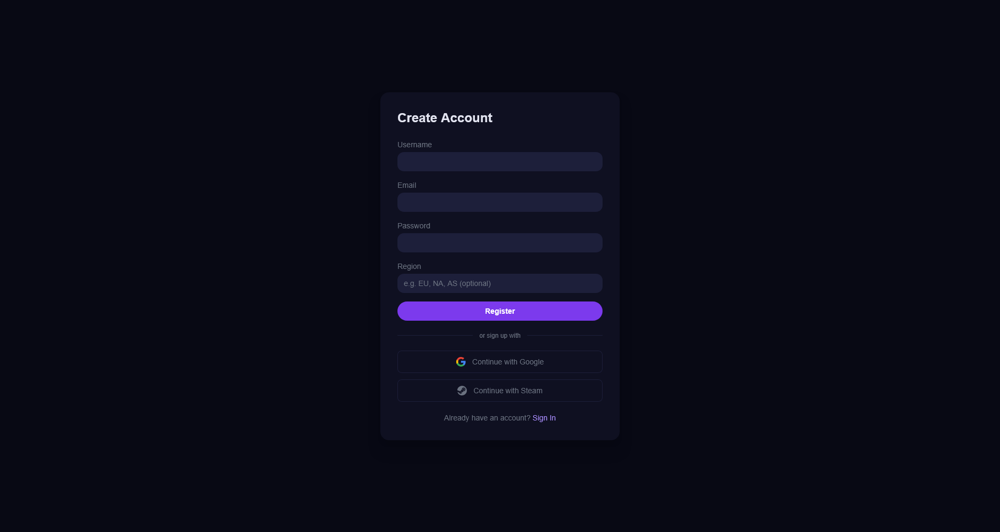

#### Option B — Sign in with Google

1. Click **Sign in with Google** on the login or sign-up page.
2. Choose your Google account in the pop-up window.
3. Grant permission when prompted.
4. You are redirected back to GameDash and logged in automatically.

#### Option C — Sign in with Steam

1. Click **Sign in with Steam** on the login or sign-up page.
2. Enter your Steam credentials in the Steam login window.
3. Approve the sign-in.
4. You are redirected back to GameDash and logged in automatically.

#### Option D — Sign in with Discord

1. Click **Sign in with Discord** on the login or sign-up page.
2. Log in to Discord if you are not already, then click **Authorise**.
3. You are redirected back to GameDash and logged in automatically.

> 💡 **Tip:** Google, Steam, and Discord logins do not require a password on GameDash — your identity is verified through those services.

---

### 2.2 Logging in

**Goal:** Access your account from any device.

1. Go to the GameDash website.
2. Click **Log in**.
3. Enter your **Username** or **Email address** and your **Password**, then click **Log in**.
   - Alternatively, click **Sign in with Google**, **Sign in with Steam**, or **Sign in with Discord**.
4. You are taken to your dashboard.

> ℹ️ **Session duration:** Your login session lasts approximately one hour. After that you will be asked to log in again. Tick **Remember me** (if shown) to stay logged in for up to seven days.

---

### 2.3 Tour of the main interface

Once logged in, you will see the main dashboard. Here are the key areas:

| Region | What it does |
|--------|-------------|
| **Top navigation bar** | Access your profile, notifications, and log out |
| **Sidebar / main menu** | Navigate between Dashboard, Matchmaking, Leaderboard, Shop, Quests, Maps, and Progression |
| **Dashboard (home)** | Quick overview of your MMR, active quests, and recent match results |
| **Profile avatar** (top-right) | Open your profile settings |

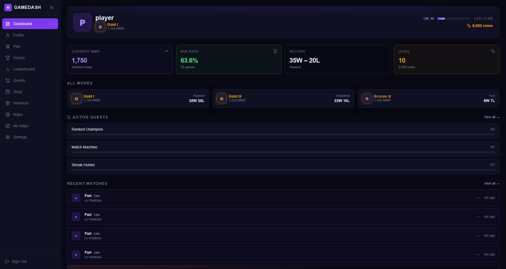

---

## 3. How to join a match and confirm results

**Goal:** Enter the matchmaking queue, play a match, and submit the result so your MMR updates and your rewards are paid out.

### Joining the queue

1. Click **Matchmaking** in the sidebar.
2. Click **Join queue**.
3. Wait for GameDash to find you an opponent. The screen shows your position in queue and estimated wait time.

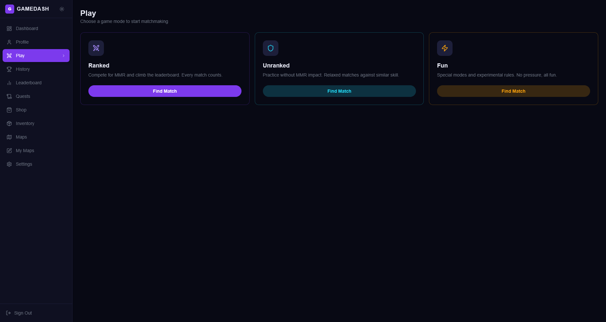

4. When a match is found, an info screen appears with two buttons: **Cancel** and **Show match info**.
   - Click **Cancel** to leave this match and return to the queue.
   - Click **Show match info** to accept and view the match details.

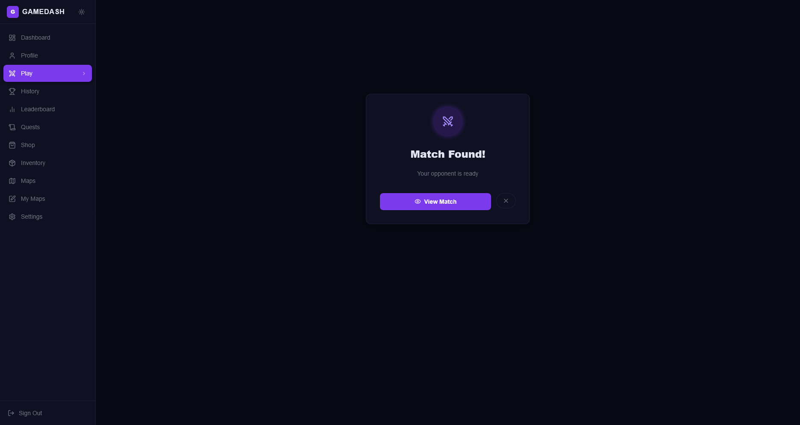

> 💡 **Tip:** Don't close the tab while you're in queue — the page needs to be open to receive your match notification.

> ℹ️ **Note:** Only one player sees this confirmation screen. The other player is automatically matched and removed from the queue at the same time.

### Submitting the result

After your match ends, both players must report the same result before rewards are paid out. This prevents disputes.

1. Go to **Matchmaking** → your active match.
2. Select the result: **I won** or **I lost**.
3. Click **Submit result**.

4. Wait for your opponent to submit their result.
5. Once both results agree, the match is **confirmed**:
   - Your MMR updates.
   - Coins and XP are added to your account.
   - The match appears in your history.

> ⚠️ **Disputed results:** If you and your opponent submit conflicting results (both claim to have won), the match is flagged for admin review. Neither player receives rewards until an admin resolves the dispute.

> ℹ️ **Note:** Results must be submitted within a reasonable window after the match. Leaving a match unresolved for too long may result in an automatic outcome.

---

## 4. How to track your MMR and ranking

**Goal:** Understand your current rank, see how close you are to the next tier, and compare yourself to other players on the leaderboard.

### Viewing your MMR

1. Click **Dashboard** (or your profile avatar in the top-right corner).
2. Your current **MMR** (Matchmaking Rating) and **Rank** are displayed prominently.

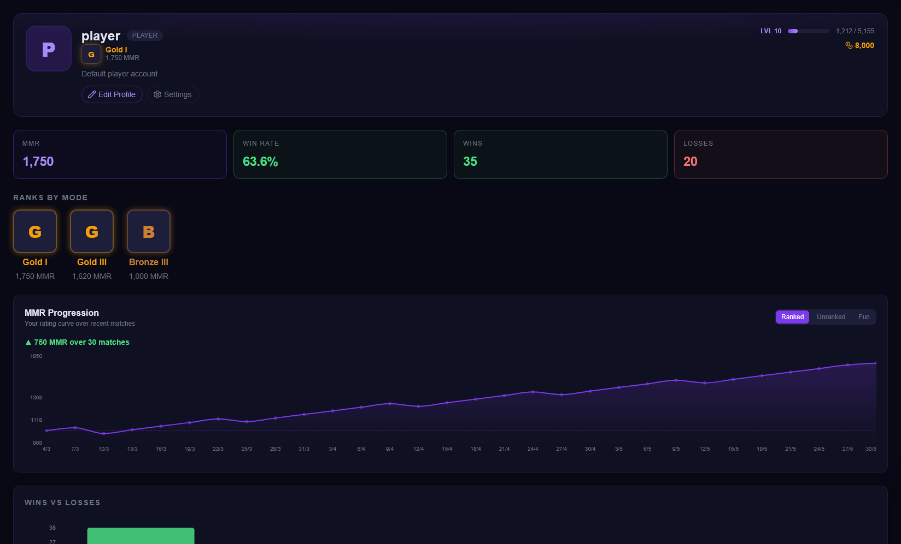

3. Below your MMR, a progress bar shows how many MMR points separate you from the next tier.

### The ranking tiers

GameDash uses 15 tiers from lowest to highest:

| Group | Tiers |
|-------|-------|
| Bronze | Bronze III → Bronze II → Bronze I |
| Silver | Silver III → Silver II → Silver I |
| Gold | Gold III → Gold II → Gold I |
| Platinum | Platinum III → Platinum II → Platinum I |
| Diamond | Diamond III → Diamond II → Diamond I |
| Master | Master |
| Grandmaster | Grandmaster |

Your rank badge updates automatically after each confirmed match.

### Viewing the leaderboard

1. Click **Leaderboard** in the sidebar.
2. The leaderboard shows all players ranked from highest to lowest MMR.
3. Use the search field to find a specific player by username.
4. Click on a player's row to see their public profile.

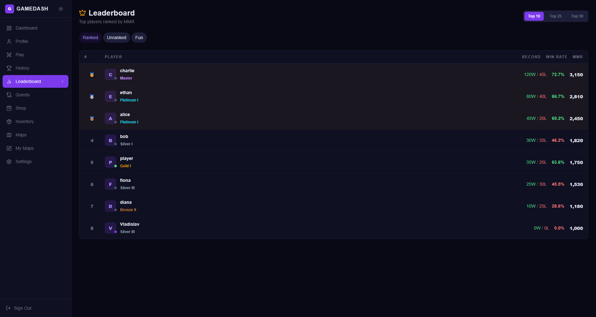

> 💡 **Tip:** Your own row is highlighted on the leaderboard so you can spot your position at a glance.

### Viewing your MMR history

1. Go to **Dashboard** or your profile.
2. Click **History** or the MMR graph.
3. A chart shows your MMR over time, with each data point representing a confirmed match.

---

## 5. How to use the shop and manage your inventory

**Goal:** Browse available items, buy them with your in-game coins, and equip them to your profile.

### Checking your coin balance

Your current coin balance is shown in the **top navigation bar** next to your profile avatar.

### Browsing and buying items

1. Click **Shop** in the sidebar.
2. Browse the item catalogue. Each item shows its name, a preview image, and its price in coins.
3. Click on an item to see its full description.
4. Click **Buy** to purchase it.

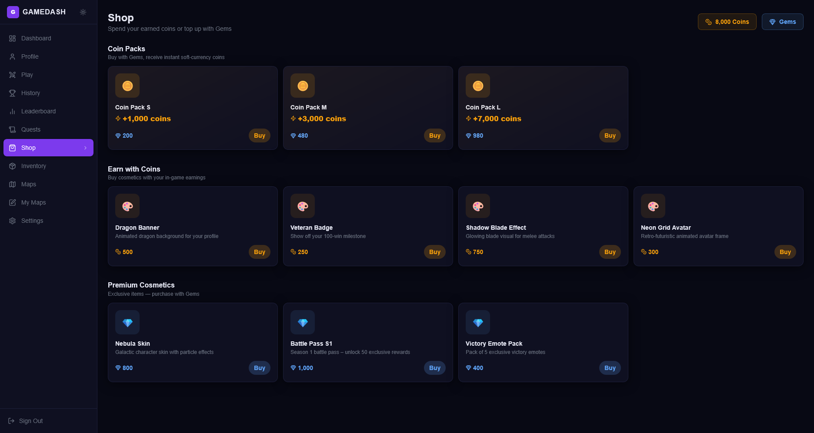

5. A confirmation prompt appears. Click **Confirm purchase** to complete the transaction.
6. The item is added to your inventory and coins are deducted from your balance.

> ⚠️ **Purchases are final.** Bought items cannot be refunded or exchanged.

> 💡 **Not enough coins?** Earn more by completing quests, winning matches, and levelling up (see [Section 6](#6-how-to-complete-quests-and-track-your-progression)).

### Viewing and equipping items

1. Click **Inventory** (accessible from your profile or the sidebar).
2. You see all items you own.
3. Click on an item and then click **Equip** to activate it on your profile.
4. Only one item of each type can be equipped at a time. Equipping a new item automatically unequips the previous one.

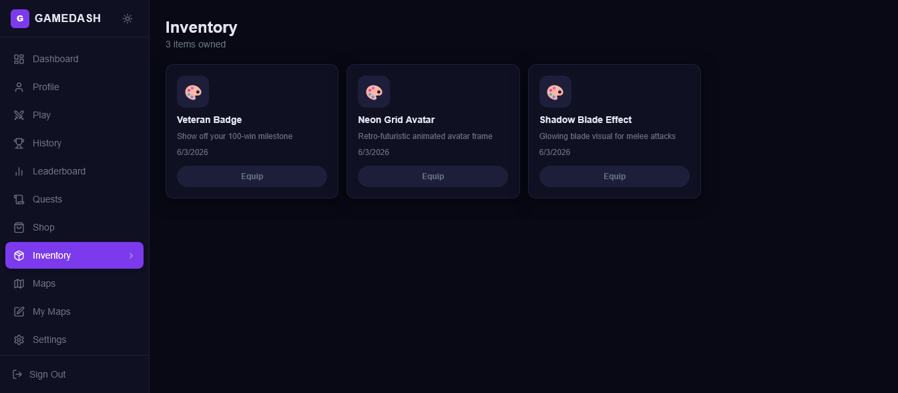

### Viewing purchase history

1. Go to **Inventory** → **Purchase history**.
2. A list of all past transactions is shown, including the item name, price paid, and date.

---

## 6. How to complete quests and track your progression

**Goal:** Claim XP and coin rewards from daily and weekly quests to level up and grow your balance.

### Understanding quests

GameDash assigns you two types of quests automatically:

| Type | Refreshes | Typical objective |
|------|-----------|-------------------|
| **Daily quest** | Every day at midnight | Win a match, play X games, etc. |
| **Weekly quest** | Every Monday at midnight | Earn X MMR, complete Y daily quests, etc. |

### Completing and claiming quests

1. Click **Quests** in the sidebar.
2. You see your active daily and weekly quests with a progress bar for each.

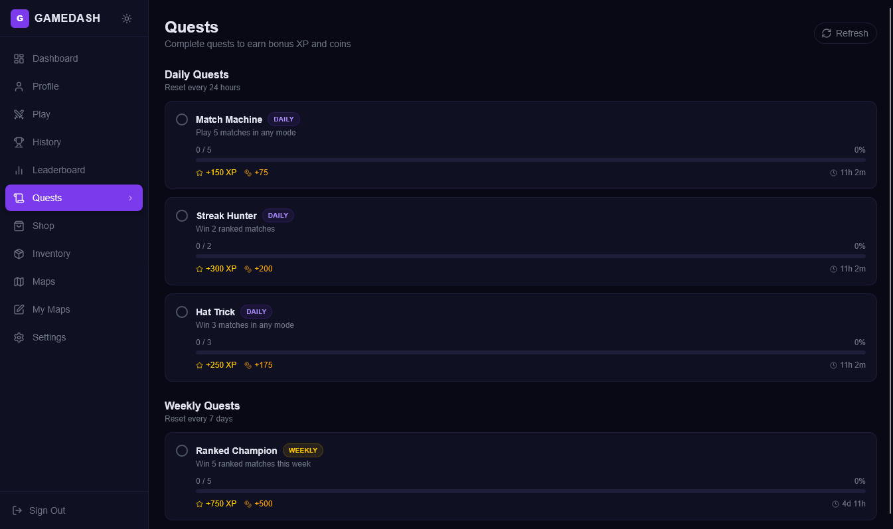

3. Play and win matches (or perform the required actions) until the progress bar is full.
4. Click **Claim** next to a completed quest to receive its rewards.
5. Your XP and coin totals update immediately.

> 💡 **Tip:** Quests are assigned automatically — you don't need to activate them. Simply check the quest page each day to see what's new.

> ℹ️ **Note:** Unclaimed rewards do not expire mid-cycle, but they are replaced when the quest rotates at the end of the day or week.

### Tracking your progression

1. Click **Progression** in the sidebar (or view the widget on your dashboard).
2. You see:
   - Your current **Level**
   - An XP bar showing progress toward the next level
   - Your total coin balance

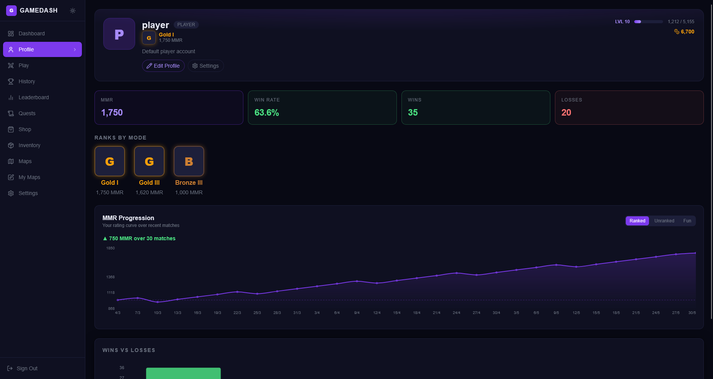

3. Every time the XP bar fills up, your level increases by one and may unlock new items or perks.

---

## 7. How to explore and create community maps

**Goal:** Discover maps made by other players, rate them, save your favourites, and publish your own.

### Browsing maps

1. Click **Maps** in the sidebar.
2. The map gallery loads. You can sort by **Newest**, **Top rated**, or **Featured**.
3. Click on any map card to open its detail page.

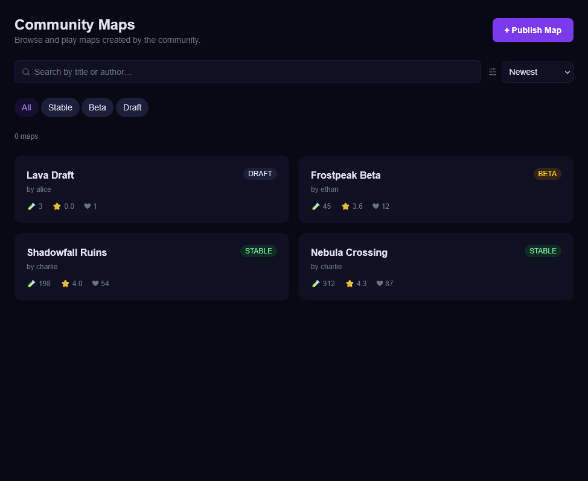

4. On the detail page you can:
   - View the map description, creator name, and version history
   - See screenshots submitted by the creator
   - Give the map a rating (one to five stars)
   - Click **Favourite** to save it to your favourites list

### Creating a map

1. Click **Maps** → **Create map** (button in the top-right of the gallery).
2. Fill in the **Map name** and **Description**.
3. Click **Create**.

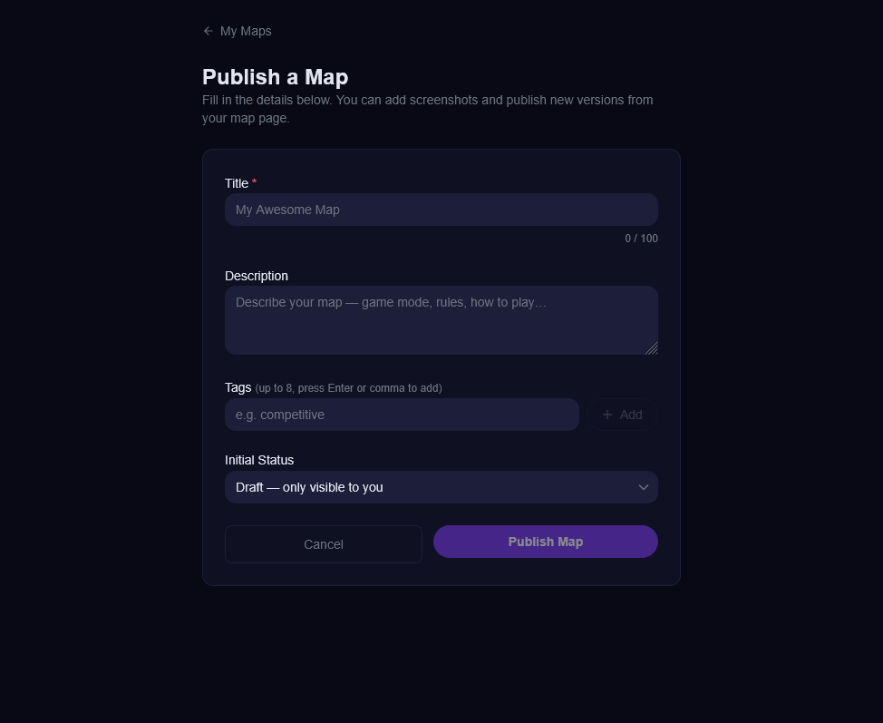

4. Your new map opens in the map editor. From here you can:
   - Click **Add version** to publish a new version of the map with notes
   - Click **Add screenshot** to upload an image showing the map
5. When you're ready to share it publicly, set its status to **Published**.

> ⚠️ **Moderation:** All maps are subject to admin review. Maps that violate community guidelines may be removed or hidden without notice.

> 💡 **Tip:** Adding clear screenshots and a detailed description helps other players find and rate your map.

### Managing your maps

1. Click your profile avatar → **My maps**.
2. You see all maps you have created.
3. Click on a map to edit its description, add a new version, or delete it.

---

## 8. Account and settings

**Goal:** Update your profile, change your password, manage notification preferences, and delete your account.

### Editing your profile

1. Click your **profile avatar** in the top-right corner.
2. Click **Profile** or **Edit profile**.
3. Update your **Username**, **Display name**, or **Profile picture**.
4. Click **Save changes**.

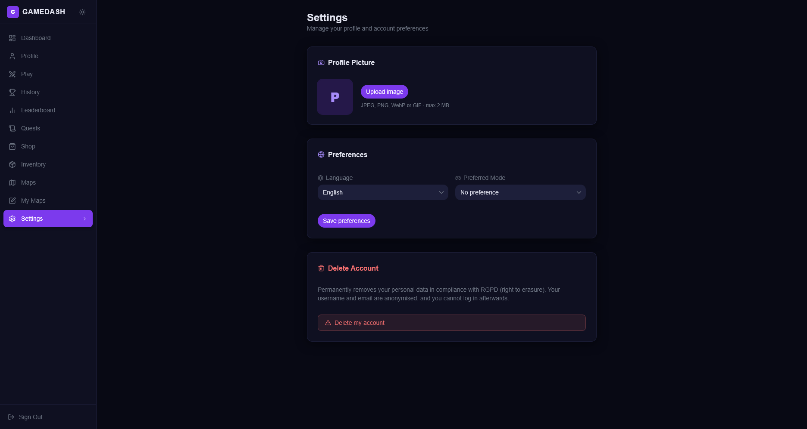

### Changing your password

> ℹ️ This option is only available if you registered with an email address. Google, Steam, and Discord accounts do not have a GameDash password.

1. Go to **Settings** → **Security** (or **Change password**).
2. Enter your **Current password**.
3. Enter and confirm your **New password**.
4. Click **Update password**.

### Notification preferences

1. Go to **Settings** → **Notifications**.
2. Toggle on or off the notifications you want to receive (match found, quest completed, etc.).
3. Click **Save**.

### Deleting your account

> ⚠️ **Account deletion is a soft-delete.** Your username and stats become hidden, but some data (match history, transaction records) is retained in our systems. Contact support if you require full data erasure under GDPR.

1. Go to **Settings** → **Account**.
2. Scroll to **Delete account**.
3. Enter your password to confirm.
4. Click **Delete my account**.
5. You are logged out immediately and your account is deactivated.

---

## 9. Troubleshooting

### I can't log in

| Symptom | Likely cause | Solution |
|---------|-------------|---------|
| "Invalid credentials" error | Wrong username/email or password | Double-check your username and password. Use **Forgot password** if needed. |
| Google login redirects in a loop | Browser cookies blocked | Allow cookies for the GameDash domain in your browser settings. |
| Steam login shows "error" | Steam servers temporarily unavailable | Wait a few minutes and try again. |
| Account says "disabled" or "banned" | Your account has been sanctioned | Contact support (see [Section 12](#12-getting-help)). |

### My MMR didn't update after a match

| Symptom | Likely cause | Solution |
|---------|-------------|---------|
| MMR unchanged after a match | Your opponent hasn't submitted their result yet | Wait for your opponent to confirm. Check the match status page. |
| Match shows "disputed" | You and your opponent submitted conflicting results | Wait for an admin to resolve the dispute. |

### A quest isn't progressing

| Symptom | Likely cause | Solution |
|---------|-------------|---------|
| Quest counter stuck | The action you performed doesn't count for this quest | Re-read the quest objective carefully. Some quests require ranked matches only. |
| Quest disappeared | It expired before you claimed it | New quests are available — check the quest page. |

### An item I bought isn't in my inventory

| Symptom | Likely cause | Solution |
|---------|-------------|---------|
| Item missing after purchase | Brief display delay | Refresh the page. If it's still missing after a minute, contact support with your purchase date and item name. |

### A map I created is no longer visible

| Symptom | Likely cause | Solution |
|---------|-------------|---------|
| Map hidden or removed | Admin moderation action | Check your email or in-app notifications for a moderation notice. Contact support to appeal. |

---

## 10. FAQ

**Do I need a Steam or Google account to play?**
No. You can register with just an email address. Steam and Google are optional login methods.

**Is GameDash free to play?**
Yes. The platform is free. Coins are earned in-game — there is no real-money purchase option.

**Can I link Google, Steam, or Discord to the same account?**
Currently each account is tied to one login method at sign-up. You cannot merge multiple social logins into one account after registration.

**What happens if my opponent never submits their match result?**
The match may be auto-resolved after a set period. If it remains stuck, contact support with the match ID.

**How is my MMR calculated?**
GameDash uses an ELO-based system. Winning against a higher-ranked opponent gives more MMR than beating someone at a similar level. Losses deduct fewer points when your opponent is ranked higher than you.

**Can I lose my rank tier?**
Yes. If your MMR drops below the threshold for your current tier, you are demoted. The thresholds can be viewed on the Leaderboard or Ranking page.

**How often do quests refresh?**
Daily quests refresh every day at midnight (server time). Weekly quests refresh every Monday at midnight.

**What is a "featured" map?**
Featured maps are selected by admins and appear at the top of the gallery. Admins choose maps based on quality and community interest.

**Can I delete a map I created?**
Yes, from **My maps** in your profile. Deleting a map removes it from the gallery permanently.

**I was banned — how do I appeal?**
Contact support (see [Section 12](#12-getting-help)) with your username and the reason you believe the ban was applied in error.

**How do I report another player for bad behaviour?**
Use the **Report** button on that player's public profile. Admins review all reports.

**How long does an admin take to resolve a disputed match?**
Response times vary. For a typical dispute, expect resolution within 24–48 hours.

---

## 11. Glossary

| Term | Plain-language definition |
|------|--------------------------|
| **MMR** (Matchmaking Rating) | A numerical score representing your skill level. It goes up when you win and down when you lose. |
| **ELO** | The mathematical formula GameDash uses to calculate MMR changes after each match. |
| **Rank / Tier** | The named badge (e.g., Gold II) assigned based on your MMR range. |
| **Queue** | The waiting room you enter when looking for a match. |
| **Result consensus** | The requirement that both players submit the same match outcome before rewards are paid. |
| **Soft-currency / Coins** | In-game money earned through matches and quests. Cannot be purchased with real money. |
| **XP** (Experience Points) | Points that fill your level bar. Earn XP from quests and matches. |
| **Progression** | Your overall character growth — level, XP, and coin balance. |
| **Community map** | A map created and shared by players (not the developers). |
| **Featured map** | A community map highlighted by an admin. |
| **OAuth2 / OpenID** | The industry-standard technology that lets you log in via Google or Steam without sharing your Google/Steam password with GameDash. |
| **HttpOnly cookie** | The secure way GameDash stores your login session in your browser. You can't read it from JavaScript, which keeps it safer. |
| **Soft-delete** | When your account is "deleted" it is actually hidden, not permanently erased. Some data is retained. |

---

## 12. Getting help

If you can't find the answer in this guide or in the [FAQ](#10-faq):

| Channel | Best for |
|---------|---------|
| **In-app support** | Report a bug or ask a question — look for the **Help** or **Support** link in the footer |
| **Email support** | Detailed issues, ban appeals, GDPR data requests |
| **Community forum / Discord** | Tips, map sharing, general discussion |

> ℹ️ When contacting support, include your **username**, a clear description of the issue, and (where relevant) the **date and time** the problem occurred. For match disputes, include the match ID shown on the match detail page.

---
---
---

# Admin Guide (English)

---

## 13. Admin overview

**Goal:** Understand what the admin backoffice gives you access to and how to navigate it.

Admin and Staff accounts have access to the **Backoffice** section of GameDash. This section is not visible to regular players.

### Accessing the backoffice

1. Log in with an account that has the **ADMIN** or **STAFF** role.
2. Click **Backoffice** in the sidebar (or top navigation).

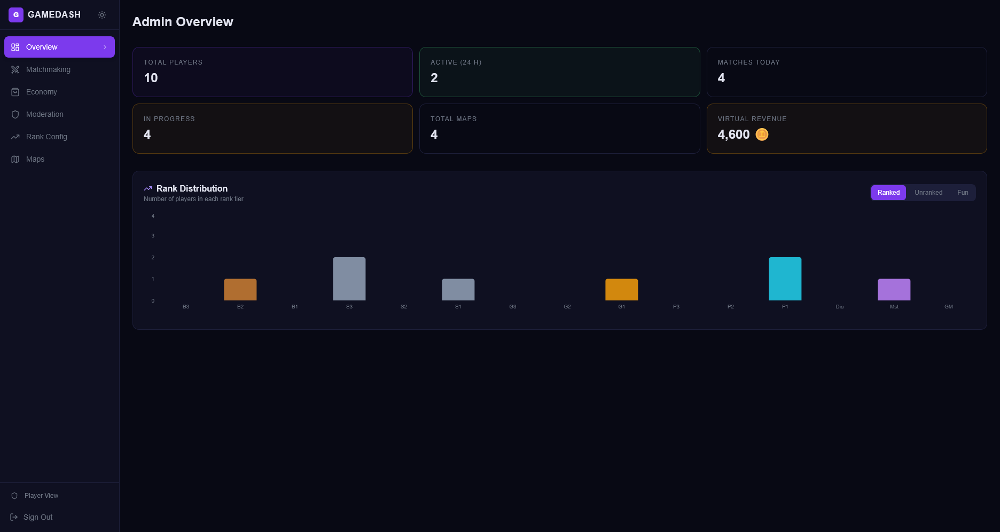

The backoffice is divided into the following sections:

| Section | Purpose |
|---------|---------|
| **Users** | Search for players, view profiles, apply or lift sanctions |
| **Ranks** | Configure MMR thresholds for each tier |
| **Matchmaking** | Tune matchmaking parameters |
| **Economy** | Create, edit, and retire shop items |
| **Maps** | Review, feature, and moderate community maps |
| **Revenue** | View transaction statistics and revenue reports |

> ⚠️ **Backoffice actions are permanent or difficult to reverse.** Double-check before issuing a ban, modifying rank thresholds, or removing items from the shop.

---

## 14. Managing users

**Goal:** Find a specific player, review their activity, and apply or remove a sanction.

### Searching for a user

1. In the backoffice, click **Users**.
2. Type a username or email address in the **Search** field.
3. Press **Enter** or click **Search**.
4. The matching account(s) appear in the results list.

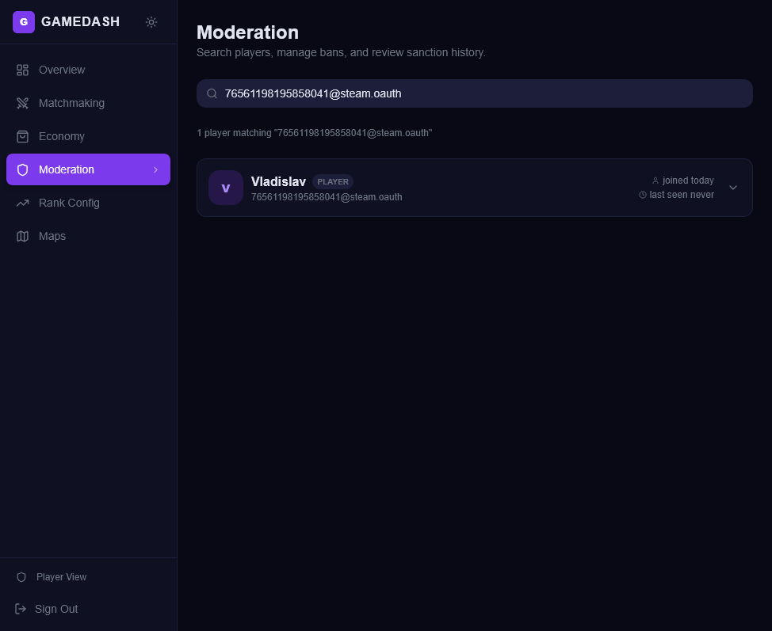

5. Click a row to open that player's admin profile view.

### Viewing a player's profile

The admin profile view shows:
- Account details (username, email, registration date, last login)
- Current MMR and rank
- Match history
- Active sanctions
- Purchase history

### Applying a sanction

1. Open the player's admin profile (see above).
2. Click **Apply sanction** (or **Ban** / **Warn**, depending on what actions are available).
3. Select the sanction type:
   - **Warning** — notifies the player but does not restrict access
   - **Temporary ban** — prevents login for a specified number of days
   - **Permanent ban** — disables the account indefinitely
4. Enter a reason in the **Reason** field. This reason is stored internally.
5. Click **Confirm**.

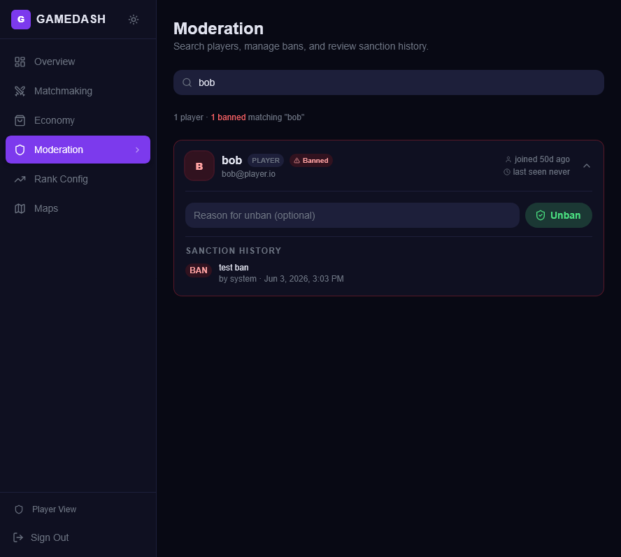

> ℹ️ **Sanction log:** Every sanction is timestamped and attributed to the admin who applied it. This log is visible in the player's admin profile view.

### Lifting a sanction

1. Open the player's admin profile.
2. Under **Active sanctions**, find the sanction to remove.
3. Click **Lift sanction** and confirm.

---

## 15. Configuring ranks and matchmaking

**Goal:** Adjust the MMR boundaries for each rank tier and tune how the matchmaking queue pairs players.

### Editing rank thresholds

1. In the backoffice, click **Ranks**.
2. A table shows each tier (Bronze III through Grandmaster) and its current MMR range.
3. Click the **Edit** icon next to a tier.
4. Update the **Minimum MMR** and/or **Maximum MMR** values.
5. Click **Save**.

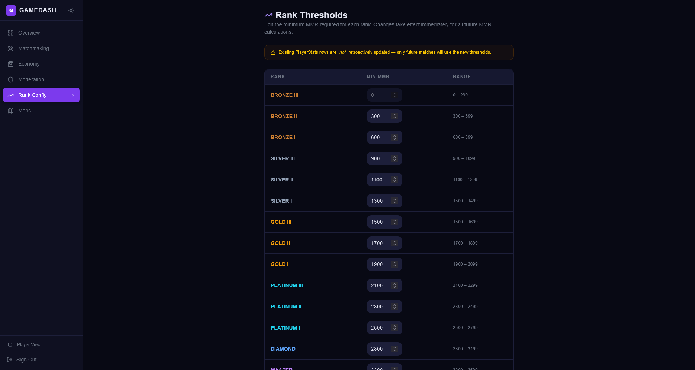

> ⚠️ **Cascading effect:** Changing a tier's threshold immediately recalculates every player's displayed rank based on their current MMR. Players may see their rank badge change without playing a match. Communicate threshold changes in advance if possible.

### Tuning matchmaking parameters

1. In the backoffice, click **Matchmaking**.
2. Adjust the available parameters (examples — verify exact labels in the app):
   - **MMR range tolerance** — how large the MMR gap between paired players can be
   - **Queue timeout** — how long a player waits before matching criteria are widened
3. Click **Save configuration**.

> 💡 **Tip:** Widen the MMR range tolerance during off-peak hours to reduce queue times for players with less common MMR values.

---

## 16. Managing the shop economy

**Goal:** Add new items to the shop, edit existing ones, and retire items that are no longer available.

### Adding a new item

1. In the backoffice, click **Economy** (or **Shop**).
2. Click **Add item**.
3. Fill in the form:
   - **Name**
   - **Description**
   - **Price** (in coins)
   - **Category** (if applicable)
   - **Image / thumbnail**
4. Click **Save**.

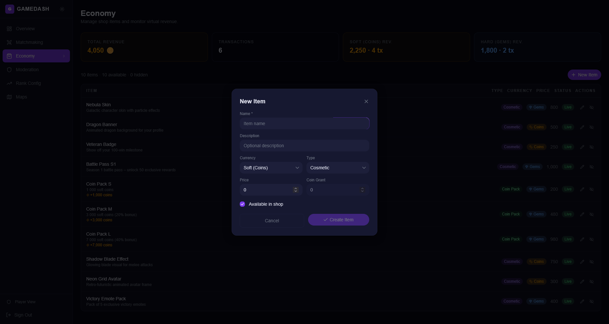

5. The item becomes immediately visible in the player-facing shop.

### Editing an existing item

1. In **Economy**, find the item in the list.
2. Click **Edit**.
3. Update the relevant fields.
4. Click **Save**.

> ℹ️ **Price changes:** Changing an item's price does not retroactively affect players who already purchased it.

### Retiring an item

1. In **Economy**, find the item.
2. Click **Retire** (or **Archive** / **Disable**).
3. Confirm the action.

Retired items no longer appear in the shop but remain in the inventories of players who already own them.

---

## 17. Moderating community maps

**Goal:** Review new maps, feature high-quality submissions, and remove content that violates guidelines.

### Reviewing maps pending moderation

1. In the backoffice, click **Maps**.
2. Filter by **Pending review** (or **Reported**) to see maps that need attention.

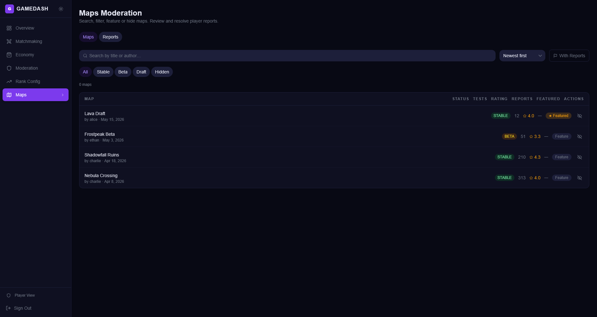

3. Click a map to open the moderation view. You can see:
   - All screenshots and version history
   - The creator's profile
   - Any player reports associated with the map

### Featuring a map

1. Open the map in the moderation view.
2. Click **Feature**.
3. The map is pinned to the top of the public gallery under the **Featured** section.

### Hiding or removing a map

1. Open the map in the moderation view.
2. Click **Hide** to make it invisible to players (reversible) or **Remove** to delete it permanently.
3. Confirm the action.

> ⚠️ **Removing a map is permanent.** The map's versions, screenshots, and ratings are deleted. Consider using **Hide** first if you are unsure.

---

## 18. Revenue and statistics

**Goal:** Monitor in-game economy activity and player spending patterns.

1. In the backoffice, click **Revenue** (or **Statistics**).
2. You can view:
   - Total coin transactions over a selected date range
   - Top-selling items
   - New player registrations over time
   - Match volume per day/week

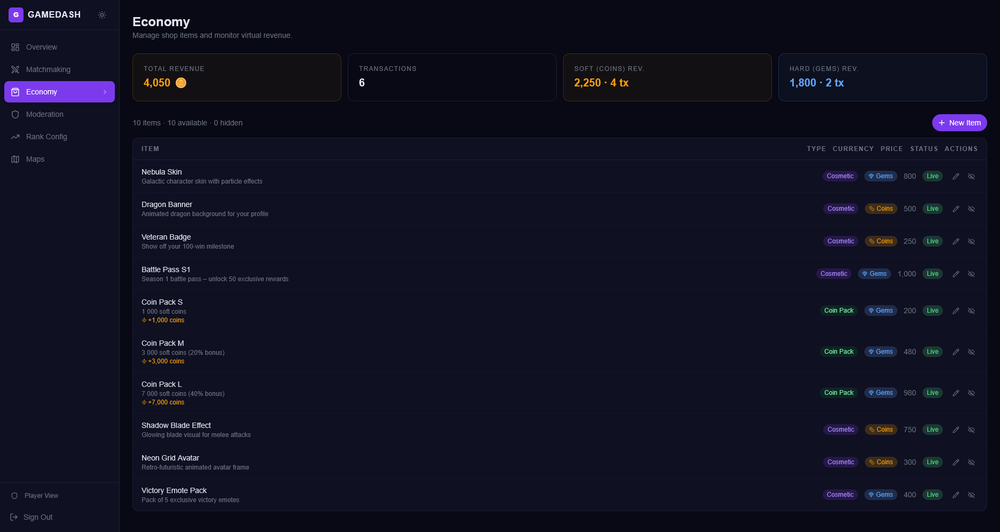

3. Use the **Date range** picker to filter results.
4. Use the **Export** button (if available) to download a CSV of the report.

> ℹ️ All figures represent in-game coin transactions, not real-money revenue.

---
---
---

# Guide d'utilisation — GameDash

> **Hypothèses et lacunes**
> Les libellés d'interface ci-dessous sont déduits du code source et de la documentation du projet. Vérifiez-les dans l'application réelle avant toute publication :
> - Noms exacts des éléments de navigation (libellés de la barre latérale, onglets)
> - Libellés des boutons dans les écrans de file d'attente et de confirmation de résultat
> - Intitulés des panneaux et sections du back-office administrateur
> - Messages de politique de mot de passe sur le formulaire d'inscription
>
> Les captures d'écran sont indiquées par des espaces réservés `[Capture : description]` tout au long du guide.

---

## Table des matières — Français

**Guide joueur**
1. [Bienvenue sur GameDash](#1-bienvenue-sur-gamedash)
2. [Premiers pas](#2-premiers-pas)
   - 2.1 [Créer un compte](#21-créer-un-compte)
   - 2.2 [Se connecter](#22-se-connecter)
   - 2.3 [Présentation de l'interface principale](#23-présentation-de-linterface-principale)
3. [Rejoindre un match et confirmer le résultat](#3-rejoindre-un-match-et-confirmer-le-résultat)
4. [Suivre son MMR et son classement](#4-suivre-son-mmr-et-son-classement)
5. [Utiliser la boutique et gérer son inventaire](#5-utiliser-la-boutique-et-gérer-son-inventaire)
6. [Accomplir des quêtes et suivre sa progression](#6-accomplir-des-quêtes-et-suivre-sa-progression)
7. [Explorer et créer des cartes communautaires](#7-explorer-et-créer-des-cartes-communautaires)
8. [Compte et paramètres](#8-compte-et-paramètres)
9. [Résolution des problèmes](#9-résolution-des-problèmes)
10. [Foire aux questions](#10-foire-aux-questions)
11. [Glossaire](#11-glossaire)
12. [Obtenir de l'aide](#12-obtenir-de-laide)

**Guide administrateur**
13. [Présentation du back-office](#13-présentation-du-back-office)
14. [Gérer les utilisateurs](#14-gérer-les-utilisateurs)
15. [Configurer les rangs et le matchmaking](#15-configurer-les-rangs-et-le-matchmaking)
16. [Gérer l'économie de la boutique](#16-gérer-léconomie-de-la-boutique)
17. [Modérer les cartes communautaires](#17-modérer-les-cartes-communautaires)
18. [Revenus et statistiques](#18-revenus-et-statistiques)

---

# Guide joueur (Français)

---

## 1. Bienvenue sur GameDash

GameDash est un tableau de bord compétitif qui centralise toute votre expérience de jeu classé en un seul endroit. Que vous gravissiez le classement, accomplissiez vos quêtes quotidiennes ou mettiez en valeur votre inventaire, tout est accessible en un clic depuis une interface web unique.

Ce guide s'adresse aux **joueurs** — aucune connaissance technique n'est requise. Si vous gérez la plateforme en tant qu'administrateur ou membre du staff, rendez-vous directement au [Guide administrateur](#13-présentation-du-back-office).

**Ce guide couvre :**

- La création et la gestion de votre compte
- La participation aux matchs classés et la confirmation des résultats
- La lecture de votre score MMR et la compréhension de votre rang
- L'achat d'articles et leur équipement sur votre profil
- L'accomplissement des quêtes et la montée en niveau
- L'exploration et la création de cartes communautaires

**Configuration requise :** GameDash fonctionne dans tout navigateur web moderne (Chrome, Firefox, Edge, Safari). Aucun téléchargement ni installation n'est nécessaire.

---

## 2. Premiers pas

### 2.1 Créer un compte

**Objectif :** Créer votre compte GameDash pour commencer à jouer et suivre vos statistiques.

Vous pouvez vous inscrire avec une adresse e-mail, ou relier votre compte Google ou Steam existant.

#### Option A — S'inscrire avec une adresse e-mail

1. Rendez-vous sur le site GameDash et cliquez sur **S'inscrire**.
2. Saisissez le **Nom d'utilisateur**, l'**Adresse e-mail** et le **Mot de passe** souhaités.

   > ⚠️ **Règles du mot de passe :** Le mot de passe doit contenir au moins une lettre majuscule, une lettre minuscule, un chiffre et un caractère spécial (ex. : `MonPass1!`).

3. Cliquez sur **Créer un compte**.
4. Vous êtes connecté immédiatement. Aucune confirmation par e-mail n'est requise.

#### Option B — Se connecter avec Google

1. Cliquez sur **Se connecter avec Google** sur la page de connexion ou d'inscription.
2. Sélectionnez votre compte Google dans la fenêtre contextuelle.
3. Accordez l'autorisation demandée.
4. Vous êtes redirigé vers GameDash et connecté automatiquement.

#### Option C — Se connecter avec Steam

1. Cliquez sur **Se connecter avec Steam** sur la page de connexion ou d'inscription.
2. Saisissez vos identifiants Steam dans la fenêtre de connexion Steam.
3. Approuvez la connexion.
4. Vous êtes redirigé vers GameDash et connecté automatiquement.

#### Option D — Se connecter avec Discord

1. Cliquez sur **Se connecter avec Discord** sur la page de connexion ou d'inscription.
2. Connectez-vous à Discord si ce n'est pas déjà fait, puis cliquez sur **Autoriser**.
3. Vous êtes redirigé vers GameDash et connecté automatiquement.

> 💡 **Conseil :** Les connexions via Google, Steam et Discord ne nécessitent pas de mot de passe sur GameDash — votre identité est vérifiée directement auprès de ces services.

---

### 2.2 Se connecter

**Objectif :** Accéder à votre compte depuis n'importe quel appareil.

1. Rendez-vous sur le site GameDash.
2. Cliquez sur **Se connecter**.
3. Saisissez votre **Nom d'utilisateur** ou **Adresse e-mail** ainsi que votre **Mot de passe**, puis cliquez sur **Se connecter**.
   - Vous pouvez également cliquer sur **Se connecter avec Google**, **Se connecter avec Steam** ou **Se connecter avec Discord**.
4. Vous accédez à votre tableau de bord.

> ℹ️ **Durée de session :** Votre session reste active environ une heure. Passé ce délai, vous devrez vous reconnecter. Cochez **Se souvenir de moi** (si disponible) pour rester connecté jusqu'à sept jours.

---

### 2.3 Présentation de l'interface principale

Une fois connecté, vous accédez au tableau de bord principal. Voici les zones clés :

| Zone | Fonction |
|------|----------|
| **Barre de navigation supérieure** | Accéder à votre profil, vos notifications et vous déconnecter |
| **Barre latérale / menu principal** | Naviguer entre Tableau de bord, Matchmaking, Classement, Boutique, Quêtes, Cartes et Progression |
| **Tableau de bord (accueil)** | Aperçu rapide de votre MMR, de vos quêtes actives et de vos derniers résultats |
| **Avatar de profil** (en haut à droite) | Ouvrir les paramètres de votre profil |

---

## 3. Rejoindre un match et confirmer le résultat

**Objectif :** Entrer dans la file d'attente de matchmaking, jouer un match et soumettre le résultat pour que votre MMR soit mis à jour et vos récompenses versées.

### Rejoindre la file d'attente

1. Cliquez sur **Matchmaking** dans la barre latérale.
2. Cliquez sur **Rejoindre la file**.
3. Attendez que GameDash vous trouve un adversaire. L'écran affiche votre position dans la file et le temps d'attente estimé.

4. Lorsqu'un match est trouvé, un écran d'information apparaît avec deux boutons : **Annuler** et **Voir les infos du match**.
   - Cliquez sur **Annuler** pour quitter ce match et revenir dans la file.
   - Cliquez sur **Voir les infos du match** pour accepter et consulter les détails.

> 💡 **Conseil :** Ne fermez pas l'onglet pendant que vous êtes en file — la page doit rester ouverte pour recevoir la notification de match.

> ℹ️ **Remarque :** Un seul joueur voit cet écran de confirmation. L'autre joueur est automatiquement mis en match et retiré de la file au même moment.

### Soumettre le résultat

Une fois votre match terminé, les deux joueurs doivent déclarer le même résultat avant que les récompenses ne soient versées. Cela permet d'éviter les litiges.

1. Rendez-vous dans **Matchmaking** → votre match actif.
2. Sélectionnez le résultat : **J'ai gagné** ou **J'ai perdu**.
3. Cliquez sur **Soumettre le résultat**.

4. Attendez que votre adversaire soumette également son résultat.
5. Une fois que les deux résultats concordent, le match est **confirmé** :
   - Votre MMR est mis à jour.
   - Des pièces et des XP sont ajoutés à votre compte.
   - Le match apparaît dans votre historique.

> ⚠️ **Résultat contesté :** Si vous et votre adversaire soumettez des résultats contradictoires (les deux prétendent avoir gagné), le match est signalé pour examen par un administrateur. Aucun joueur ne reçoit ses récompenses tant que le litige n'est pas résolu.

> ℹ️ **Remarque :** Les résultats doivent être soumis dans un délai raisonnable après le match. Un match laissé sans résolution trop longtemps peut faire l'objet d'un résultat automatique.

---

## 4. Suivre son MMR et son classement

**Objectif :** Comprendre votre rang actuel, voir à quelle distance vous êtes du palier suivant et vous comparer aux autres joueurs sur le classement.

### Consulter votre MMR

1. Cliquez sur **Tableau de bord** (ou sur votre avatar de profil en haut à droite).
2. Votre **MMR** (indice de matchmaking) et votre **Rang** sont affichés en bonne place.

3. Sous votre MMR, une barre de progression indique combien de points vous séparent du palier suivant.

### Les paliers de classement

GameDash utilise 15 paliers, du plus bas au plus élevé :

| Groupe | Paliers |
|--------|---------|
| Bronze | Bronze III → Bronze II → Bronze I |
| Argent | Argent III → Argent II → Argent I |
| Or | Or III → Or II → Or I |
| Platine | Platine III → Platine II → Platine I |
| Diamant | Diamant III → Diamant II → Diamant I |
| Master | Master |
| Grandmaster | Grandmaster |

Votre badge de rang se met à jour automatiquement après chaque match confirmé.

### Consulter le classement

1. Cliquez sur **Classement** dans la barre latérale.
2. Le classement affiche tous les joueurs triés du MMR le plus élevé au plus faible.
3. Utilisez le champ de recherche pour trouver un joueur précis par son nom d'utilisateur.
4. Cliquez sur la ligne d'un joueur pour consulter son profil public.

> 💡 **Conseil :** Votre propre ligne est mise en évidence dans le classement pour repérer votre position en un coup d'œil.

### Consulter l'historique de votre MMR

1. Rendez-vous dans **Tableau de bord** ou sur votre profil.
2. Cliquez sur **Historique** ou sur le graphique MMR.
3. Un graphique affiche l'évolution de votre MMR au fil du temps, chaque point correspondant à un match confirmé.

---

## 5. Utiliser la boutique et gérer son inventaire

**Objectif :** Parcourir les articles disponibles, les acheter avec vos pièces en jeu et les équiper sur votre profil.

### Vérifier votre solde de pièces

Votre solde de pièces actuel est affiché dans la **barre de navigation supérieure**, à côté de votre avatar de profil.

### Parcourir la boutique et acheter un article

1. Cliquez sur **Boutique** dans la barre latérale.
2. Parcourez le catalogue d'articles. Chaque article affiche son nom, une image de prévisualisation et son prix en pièces.
3. Cliquez sur un article pour en voir la description complète.
4. Cliquez sur **Acheter**.

5. Une fenêtre de confirmation s'affiche. Cliquez sur **Confirmer l'achat** pour finaliser la transaction.
6. L'article est ajouté à votre inventaire et les pièces sont déduites de votre solde.

> ⚠️ **Les achats sont définitifs.** Les articles achetés ne peuvent pas être remboursés ni échangés.

> 💡 **Pas assez de pièces ?** Gagnez-en davantage en accomplissant des quêtes, en remportant des matchs et en montant de niveau (voir [Section 6](#6-accomplir-des-quêtes-et-suivre-sa-progression)).

### Consulter et équiper ses articles

1. Cliquez sur **Inventaire** (accessible depuis votre profil ou la barre latérale).
2. Vous voyez tous les articles que vous possédez.
3. Cliquez sur un article puis sur **Équiper** pour l'activer sur votre profil.
4. Un seul article de chaque type peut être équipé à la fois. Équiper un nouvel article déséquipe automatiquement le précédent.

### Consulter l'historique d'achats

1. Accédez à **Inventaire** → **Historique d'achats**.
2. La liste de toutes vos transactions passées s'affiche, avec le nom de l'article, le prix payé et la date.

---

## 6. Accomplir des quêtes et suivre sa progression

**Objectif :** Réclamer des récompenses en XP et en pièces grâce aux quêtes quotidiennes et hebdomadaires, pour monter de niveau et renflouer votre solde.

### Comprendre les quêtes

GameDash vous attribue automatiquement deux types de quêtes :

| Type | Renouvellement | Objectif typique |
|------|---------------|-----------------|
| **Quête quotidienne** | Chaque jour à minuit | Remporter un match, jouer X parties, etc. |
| **Quête hebdomadaire** | Chaque lundi à minuit | Gagner X points de MMR, accomplir Y quêtes quotidiennes, etc. |

### Accomplir et réclamer des quêtes

1. Cliquez sur **Quêtes** dans la barre latérale.
2. Vos quêtes quotidiennes et hebdomadaires actives s'affichent, chacune avec une barre de progression.

3. Jouez et remportez des matchs (ou effectuez les actions requises) jusqu'à ce que la barre de progression soit pleine.
4. Cliquez sur **Réclamer** à côté d'une quête terminée pour recevoir ses récompenses.
5. Vos totaux d'XP et de pièces sont mis à jour immédiatement.

> 💡 **Conseil :** Les quêtes sont attribuées automatiquement — inutile de les activer. Consultez simplement la page des quêtes chaque jour pour voir les nouveautés.

> ℹ️ **Remarque :** Les récompenses non réclamées n'expirent pas en cours de cycle, mais elles sont remplacées lors du renouvellement de la quête en fin de journée ou de semaine.

### Suivre sa progression

1. Cliquez sur **Progression** dans la barre latérale (ou consultez le widget sur votre tableau de bord).
2. Vous voyez :
   - Votre **Niveau** actuel
   - Une barre d'XP indiquant votre avancement vers le niveau suivant
   - Votre solde total de pièces

3. Chaque fois que la barre d'XP se remplit, votre niveau augmente d'un et peut débloquer de nouveaux articles ou avantages.

---

## 7. Explorer et créer des cartes communautaires

**Objectif :** Découvrir des cartes créées par d'autres joueurs, les évaluer, enregistrer vos favoris et publier les vôtres.

### Parcourir les cartes

1. Cliquez sur **Cartes** dans la barre latérale.
2. La galerie de cartes se charge. Vous pouvez trier par **Plus récentes**, **Mieux notées** ou **À la une**.
3. Cliquez sur une carte pour ouvrir sa page de détail.

4. Sur la page de détail, vous pouvez :
   - Consulter la description de la carte, le nom du créateur et l'historique des versions
   - Voir les captures d'écran soumises par le créateur
   - Attribuer une note à la carte (de une à cinq étoiles)
   - Cliquer sur **Ajouter aux favoris** pour l'enregistrer dans votre liste de favoris

### Créer une carte

1. Cliquez sur **Cartes** → **Créer une carte** (bouton en haut à droite de la galerie).
2. Renseignez le **Nom de la carte** et la **Description**.
3. Cliquez sur **Créer**.

4. Votre nouvelle carte s'ouvre dans l'éditeur. Vous pouvez alors :
   - Cliquer sur **Ajouter une version** pour publier une nouvelle version avec des notes
   - Cliquer sur **Ajouter une capture** pour téléverser une image de la carte
5. Lorsque vous êtes prêt à la partager publiquement, définissez son statut sur **Publié**.

> ⚠️ **Modération :** Toutes les cartes sont soumises à un examen par les administrateurs. Les cartes enfreignant les règles de la communauté peuvent être retirées ou masquées sans préavis.

> 💡 **Conseil :** Ajouter des captures d'écran claires et une description détaillée aide les autres joueurs à trouver et évaluer votre carte.

### Gérer ses cartes

1. Cliquez sur votre avatar de profil → **Mes cartes**.
2. Vous voyez toutes les cartes que vous avez créées.
3. Cliquez sur une carte pour modifier sa description, ajouter une nouvelle version ou la supprimer.

---

## 8. Compte et paramètres

**Objectif :** Mettre à jour votre profil, changer votre mot de passe, gérer vos préférences de notification et supprimer votre compte.

### Modifier votre profil

1. Cliquez sur votre **avatar de profil** en haut à droite.
2. Cliquez sur **Profil** ou **Modifier le profil**.
3. Mettez à jour votre **Nom d'utilisateur**, votre **Nom d'affichage** ou votre **Photo de profil**.
4. Cliquez sur **Enregistrer les modifications**.

### Changer votre mot de passe

> ℹ️ Cette option est disponible uniquement si vous vous êtes inscrit avec une adresse e-mail. Les comptes Google, Steam et Discord n'ont pas de mot de passe GameDash.

1. Accédez à **Paramètres** → **Sécurité** (ou **Changer le mot de passe**).
2. Saisissez votre **Mot de passe actuel**.
3. Saisissez et confirmez votre **Nouveau mot de passe**.
4. Cliquez sur **Mettre à jour le mot de passe**.

### Préférences de notification

1. Accédez à **Paramètres** → **Notifications**.
2. Activez ou désactivez les notifications souhaitées (match trouvé, quête terminée, etc.).
3. Cliquez sur **Enregistrer**.

### Supprimer votre compte

> ⚠️ **La suppression du compte est une suppression logique.** Votre nom d'utilisateur et vos statistiques sont masqués, mais certaines données (historique des matchs, transactions) sont conservées dans nos systèmes. Contactez le support si vous souhaitez une suppression complète de vos données au titre du RGPD.

1. Accédez à **Paramètres** → **Compte**.
2. Faites défiler jusqu'à **Supprimer le compte**.
3. Saisissez votre mot de passe pour confirmer.
4. Cliquez sur **Supprimer mon compte**.
5. Vous êtes déconnecté immédiatement et votre compte est désactivé.

---

## 9. Résolution des problèmes

### Je n'arrive pas à me connecter

| Symptôme | Cause probable | Solution |
|----------|---------------|---------|
| Erreur « Identifiants invalides » | Nom d'utilisateur/adresse e-mail ou mot de passe incorrect | Vérifiez vos identifiants. Utilisez **Mot de passe oublié** si nécessaire. |
| La connexion Google tourne en boucle | Cookies bloqués par le navigateur | Autorisez les cookies pour le domaine GameDash dans les paramètres de votre navigateur. |
| La connexion Steam affiche une erreur | Serveurs Steam temporairement indisponibles | Patientez quelques minutes et réessayez. |
| Message « Compte désactivé » ou « Banni » | Votre compte a fait l'objet d'une sanction | Contactez le support (voir [Section 12](#12-obtenir-de-laide)). |

### Mon MMR n'a pas été mis à jour après un match

| Symptôme | Cause probable | Solution |
|----------|---------------|---------|
| MMR inchangé après un match | Votre adversaire n'a pas encore soumis son résultat | Attendez que votre adversaire confirme. Consultez la page de statut du match. |
| Le match affiche « Contesté » | Vous et votre adversaire avez soumis des résultats contradictoires | Attendez qu'un administrateur résolve le litige. |

### Une quête ne progresse pas

| Symptôme | Cause probable | Solution |
|----------|---------------|---------|
| Le compteur de la quête est bloqué | L'action effectuée ne compte pas pour cette quête | Relisez attentivement l'objectif. Certaines quêtes exigent des matchs classés uniquement. |
| La quête a disparu | Elle a expiré avant que vous ne la réclamiez | De nouvelles quêtes sont disponibles — consultez la page des quêtes. |

### Un article acheté n'est pas dans mon inventaire

| Symptôme | Cause probable | Solution |
|----------|---------------|---------|
| Article manquant après achat | Délai d'affichage momentané | Actualisez la page. S'il est toujours absent après une minute, contactez le support en indiquant la date d'achat et le nom de l'article. |

### Une carte que j'ai créée n'est plus visible

| Symptôme | Cause probable | Solution |
|----------|---------------|---------|
| Carte masquée ou supprimée | Action de modération par un administrateur | Vérifiez vos e-mails ou notifications dans l'application. Contactez le support pour faire appel. |

---

## 10. Foire aux questions

**Ai-je besoin d'un compte Steam ou Google pour jouer ?**
Non. Vous pouvez vous inscrire avec une simple adresse e-mail. Steam et Google sont des méthodes de connexion optionnelles.

**GameDash est-il gratuit ?**
Oui. La plateforme est entièrement gratuite. Les pièces se gagnent en jeu — aucun achat avec de l'argent réel n'est possible.

**Puis-je lier Google, Steam ou Discord au même compte ?**
Pour l'instant, chaque compte est associé à une seule méthode de connexion à l'inscription. Il n'est pas possible de fusionner plusieurs connexions sociales sur un même compte après l'inscription.

**Que se passe-t-il si mon adversaire ne soumet jamais le résultat du match ?**
Le match peut être résolu automatiquement après un certain délai. S'il reste bloqué, contactez le support en indiquant l'identifiant du match.

**Comment mon MMR est-il calculé ?**
GameDash utilise un système basé sur l'ELO. Vaincre un adversaire mieux classé rapporte davantage de MMR que battre quelqu'un de niveau similaire. Les défaites font perdre moins de points lorsque votre adversaire est mieux classé que vous.

**Puis-je perdre mon palier de rang ?**
Oui. Si votre MMR descend sous le seuil de votre palier actuel, vous êtes rétrogradé. Les seuils sont consultables sur la page Classement ou Rangs.

**À quelle fréquence les quêtes se renouvellent-elles ?**
Les quêtes quotidiennes se renouvellent chaque jour à minuit (heure du serveur). Les quêtes hebdomadaires se renouvellent chaque lundi à minuit.

**Qu'est-ce qu'une carte « à la une » ?**
Les cartes à la une sont sélectionnées par les administrateurs et apparaissent en tête de la galerie. Elles sont choisies selon leur qualité et l'intérêt de la communauté.

**Puis-je supprimer une carte que j'ai créée ?**
Oui, depuis **Mes cartes** dans votre profil. La suppression d'une carte la retire définitivement de la galerie.

**J'ai été banni — comment faire appel ?**
Contactez le support (voir [Section 12](#12-obtenir-de-laide)) en indiquant votre nom d'utilisateur et la raison pour laquelle vous estimez le bannissement injustifié.

**Comment signaler un joueur pour comportement inapproprié ?**
Utilisez le bouton **Signaler** sur le profil public de ce joueur. Tous les signalements sont examinés par les administrateurs.

**Combien de temps faut-il à un administrateur pour résoudre un match contesté ?**
Les délais varient. Pour un litige classique, comptez 24 à 48 heures.

---

## 11. Glossaire

| Terme | Définition en langage courant |
|-------|-------------------------------|
| **MMR** (Indice de matchmaking) | Un score numérique représentant votre niveau de jeu. Il augmente lorsque vous gagnez et diminue lorsque vous perdez. |
| **ELO** | La formule mathématique utilisée par GameDash pour calculer les variations de MMR après chaque match. |
| **Rang / Palier** | Le badge nommé (ex. : Or II) attribué en fonction de votre plage de MMR. |
| **File d'attente** | La salle d'attente dans laquelle vous entrez lorsque vous cherchez un match. |
| **Consensus de résultat** | L'obligation pour les deux joueurs de déclarer le même résultat avant que les récompenses ne soient versées. |
| **Monnaie virtuelle / Pièces** | L'argent en jeu gagné via les matchs et les quêtes. Ne peut pas être acheté avec de l'argent réel. |
| **XP** (Points d'expérience) | Points qui remplissent votre barre de niveau. Gagnez des XP grâce aux quêtes et aux matchs. |
| **Progression** | L'évolution globale de votre personnage — niveau, XP et solde de pièces. |
| **Carte communautaire** | Une carte créée et partagée par des joueurs (et non par les développeurs). |
| **Carte à la une** | Une carte communautaire mise en avant par un administrateur. |
| **OAuth2 / OpenID** | La technologie standard qui vous permet de vous connecter via Google ou Steam sans communiquer votre mot de passe Google/Steam à GameDash. |
| **Jeton HttpOnly** | La façon sécurisée dont GameDash stocke votre session de connexion dans votre navigateur. Inaccessible depuis JavaScript, ce qui renforce la sécurité. |
| **Suppression logique** | Quand votre compte est « supprimé », il est en réalité masqué et non effacé définitivement. Certaines données sont conservées. |

---

## 12. Obtenir de l'aide

Si vous ne trouvez pas la réponse dans ce guide ni dans la [Foire aux questions](#10-foire-aux-questions) :

| Canal | Le mieux adapté pour |
|-------|---------------------|
| **Support intégré** | Signaler un bug ou poser une question — cherchez le lien **Aide** ou **Support** dans le pied de page |
| **Support par e-mail** | Problèmes détaillés, appels de bannissement, demandes de données RGPD |
| **Forum communautaire / Discord** | Conseils, partage de cartes, discussion générale |

> ℹ️ Lorsque vous contactez le support, indiquez votre **nom d'utilisateur**, une description claire du problème et (si possible) la **date et l'heure** à laquelle il s'est produit. Pour les litiges de match, fournissez l'identifiant du match affiché sur la page de détail du match.

---
---
---

# Guide administrateur (Français)

---

## 13. Présentation du back-office

**Objectif :** Comprendre à quoi donne accès le back-office administrateur et comment s'y repérer.

Les comptes de type **ADMIN** ou **STAFF** ont accès à la section **Back-office** de GameDash. Cette section n'est pas visible par les joueurs ordinaires.

### Accéder au back-office

1. Connectez-vous avec un compte disposant du rôle **ADMIN** ou **STAFF**.
2. Cliquez sur **Back-office** dans la barre latérale (ou la navigation supérieure).

Le back-office est divisé en sections suivantes :

| Section | Rôle |
|---------|------|
| **Utilisateurs** | Rechercher des joueurs, consulter les profils, appliquer ou lever des sanctions |
| **Rangs** | Configurer les seuils de MMR pour chaque palier |
| **Matchmaking** | Ajuster les paramètres de matchmaking |
| **Économie** | Créer, modifier et retirer des articles de la boutique |
| **Cartes** | Examiner, mettre en avant et modérer les cartes communautaires |
| **Revenus** | Consulter les statistiques de transactions et les rapports |

> ⚠️ **Les actions du back-office sont permanentes ou difficiles à annuler.** Vérifiez avant d'émettre un bannissement, de modifier des seuils de rang ou de supprimer des articles de la boutique.

---

## 14. Gérer les utilisateurs

**Objectif :** Trouver un joueur précis, consulter son activité et appliquer ou lever une sanction.

### Rechercher un utilisateur

1. Dans le back-office, cliquez sur **Utilisateurs**.
2. Saisissez un nom d'utilisateur ou une adresse e-mail dans le champ **Rechercher**.
3. Appuyez sur **Entrée** ou cliquez sur **Rechercher**.
4. Le ou les comptes correspondants apparaissent dans la liste de résultats.

5. Cliquez sur une ligne pour ouvrir le profil administrateur de ce joueur.

### Consulter le profil d'un joueur

Le profil administrateur affiche :
- Les informations du compte (nom d'utilisateur, e-mail, date d'inscription, dernière connexion)
- Le MMR et le rang actuels
- L'historique des matchs
- Les sanctions actives
- L'historique d'achats

### Appliquer une sanction

1. Ouvrez le profil administrateur du joueur (voir ci-dessus).
2. Cliquez sur **Appliquer une sanction** (ou **Bannir** / **Avertir**, selon les actions disponibles).
3. Sélectionnez le type de sanction :
   - **Avertissement** — notifie le joueur sans restreindre l'accès
   - **Bannissement temporaire** — empêche la connexion pendant un nombre de jours spécifié
   - **Bannissement permanent** — désactive le compte indéfiniment
4. Saisissez une raison dans le champ **Motif**. Ce motif est enregistré en interne.
5. Cliquez sur **Confirmer**.

> ℹ️ **Journal des sanctions :** Chaque sanction est horodatée et attribuée à l'administrateur qui l'a appliquée. Ce journal est visible dans le profil administrateur du joueur.

### Lever une sanction

1. Ouvrez le profil administrateur du joueur.
2. Sous **Sanctions actives**, trouvez la sanction à supprimer.
3. Cliquez sur **Lever la sanction** et confirmez.

---

## 15. Configurer les rangs et le matchmaking

**Objectif :** Ajuster les seuils de MMR de chaque palier et régler la façon dont la file d'attente associe les joueurs.

### Modifier les seuils de rang

1. Dans le back-office, cliquez sur **Rangs**.
2. Un tableau affiche chaque palier (de Bronze III à Grandmaster) et sa plage de MMR actuelle.
3. Cliquez sur l'icône **Modifier** à côté d'un palier.
4. Mettez à jour les valeurs **MMR minimum** et/ou **MMR maximum**.
5. Cliquez sur **Enregistrer**.

> ⚠️ **Effet en cascade :** Modifier le seuil d'un palier recalcule immédiatement le rang affiché de tous les joueurs en fonction de leur MMR actuel. Des joueurs peuvent voir leur badge de rang changer sans avoir joué de match. Dans la mesure du possible, communiquez les changements de seuils à l'avance.

### Ajuster les paramètres de matchmaking

1. Dans le back-office, cliquez sur **Matchmaking**.
2. Ajustez les paramètres disponibles (exemples — vérifiez les libellés exacts dans l'application) :
   - **Tolérance d'écart de MMR** — écart de MMR maximal autorisé entre deux joueurs appariés
   - **Délai de file d'attente** — durée d'attente avant l'élargissement des critères de recherche
3. Cliquez sur **Enregistrer la configuration**.

> 💡 **Conseil :** Élargissez la tolérance d'écart de MMR aux heures creuses pour réduire les temps d'attente des joueurs avec des valeurs de MMR peu communes.

---

## 16. Gérer l'économie de la boutique

**Objectif :** Ajouter de nouveaux articles à la boutique, modifier les articles existants et retirer ceux qui ne sont plus disponibles.

### Ajouter un nouvel article

1. Dans le back-office, cliquez sur **Économie** (ou **Boutique**).
2. Cliquez sur **Ajouter un article**.
3. Remplissez le formulaire :
   - **Nom**
   - **Description**
   - **Prix** (en pièces)
   - **Catégorie** (le cas échéant)
   - **Image / vignette**
4. Cliquez sur **Enregistrer**.

5. L'article est immédiatement visible dans la boutique côté joueur.

### Modifier un article existant

1. Dans **Économie**, trouvez l'article dans la liste.
2. Cliquez sur **Modifier**.
3. Mettez à jour les champs concernés.
4. Cliquez sur **Enregistrer**.

> ℹ️ **Changement de prix :** Modifier le prix d'un article n'affecte pas rétroactivement les joueurs qui l'ont déjà acheté.

### Retirer un article

1. Dans **Économie**, trouvez l'article.
2. Cliquez sur **Retirer** (ou **Archiver** / **Désactiver**).
3. Confirmez l'action.

Les articles retirés n'apparaissent plus dans la boutique, mais restent dans l'inventaire des joueurs qui les possèdent déjà.

---

## 17. Modérer les cartes communautaires

**Objectif :** Examiner les nouvelles cartes, mettre en avant les meilleures soumissions et supprimer les contenus enfreignant les règles.

### Examiner les cartes en attente de modération

1. Dans le back-office, cliquez sur **Cartes**.
2. Filtrez par **En attente d'examen** (ou **Signalées**) pour voir les cartes nécessitant une attention.

3. Cliquez sur une carte pour ouvrir la vue de modération. Vous pouvez consulter :
   - Toutes les captures d'écran et l'historique des versions
   - Le profil du créateur
   - Les signalements de joueurs associés à la carte

### Mettre une carte à la une

1. Ouvrez la carte dans la vue de modération.
2. Cliquez sur **Mettre à la une**.
3. La carte est épinglée en tête de la galerie publique dans la section **À la une**.

### Masquer ou supprimer une carte

1. Ouvrez la carte dans la vue de modération.
2. Cliquez sur **Masquer** pour la rendre invisible aux joueurs (action réversible) ou sur **Supprimer** pour l'effacer définitivement.
3. Confirmez l'action.

> ⚠️ **La suppression d'une carte est définitive.** Les versions, captures d'écran et notes de la carte sont supprimées. Privilégiez **Masquer** si vous avez un doute.

---

## 18. Revenus et statistiques

**Objectif :** Surveiller l'activité de l'économie en jeu et les habitudes de dépenses des joueurs.

1. Dans le back-office, cliquez sur **Revenus** (ou **Statistiques**).
2. Vous pouvez consulter :
   - Le total des transactions en pièces sur une période sélectionnée
   - Les articles les plus vendus
   - Les nouvelles inscriptions de joueurs au fil du temps
   - Le volume de matchs par jour/semaine

3. Utilisez le sélecteur de **Plage de dates** pour filtrer les résultats.
4. Utilisez le bouton **Exporter** (si disponible) pour télécharger un fichier CSV du rapport.

> ℹ️ Tous les chiffres correspondent à des transactions en pièces virtuelles, non à des revenus en argent réel.
